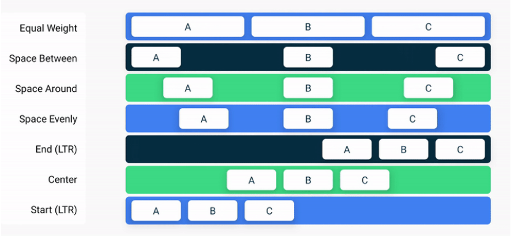
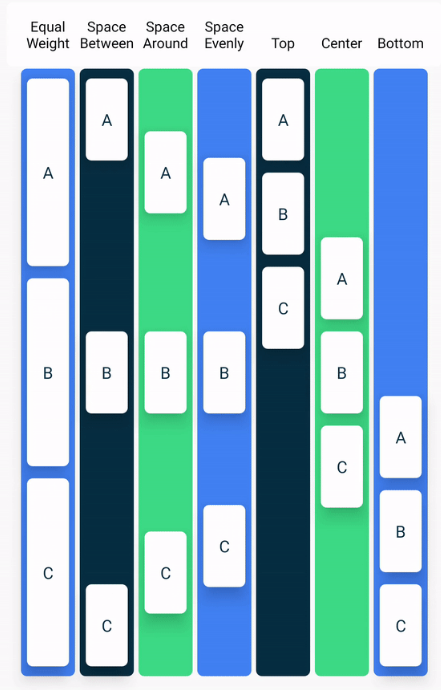

## Jetpack Compose

`Jetpack Compose` - это современный инструментарий для создания пользовательских интерфейсов Android.
С помощью Compose вы можете создать свой пользовательский интерфейс, определив набор функций,
называемых `Composable` функциями, которые принимают данные и описывают элементы пользовательского интерфейса.

`Composition` - называние UI, построенного с помощью `Jetpack Compose`. При изменении состояния происходит процесс
обновления UI - `recomposition`. `Stateless` функции - функции без состояния (переменных), `stateful` - с состоянием.

### Структура проекта

`sp` - мера для размера текста
`dp` - мера для размера отступов в layout

Директория `drawable` - картинки
Директория `mipmap` - иконки приложения
Директория `font` - шрифты

`strings.xml` - содержит строки
`dimens.xml` - содержит значения размеров в `dp`.

`Color.kt` - для цветов
`Theme.kt` - для тем
`Shape.kt` - для форм
`Type.kt` - для шрифтов

### `@Composable` функции

#### Общее

- Эти функции могут вызываться только из других`@Composable` функций.
- Они начинаются с заглавной буквы, называются существительным и ничего не возвращают.
- `@Preview` служит для отображения функций в режиме превью, все параметры должны быть по умолчанию. Атрибуты:
    - `showBackground`
    - `showSystemUi`
    - `widthDp`
- Каждая функция принимает опциональный параметр `Modifier` в качестве первого опционального параметра. Атрибуты:
    - `height` (может использоваться с `dimensionResource`)
    - `width`
    - `allign` - значение `justify` для растягивания
    - `padding`
    - `marging`
    - `background`
    - `weight` - если указан только у 1 элемента, то занимает все свободное пространство, оставшееся после других
      элементов
    - `fillMaxSize`
    - `fillMaxWidth`
    - `wrapContentSize`
    - `wrapContentHeight`
    - `clickable` - можно поставить действие на клик
    - `verticalScroll(rememberScrollState())` - для маленького экрана с пролистыванием, для запоминания позиции.
    - `border` - можно менять `BorderStroke`, `Color`, `Elevation`
    - `statusBarsPadding`
    - `aspectRatio`
    - `clip` - для настройки формы
    - `animateContentSize` - анимация изменения размера для дочерних элементов, принимает параметр `animationSpec` со
      значением функции `spring`
    - `minimumTouchTargetSize()` - минимальный размер для нажатия
    - `selectable` - дает возможность выбирать элемент, `selected` и `onClick`
    - `testTag` - добавляет тег для тестирования и использования `onNodeWithTagForStringId`
    - `nestedScroll` - можно задать с помощью `TopAppBarDefaults.enterAlwaysScrollBehavior().nestedScrollConnection`

#### Размещение элементов

- `setContent` - основной контейнер для `@Composable` функций. Внутри лежит тема, внутри который базовый `Surface`
  с указанием базовых аттрибутов.
- `Scaffold()` - контейнер для размещения элементов. Атрибуты:
    - `color`
    - `topBar`
- `Surface()` - контейнер для определения заднего фона, границ. Атрибуты:
    - `topBar`
- `FloatingActionButton` - 'парящая' кнопка
- `TopAppBar()` - верхний бар. Атрибуты:
    - `title`
    - `colors` - цвет
    - `navigationIcon`
    - `scrollBehavior` - можно получить с помощью `TopAppBarDefaults.enterAlwaysScrollBehavior()`
- `BottomAppBar()` - нижний бар.
- `NavigationRail()` - используется как альтернатива нижнему бару на планшетах, располагается сбоку. Внутри должен
  содержать набор `NavigationRailItem`
- `NavigationRailItem()` - элемент `NavigationRail`. Атрибуты:
    - `selected`
    - `onClick`
    - `icon`
- `PermanentNavigationDrawer()` - используется как альтернатива нижнему бару на компьюетрах, располагается сбоку.
  Оборачивает остальное приложение.
  Атрибуты:
    - `drawerContent` - принимает в качестве значения `PermanentDrawerSheet` с внутренним `NavigationDrawerContent`
- `NavigationDrawerContent()` - настраивает `PermanentNavigationDrawer`. Атрибуты:
    - `selectedDestination` - состояние по умолчанию
    - `onTabPressed`
    - `navigationItemContentList`
- `AnimatedVisibility` - применяется для сокрытия элементов. Атрибуты:
    - `visible`

#### Элементы

- `Text()` - обычный текст. Атрибуты:
    - `text` - лучше использовать с `stringResource()`
    - `fontSize`
    - `fontWeight`
    - `lineHeight`
    - `textAlign`
    - `style`
    - `buildAnnotatedString` - для использования разных стилей для частей текста
- `Image()` - обычная картинка. Атрибуты:
    - `painter` - используется вместе с `painterResource()`
    - `contentDescription`
    - `contentScale` - как масштабировать картинку
    - `alpha` - для засветления картинки
- `Icon()` - иконка. Атрибуты:
    - `painter` либо `imageVector`
    - `tint` - цвет
- `Card()` - карточка с закругленными краями. Атрибуты:
    - `elevation` - с помощью `CardDefaults.cardElevation`
    - `shape`
    - `onClick`
- `Button()` - элемент для добавления кнопки. Атрибуты:
    - `onClick`
    - `shape`
    - `colors`
- `OutlinedButton()` - `Button`, но цвет фона совпадает с background, очерченный линией
- `FilledTonalButton()` - `Button`, но темный текст на светлом фоне
- `ElevatedButton()` - `Button`, но парящая
- `TextButton` - кнопка на тексте. Атрибуты:
    - `onClick`
- `IconButton` - кнопка на иконке. Атрибуты:
    - `onClick`
- `RadioButton` - выбор элемента. Атрибуты:
    - `selected`
    - `onClick`
- `Switch()` - переключатель. Атрибуты:
    - `checked`
    - `onCheckedChange`
- `TextField()` - элемент для ввода текста. Атрибуты:
    - `value`
    - `onValueChange`
    - `isError` - нужно ли показывать ошибку при вводе
    - `label` - пометка при вводе, нужно менять в зависимости от `isError`
    - `leadingIcon`
    - `singleLine`
    - `shape`
    - `keyboardOptions` - имеет атрибут `keyboardType`, где указываетcя тип вводимых данных, и `imeAction` -
      показывающей тип `action` кнопки клавиатуры (может быть `next`, `done`, `search`, `send`, `go`)
    - `keyboardActions` - имеет атрибут `onDone`, в котором можно указать, что делать при нажатии
- `OutlinedTextField()` - похож на `TextField`, но менее визуально акцентированный

#### Сложные элементы

- `Row`, `Column` - для расположения дочерних UI элементов. Атрибуты:
    - `verticalArrangement`
    - `verticalAlignment`
    - `horizontalArrangement`
    - `horizontalAlignment`
- `Box` - для расположения дочерних UI элементов поверх друг друга. Атрибуты те же, что и у `Row`, `Column`
- `Spacer` - элемент для добавления пустот. Атрибуты те же, что и у `Row`, `Column`
- `Divider` - разделительная черта. Атрибуты:
    - `thickness`
- `LazyColumn`, `LazyRow` - используется для бесконечных списков. Атрибуты:
    - `contentPadding` - в качестве значения может быть передана `contentWindowInsets` из `Scaffold`.

  Внутри вызывается функция `items(список, ключ) { элемент -> создание одной UI }`. Ключ необходим `Jetpack Compose` для
  правильного определения местоположения элементов при добавлении новых или повороте экрана. Код для `padding` для
  `Surface` под список:
    ```kotlin
    @Composable
    fun AffirmationsApp() {
        val layoutDirection = LocalLayoutDirection.current
        Surface(
            Modifier = Modifier
            .fillMaxSize()
            .statusBarsPadding()
            .padding(
                start = WindowInsets.safeDrawing.asPaddingValues()
                        .calculateStartPadding(layoutDirection),
                end = WindowInsets.safeDrawing.asPaddingValues()
                        .calculateEndPadding(layoutDirection),
            ),
        ) {
        }
    }
    ```
- `LazyVerticalGrid`, `LazyHorizontalGrid` - используется для бесконечной сетки с одинаковыми по размеру элементами.
  Атрибуты:
    - `columns` - можно определить размер столбцов с помощью `GridCells.Adaptive(minSize)` или `GridCells.Fixed(number)`
- `LazyVerticalStaggeredGrid`, `LazyHorizontalStaggeredGrid` - используется для бесконечной сетки с разными по размеру
  элементами.
- `AlertDialog()` - выводит диалоговое окно на экран. Атрибуты:
    - `onDismissRequest` - закрытие окна
    - `title`
    - `text`
    - `dismissButton` - кнопка закрытия окна
    - `confirmButton` - подтверждение
- `AsyncImage` - загружает и отображает картинку из интернета (библиотека `Coil`). Атрибуты:
    - `model` - либо `URL`, либо создание `ImageRequest`:
      ```kotlin
      ImageRequest.Builder(LocalContext.current)
      .data("URL")
      .crossfade(true)
      .build()
      ```
    - `placeholder`, `error`, `fallback` - картинки для разных результатов выполнения запроса
    - `onLoading`, `onSuccess`, `onError` - callback для разных результатов выполнения запроса
- `CircularProgressIndicator` - круглый индикатор загрузки
- `LinearProgressIndicator` - линейный индикатор загрузки

<p align="center"></p>

<p align="center"></p>

#### Другие полезные функции

- `stringResource()` - возвращает строку ресурса, можно добавить `%s` в ресурс для шаблона, на параметр ресурса стоит
  повесить `@StringRes`
- `painterResource()` - возвращает картинку ресурса, на параметр ресурса стоит повесить `@DrawableRes`
- `dimensionResource()` - возвращает значение размера ресурса
- `remember` - запоминает объект в памяти, чтобы он не сбрасывался при перезагрузке UI
- `mutableStateOf()` или `MutableState` - возвращает Observer на одиночное значение, который тригерится при изменении
  значения, и вызывает перезагрузку (рекомпозицию) UI, сделано специально для `Jetpack Compose`. Не поддерживает
  многопоточность.
- `animate*AsState()` - создает анимацию (цвета, размера) при изменении состояния. Атрибуты:
    - `targetValue`
- `LaunchedEffect()` - используется для вызова `suspend` функций и поддерживает их, пока сама находится в композиции.
  Атрибуты:
    - `key`-s - набор ключей (функций), при изменении которых происходит отмена и перезагрузка корутины

### Темы и стили

[Пример задания темы](https://developer.android.com/codelabs/basic-android-kotlin-compose-material-theming#1)

[Создание темы](https://material-foundation.github.io/material-theme-builder/)

[Контраст цветов](https://webaim.org/resources/contrastchecker/)

## Тестирование

Локальные тесты - обычные тесты без запуска эмулятора (папка `test`), инструментальные тесты - тестируют взаимодействие
с UI приложения на эмуляторе (папка `androidTest`).

#### Общее

- `@VisibleForTesting` - делает метод публичным для тестирования.
- `createComposeRule()` - метод для создания заглушки для инструментального теста, также она должна иметь аннотацию
  `@get:Rule`. `setContent` используется для создания контейнера для заглушки, такого же как и в оригинальном коде.
- `createAndroidComposeRule<ComponentActivity>` - аналог `createComposeRule()`.

> Можно получить текущий контекст с помощью поля `activity` у `createComposeRule()`. Можно получить текст ресурса с
> помощью вызова `getString(id)` у `activity`.

> Нужно использовать `TestNavHostController` для тестирования навигации. При создании объекта нужно также создать
> навигатор с помощью `navigatorProvider.addNavigator(ComposeNavigator())`.

#### Поиск и проверки

- `onNodeWithText(текст)` - используется поиск `composable` элемента, содержащей текст.
- `onNodeWithStringId(id)` - используется поиск `composable` элемента, содержащей текст.
- `onNodeWithContentDescription(текст)` - используется поиск `composable` элемента, содержащей текст.
- `onNodeWithContentDescriptionForStringId(id)` - используется поиск `composable` элемента, содержащей текст.
- `onNodeWithTagForStringId(id)` - используется поиск `composable` элемента, содержащей тег.
- `assertExists`, `assertDoesNotExist`, `assertIsDisplayed`, `assertIsNotEnabled`, `assertAny` (вместе с `onChildren()`)

#### Взаимодействие

- `performTextInput(текст)` - ввод текста в `TextField`
- `performClick()` - можно сделать клик на `composable` элементе.
- `emulateSavedInstanceStateRestore()` - симуляция изменения конфигурации, как при повороте экрана
