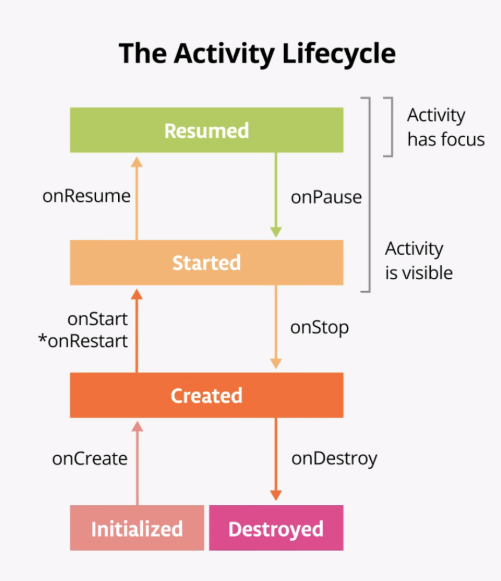
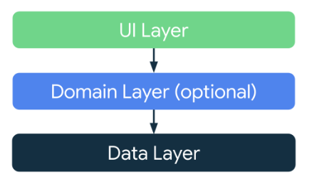
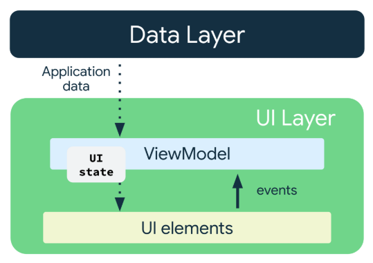
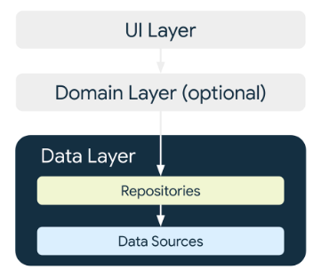
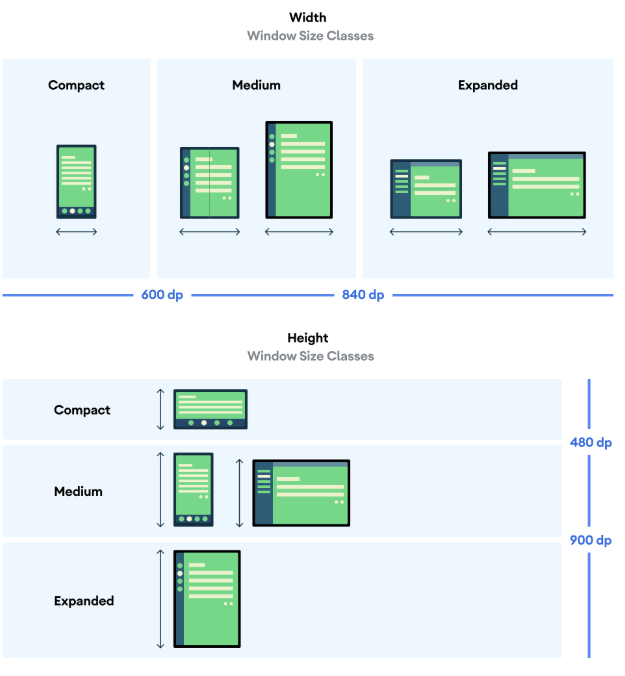
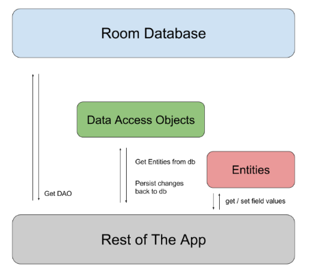

## Lifecycle

<p align="center"></p>

> При повороте экрана `Activity` закрывается и пересоздается заново.

- `onRestart` - вызывается перед `onStart` только если приложение уже было остановлено с помощью `onStop`, но без
  `onDestroy`
- `Log.d(tag, message)` - запись в `DEBUG` консоли  `Logcat`. Тег помогает быстрее находить логи в `Logcat`
- `finish()` - метод для закрытия `Activity`
- `rememberSaveable` - сохраняет состояние при рекомпозиции и изменении конфигурации приложения, аналог `remember`,
  которая работает только при рекомпозиции.
- `LocalContext.current as Activity` - дает доступ к текущей `Activity`

## ViewModel

<p align="center"></p>

<p align="center"></p>

<p align="center"></p>

- `MutableLiveData` - вариант для обработки изменений в состоянии UI, вариант на замену `MutableState`. Чтобы
  использовать в `Jetpack Compose`, нужно вызывать функцию `observeAsState`. Плохо поддерживается с `Jetpack Compose`.
- `MutableStateFlow` - вариант для обработки изменений в состоянии UI, вариант на замену `MutableState`. Чтобы
  использовать в `Jetpack Compose`, нужно вызывать функцию `collectAsState`. Поддерживает реактивность и
  многопоточность.
- `ViewModel` - хранит состояние UI, которое не уничтожается при рекомпозиции и изменении конфигурации.
    - Вариант `rememberSaveable`, но может использоваться вне Compose, более общего назначения.
    - В качестве обсервера для данных относящихся только к UI лучше использовать `MutableState`, а для тех, что
      необходимо хранить - `MutableStateFlow`
    - Лучше использовать backing property для взаимодействия с такими объектами:
      ```kotlin
      private val _uiState = MutableStateFlow(GameUiState())
      val uiState: StateFlow<GameUiState> = _uiState.asStateFlow() // делает объект иммутабельным
      ```
    - Либо можно использовать приватный сеттер:
      ```kotlin
      var userGuess by mutableStateOf("")
      private set
      ```
    - Для использования в `Composable` функциях, нужно передавать в качестве параметра с дефолтным значением
      `viewModel()`. После этого создавать переменную с `by viewmodel.поле.collectAsState()`
    - На изменение состояния мы вызываем функцию `ViewModel` с новым состоянием в качестве параметра. Внутри мы можем
      обновить `MutableStateFlow` с помощью поля `value`, либо с помощью функции `update` (возможно только она вызывает
      рекомпозицию?)

## Навигация

- `NavController` (и его подкласс `NavHostController`) - отвечает за навигацию между экранами с помощью метода
  `navigate()`. Можно получить главный `NavHostController` с помощью `rememberNavController()`. При переходе к
  следующему пункту назначения он кладется в back stack, чтобы потом можно было вернуться к нему кнопкой возврата.
  Можно вернуться к предыдущему пункту назначения с помощью `popBackStack()` с атрибутами `route` и `inclusive`, если
  `true`, то снимает со стека также и сам `route`. Можно получить текущий экран в back stack с помощью
  `currentBackStackEntry` или `by navController.currentBackStackEntryAsState()`. А чтобы получить имя `route` можно
  вызвать у back stack поле `destination?.route`. Для проверки есть ли предыдущий экран можно использовать
  `previousBackStackEntry`. Можно вернуться на предыдущий экран с помощью `navigateUp()` или `navigateBack()`.
- `NavGraph` - определяет `Composable` элементы в качестве пунктов назначения, к которым можно перейти
- `NavHost` - может выбирать `Composable` элемент в качестве текущего пункта назначения. Внутри вызываются
  функции `composable` с атрибутами `route` пунктов назначения. Атрибуты:
    - `navController`
    - `startDestination` - стартовый экран
- `Intent` - позволяет сделать запрос к операционной системе для перехода к другому приложению. Для этого требуется
  создать новую `Activity` с помощью `context.startActivity()` и передать в качестве параметра `Intent`, преобразованный
  в `Activity` с помощью `Intent.createChooser()`. Атрибуты:
    - Тип `Intent`-а - `ACTION_SEND`
    - Дополнительные данные - зависят от типа `Intent`-а, с помощью метода `putExtra()`
    - Тип дополнительных данных - `text/plain`, `image/*`, `video/*`
- `BackHandler` - необходим для обработки возвращения на предыдущий экран в случае, когда для навигации не используется
  `NavHost`

## Accessibility

`Breakpoint range` - разброс размеров экранов, который идентифицирует тип устройства (телефон, планшет)

<p align="center"></p>

- `WindowSizeClass` - класс отвечает за работу с экранами разных размеров
- `calculateWindowSizeClass()` - вычисляет размер окна
- `WindowWidthSizeClass` - ширина экрана, можно получить через поле `widthSizeClass` у `calculateWindowSizeClass()`

## Асинхронность

- `runBlocking()` - создает контекст для запуска корутин
- `lifecycleScope` и `viewModelScope` - встроенные функции для определения контекстов для запуска корутин в `Activity` и
  `ViewModel` соотвественно. Для запуска корутины у них нужно вызвать `launch`.
- `rememberCoroutineScope()` - позволяет создать контекст для запуска корутин, которые будут привязаны к композиции.
- `delay()` - задержка при выполнении корутины
- `launch()` - запуск корутины
- `async()` - запуск корутины, результат которой потом можно синхронно дождаться с помощью `await()`
- `coroutineScope()` - создает новую область выполнения для запуска корутин, которая ждет выполнения всех дочерних
  корутин
- `withContext()` - создает новый контекст, все запущенное внутри будет его иметь, но не ждет выполнения всех дочерних
  корутин
  > Dispatchers - Main, IO, Default

- `runTest()` - используется для тестирования корутин
  > Внутри тестов `delay` не работают
- `advanceTimeBy()` - добавить времени к текущему времени
- `runCurrent()` - выполняет все задачи, оставшиеся в текущий момент вреемени

Для тестов, в которых необходимо создание корутин необходимо изменить `Main` диспатчер на тестовый.
`UnconfinedTestDispatcher` - используется для запуска простых тестов, `StandardTestDispatcher` - дает больший контроль
над выполнением корутин. Код для создания правила замены диспатчера перед и после каждого теста:

```kotlin
class TestDispatcherRule(
    val testDispatcher: TestDispatcher = UnconfinedTestDispatcher(),
) : TestWatcher() {
    override fun starting(description: Description) {
        Dispatchers.setMain(testDispatcher)
    }

    override fun finished(description: Description) {
        Dispatchers.resetMain()
    }
}
```

Код для использования правила:

```kotlin
@get:Rule
val testDispatcher = TestDispatcherRule()
```

## Репозитории

Создается интерфейс, в котором описываются все `suspend` методы для взаимодействия с данными.

После чего создается класс, реализующий интерфейс и его методы. В качестве параметра поступает сервис для получения
данных.

## Retrofit

Для получения доступа к интернету нужно получить `permission` с помощью (добавляется перед `<application>`):
`<uses-permission android:name="android.permission.INTERNET" />`

Создается с помощью:

```kotlin
Retrofit.Builder()
    .addConverterFactory(FACTORY)
    .baseUrl(URL)
    .build()
```

Вместо FACTORY:

- `ScalarsConverterFactory` - для отображения `JSON` в виде `String`
- `Json.asConverterFactory("application/json".toMediaType()` - для преобразования `JSON` в объект. Объект нужно снабдить
  аннотацией `@Serializable`. Если имя поля отличается от имени в `JSON`, то нужно добавить `@SerialName(JSON-имя)` на
  поле.

Создается интерфейс, в котором описываются все `suspend` методы с аннотациями в виде метода HTTP и пути (`@GET("url")`).

После чего создается сервис с помощью `retrofit.create(интерфейс)`, у которого можно вызывать методы и получать данные.

## Room

<p align="center"></p>

Room - обертка вокруг SQLite.

На класс данных:

- `@Entity(tableName)` - для создания таблицы
- `@PrimaryKey(autoGenerate)` - для первичного ключа таблицы
- `@ColumnInfo(name)` - сменить имя для столбца

Для доступа к данным создается `DAO` - интерфейс с аннотацией `@Dao` и методами для взаимодействия с данными:

- `@Query("SQL")` - описание своего запроса, `:параметр` для доступа к параметрам функции в SQL запросе, лучше
  использовать `Flow` в качестве результата. Если используется `Flow`, метод не должен быть `suspend`
- `@Insert(onConflict)` - метод добавления, должен быть `suspend` функцией. `onConflict` задает поведения на случай
  ошибки, допустим при вставке элемента с тем же первичным ключом, можно сделать `ConflictStrategy.IGNORE`
- `@Update` - метод обновления, должен быть suspend функцией
- `@Delete` - метод удаления, должен быть suspend функцией

Также создается абстрактный класс, который наследует `RoomDatabase`, с аннотацией
`@Database(entities=Класс_данных, version = 1, exportSchema = false)`:

- Внутри находится абстрактная функция получения `DAO`
- Синхронизированный синглтон для получения инстанса класса с использованием `Room.databaseBuilder`

```kotlin
companion object {
    @Volatile
    private var INSTANCE: InventoryDatabase? = null

    fun getDatabase(context: Context): InventoryDatabase {
        return INSTANCE ?: synchronized(this) {
            Room.databaseBuilder(context, InventoryDatabase::class.java, "item_database")
                .build()
                .also { INSTANCE = it }
        }
    }
}
```