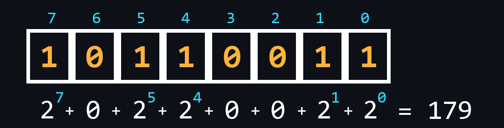
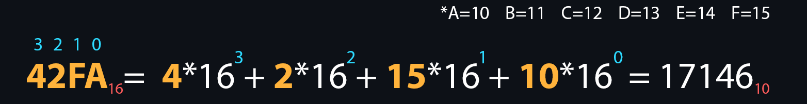

-   ### Системы счисления

    [Система счисления (СС)](https://ru.wikipedia.org/wiki/%D0%A1%D0%B8%D1%81%D1%82%D0%B5%D0%BC%D0%B0_%D1%81%D1%87%D0%B8%D1%81%D0%BB%D0%B5%D0%BD%D0%B8%D1%8F) представляет собой совокупность символов и правил для обозначения чисел. В информатике принято выделять четыре основных системы счисления: двоичная, восьмеричная, десятичная, шестнадцатеричная. Связано это, в первую очередь, с их использованием в различных отраслях программирования.

    -   [Двоичная СС](https://ru.wikipedia.org/wiki/%D0%94%D0%B2%D0%BE%D0%B8%D1%87%D0%BD%D0%B0%D1%8F_%D1%81%D0%B8%D1%81%D1%82%D0%B5%D0%BC%D0%B0_%D1%81%D1%87%D0%B8%D1%81%D0%BB%D0%B5%D0%BD%D0%B8%D1%8F)
        > Самая важная СС для вычислительной техники. Её использование обосновано тем, что логика работы процессора построена на основе всего двух состояний (включено/выключено, открыто/закрыто, высокий/низкий, истина/ложь, да/нет, больше/меньше).

    

    -   [Восьмеричная СС](https://ru.wikipedia.org/wiki/%D0%92%D0%BE%D1%81%D1%8C%D0%BC%D0%B5%D1%80%D0%B8%D1%87%D0%BD%D0%B0%D1%8F_%D1%81%D0%B8%D1%81%D1%82%D0%B5%D0%BC%D0%B0_%D1%81%D1%87%D0%B8%D1%81%D0%BB%D0%B5%D0%BD%D0%B8%D1%8F)
        > Используется, например, в Linux-системах для выдачи прав доступа.

    

    -   [Десятичная СС](https://ru.wikipedia.org/wiki/%D0%94%D0%B5%D1%81%D1%8F%D1%82%D0%B8%D1%87%D0%BD%D0%B0%D1%8F_%D1%81%D0%B8%D1%81%D1%82%D0%B5%D0%BC%D0%B0_%D1%81%D1%87%D0%B8%D1%81%D0%BB%D0%B5%D0%BD%D0%B8%D1%8F)
        > СС которая удобная для восприятия большинству людей.
    -   [Шестнадцатеричная СС](https://ru.wikipedia.org/wiki/%D0%A8%D0%B5%D1%81%D1%82%D0%BD%D0%B0%D0%B4%D1%86%D0%B0%D1%82%D0%B5%D1%80%D0%B8%D1%87%D0%BD%D0%B0%D1%8F_%D1%81%D0%B8%D1%81%D1%82%D0%B5%D0%BC%D0%B0_%D1%81%D1%87%D0%B8%D1%81%D0%BB%D0%B5%D0%BD%D0%B8%D1%8F)
        > Для записи используются дополнительно буквы: A, B, C, D, E, F. Широко используется в низкоуровневом программировании и компьютерной документации из-за, того что минимальной адресуемой единицей памяти является 8-битный байт, значения которого удобно записывать двумя шестнадцатеричными цифрами.

    

    -   Перевод из одной СС в другую
        > Для лучшего понимания можно попробовать [онлайн конвертер](https://cheatsnake.github.io/NSConverter/)

     

    
🔗 <b>Ссылки на материалы</b>

1. 📄 [**Системы счисления: полный гайд**](https://guides.hexlet.io/ru/numeral-systems/)
2. 📺 [**Двоичная система счисления. Самое простое объяснение** – YouTube](https://youtu.be/RcxvcLl1nAs)
3. 📺 [**Системы счисления с нуля | Основы программирования** – YouTube](https://youtu.be/kG_ipMygRUc)
4. 📺 [**Перевод чисел между системами счисления** – YouTube](https://youtu.be/fAmuiQxqWZs)

-   ### Логические операции

    [Логические операции](https://ru.wikipedia.org/wiki/%D0%9B%D0%BE%D0%B3%D0%B8%D1%87%D0%B5%D1%81%D0%BA%D0%B0%D1%8F_%D0%BE%D0%BF%D0%B5%D1%80%D0%B0%D1%86%D0%B8%D1%8F) широко используются в программировании для работы с булевыми типами (true/false или 1/0). Результатом логического выражения также является значение булевого типа.

    <table>
    <tr><td width=33% valign=top>

    И (AND)
    | a | b | a AND b |
    |---|---|:-------:|
    | 0 | 0 | 0       |
    | 0 | 1 | 0       |
    | 1 | 0 | 0       |
    | 1 | 1 | 1       |

    </td><td width=33% valign=top>

    ИЛИ (OR)
    | a | b | a OR b |
    |---|---|:-------:|
    | 0 | 0 | 0       |
    | 0 | 1 | 1       |
    | 1 | 0 | 1       |
    | 1 | 1 | 1       |
    </td><td valign=top>

    Исключающее ИЛИ (XOR)
    | a | b | a XOR b |
    |---|---|:-------:|
    | 0 | 0 | 0       |
    | 0 | 1 | 1       |
    | 1 | 0 | 1       |
    | 1 | 1 | 0       |
    </td></tr>
    </table>

    -   Простейшие логические операции
        > Лежат в основе других всевозможных операций.  
        > Всего их 3: [Операция И (AND, &&, Конъюнкция)](https://ru.wikipedia.org/wiki/%D0%9A%D0%BE%D0%BD%D1%8A%D1%8E%D0%BD%D0%BA%D1%86%D0%B8%D1%8F), [операция ИЛИ (OR, ||, Дизъюнкция)](https://ru.wikipedia.org/wiki/%D0%94%D0%B8%D0%B7%D1%8A%D1%8E%D0%BD%D0%BA%D1%86%D0%B8%D1%8F), [операция НЕ (NOT, !)](https://ru.wikipedia.org/wiki/%D0%9B%D0%BE%D0%B3%D0%B8%D1%87%D0%B5%D1%81%D0%BA%D0%B8%D0%B5_%D1%8D%D0%BB%D0%B5%D0%BC%D0%B5%D0%BD%D1%82%D1%8B#%D0%9E%D1%82%D1%80%D0%B8%D1%86%D0%B0%D0%BD%D0%B8%D0%B5_(%D0%B8%D0%BD%D0%B2%D0%B5%D1%80%D1%81%D0%B8%D1%8F)._%D0%9E%D0%BF%D0%B5%D1%80%D0%B0%D1%86%D0%B8%D1%8F_%C2%AB%D0%9D%D0%95%C2%BB).
    -   Операция [`Исключающее  ИЛИ (XOR, Сложение по модулю 2)`](https://ru.wikipedia.org/wiki/%D0%98%D1%81%D0%BA%D0%BB%D1%8E%D1%87%D0%B0%D1%8E%D1%89%D0%B5%D0%B5_%C2%AB%D0%B8%D0%BB%D0%B8%C2%BB)
        > Важная операция, которая является фундаментальной в области шифрования информации.
    -   [Таблицы истинности](https://ru.wikipedia.org/wiki/%D0%A2%D0%B0%D0%B1%D0%BB%D0%B8%D1%86%D0%B0_%D0%B8%D1%81%D1%82%D0%B8%D0%BD%D0%BD%D0%BE%D1%81%D1%82%D0%B8)
        > Для логических операций существуют специальные таблицы, которые описывают входные данные и возвращаемый результат.
    -   Приоритет операций
        > Наибольший приоритет имеет оператор `НЕ`, за ним следует оператор `И`, а затем оператор `ИЛИ`. С помощью скобок это поведение можно изменить.

    
🔗 <b>Ссылки на материалы</b>

1. 📺 [**Конъюнкция, дизъюнкция, импликация, эквиваленция, отрицание. На примерах из жизни** – YouTube](https://youtu.be/IF7Blq2TT6s)
2. 📄 [**Логические основы алгоритмизации** – GitHub](https://github.com/kolei/OAP/blob/master/articles/t1l3.md)
3. 📺 [**Основы программирования. Логические операции** – YouTube](https://youtu.be/UZetH9129Lw)

-   ### Структуры данных

    [Структуры данных (СД)](https://ru.wikipedia.org/wiki/%D0%A1%D1%82%D1%80%D1%83%D0%BA%D1%82%D1%83%D1%80%D0%B0_%D0%B4%D0%B0%D0%BD%D0%BD%D1%8B%D1%85) – это контейнеры в которых данные хранятся по определенным правилам. В зависимости от этих правил структура данных будет эффективна в одних задачах и неэффективна в других. Поэтому необходимо понимать, когда и где использовать ту или иную структуру.
    -   [Массив](https://ru.wikipedia.org/wiki/%D0%9C%D0%B0%D1%81%D1%81%D0%B8%D0%B2_(%D1%82%D0%B8%D0%BF_%D0%B4%D0%B0%D0%BD%D0%BD%D1%8B%D1%85))
        > СД, которая позволяет хранить данные одинакового типа, где каждому элементу присваивается свой порядковый номер.

    

    -   [Связный список](https://ru.wikipedia.org/wiki/%D0%A1%D0%B2%D1%8F%D0%B7%D0%BD%D1%8B%D0%B9_%D1%81%D0%BF%D0%B8%D1%81%D0%BE%D0%BA)
        > СД где все элементы, помимо данных, содержат ссылки на последующий и/или предыдущий элемент. Существуют 3 разновидности:
        > - Односвязный список – СД, где каждый элемент хранит ссылку только на следующий (одно направление).
        > - Двусвязный список – СД, где элементы содержат ссылки, как на следующий элемент, так и на предыдущий (два направления).
        > - Кольцевой список – разновидность двусвязного списка, где последний элемент кольцевого списка содержит указатель на первый, а первый — на последний.

    

    -   [Стек](https://ru.wikipedia.org/wiki/%D0%A1%D1%82%D0%B5%D0%BA)
        > СД где хранение данных работает по принципу "последним пришел – первым вышел".

    

    -   [Очередь](https://ru.wikipedia.org/wiki/%D0%9E%D1%87%D0%B5%D1%80%D0%B5%D0%B4%D1%8C_(%D0%BF%D1%80%D0%BE%D0%B3%D1%80%D0%B0%D0%BC%D0%BC%D0%B8%D1%80%D0%BE%D0%B2%D0%B0%D0%BD%D0%B8%D0%B5))
        > СД где хранение данных происходит по принципу "первым пришел – первым вышел".

    

    -   [Хеш-таблица](https://ru.wikipedia.org/wiki/%D0%A5%D0%B5%D1%88-%D1%82%D0%B0%D0%B1%D0%BB%D0%B8%D1%86%D0%B0)
        > По другому ассоциативный массив. Здесь для обращения к каждому из элементов используется соответствующее ключевое значение, которое вычисляется с помощью [хеш-функции](https://ru.wikipedia.org/wiki/%D0%A5%D0%B5%D1%88-%D1%84%D1%83%D0%BD%D0%BA%D1%86%D0%B8%D1%8F) по определенному алгоритму.

    

    -   [Дерево](https://ru.wikipedia.org/wiki/%D0%94%D0%B5%D1%80%D0%B5%D0%B2%D0%BE_(%D1%81%D1%82%D1%80%D1%83%D0%BA%D1%82%D1%83%D1%80%D0%B0_%D0%B4%D0%B0%D0%BD%D0%BD%D1%8B%D1%85))
        > СД с иерархической моделью, в виде набора связанных между собой элементов, как правило, никак не упорядоченных.

    

    -   [Куча](https://ru.wikipedia.org/wiki/%D0%9A%D1%83%D1%87%D0%B0_(%D1%81%D1%82%D1%80%D1%83%D0%BA%D1%82%D1%83%D1%80%D0%B0_%D0%B4%D0%B0%D0%BD%D0%BD%D1%8B%D1%85))
        > Аналогична дереву, но в куче, элементы с наибольшим ключом, является корневым узлом (max-куча). Но может быть и наоборот, тогда это min-кучи.

    

    -   [Граф](https://ru.wikipedia.org/wiki/%D0%93%D1%80%D0%B0%D1%84_(%D0%BC%D0%B0%D1%82%D0%B5%D0%BC%D0%B0%D1%82%D0%B8%D0%BA%D0%B0)#%D0%A1%D0%BF%D0%BE%D1%81%D0%BE%D0%B1%D1%8B_%D0%BF%D1%80%D0%B5%D0%B4%D1%81%D1%82%D0%B0%D0%B2%D0%BB%D0%B5%D0%BD%D0%B8%D1%8F_%D0%B3%D1%80%D0%B0%D1%84%D0%B0_%D0%B2_%D0%B8%D0%BD%D1%84%D0%BE%D1%80%D0%BC%D0%B0%D1%82%D0%B8%D0%BA%D0%B5)
        > Структура, которая предназначена для работы с большим количеством связей.

    

    
🔗 <b>Ссылки на материалы</b>

1. 📄 [**8 структур данных, которые должен знать каждый программист**](https://blog.askmentor.io/8-data-structure-everybody-should-know/)
2. 📄 [**Структуры данных для самых маленьких** – habr.com](https://habr.com/ru/post/310794/)
3. 📄 [**Обзор наиболее часто используемых структур данных** – habr.com](https://habr.com/ru/post/128457/)
4. 📺 [**Вся правда о массивах** – YouTube](https://youtu.be/47_LhSf-ago)
5. 📺 [**Как работает стек** – YouTube](https://www.youtube.com/watch?v=MXoMuymbfo8)
6. 📺 [**Хэш-таблицы за 10 минут** – YouTube](https://youtu.be/0UX4MIfOMEs)
7. 📺 [**Как работают хэш-таблицы** – YouTube](https://youtu.be/cWbuK7C13HQ)

-   ### Базовые алгоритмы

    [Алгоритмы](https://ru.wikipedia.org/wiki/%D0%90%D0%BB%D0%B3%D0%BE%D1%80%D0%B8%D1%82%D0%BC) подразумевают под собой наборы последовательных инструкций (шагов), которые приводят к решению поставленной задачи. За всю человеческую историю было придумано огромное количество алгоритмов, которые позволяют решать определенные задачи максимально эффективным способом. Соответственно правильный выбор алгоритмов в программировании позволит создавать максимально быстрые и ресурсоемкие решения.
    > Существует очень хорошая книжка по алгоритмам – [Грокаем алгоритмы](https://github.com/mduisenov/GrokkingAlgorithms). С ней можно параллельно начать [изучение языка программирования](#язык-программирования).

     

    -   [Двоичный поиск](https://ru.wikipedia.org/wiki/%D0%94%D0%B2%D0%BE%D0%B8%D1%87%D0%BD%D1%8B%D0%B9_%D0%BF%D0%BE%D0%B8%D1%81%D0%BA)
        > Максимально эффективный алгоритм поиска для отсортированных списков.
    -   [Сортировка выбором](https://ru.wikipedia.org/wiki/%D0%A1%D0%BE%D1%80%D1%82%D0%B8%D1%80%D0%BE%D0%B2%D0%BA%D0%B0_%D0%B2%D1%8B%D0%B1%D0%BE%D1%80%D0%BE%D0%BC)
        > На каждом шаге алгоритма происходит поиск минимального элемента и затем он меняется местами с текущим элементом итерации.
    -   [Рекурсия](https://ru.wikipedia.org/wiki/%D0%A0%D0%B5%D0%BA%D1%83%D1%80%D1%81%D0%B8%D1%8F#%D0%92_%D0%BF%D1%80%D0%BE%D0%B3%D1%80%D0%B0%D0%BC%D0%BC%D0%B8%D1%80%D0%BE%D0%B2%D0%B0%D0%BD%D0%B8%D0%B8)
        > Когда функция может вызывать сама себя и так до бесконечности. С одной стороны решения на основе рекурсии выглядят очень элегантно, а с другой стороны такой подход очень быстро приводит к переполнению стека и его рекомендуют избегать.
    -   [Сортировка пузырьком](https://ru.wikipedia.org/wiki/%D0%A1%D0%BE%D1%80%D1%82%D0%B8%D1%80%D0%BE%D0%B2%D0%BA%D0%B0_%D0%BF%D1%83%D0%B7%D1%8B%D1%80%D1%8C%D0%BA%D0%BE%D0%BC)
        > На каждой итерации последовательно сравниваются соседние элементы, и, если порядок в паре неверный, то элементы меняют местами.
    -   [Быстрая сортировка](https://ru.wikipedia.org/wiki/%D0%91%D1%8B%D1%81%D1%82%D1%80%D0%B0%D1%8F_%D1%81%D0%BE%D1%80%D1%82%D0%B8%D1%80%D0%BE%D0%B2%D0%BA%D0%B0)
        > Усовершенствованный метод пузырьковой сортировки.
    -   [Поиск в ширину](https://ru.wikipedia.org/wiki/%D0%9F%D0%BE%D0%B8%D1%81%D0%BA_%D0%B2_%D1%88%D0%B8%D1%80%D0%B8%D0%BD%D1%83)
        > Позволяет находить все кратчайшие пути от заданной вершины графа.
    -   [Алгоритм Дейкстры](https://ru.wikipedia.org/wiki/%D0%90%D0%BB%D0%B3%D0%BE%D1%80%D0%B8%D1%82%D0%BC_%D0%94%D0%B5%D0%B9%D0%BA%D1%81%D1%82%D1%80%D1%8B)
        > Находит кратчайшие пути между всеми вершинами графа и их длину.
    -   [Жадный алгоритм](https://ru.wikipedia.org/wiki/%D0%96%D0%B0%D0%B4%D0%BD%D1%8B%D0%B9_%D0%B0%D0%BB%D0%B3%D0%BE%D1%80%D0%B8%D1%82%D0%BC)
        > Алгоритм, который на каждом шагу делает локально наилучший выбор в надежде, что итоговое решение будет оптимальным.

     

    
🔗 <b>Ссылки на материалы</b>

1. 📺 [**Алгоритмы и структуры данных. Подготовительный курс (плейлист)** – YouTube](https://youtube.com/playlist?list=PLrCZzMib1e9pDxHYzmEzMmnMMUK-dz0_7)
2. 📺 [**Алгоритмы и структуры данных на JavaScript** – YouTube](https://youtu.be/NErrGZ64OdE)
3. 📺 [**Как работают сортировки** – YouTube](https://youtu.be/PF7AqefS4MU)
4. 📄 [**Сортировки выбором** – habr.com](https://habr.com/ru/post/422085/)
5. 📺 [**Сортировка выбором** – YouTube](https://youtu.be/KZxP5JqtKKA)
6. 📄 [**Рекурсия. Занимательные задачки** – habr.com](https://habr.com/ru/post/275813/)
7. 📄 [**Пузырьковая сортировка и все-все-все** – habr.com](https://habr.com/ru/post/204600/)
8. 📄 [**Алгоритм Дейкстры** – habr.com](https://habr.com/ru/post/111361/)
9. 📄 [**Жадные алгоритмы** – habr.com](https://habr.com/ru/post/120343/)
10. 📄 [**Визуализация алгоритмов сортировки**](https://www.cs.usfca.edu/~galles/visualization/ComparisonSort.html)
11. 📄 [**Сайт с алгоритмами и структурами данных**](https://ru.algorithmica.org/)
12. 📄 [**Крупнейшая библиотека алгоритмов на разных языках**](https://ru.algorithmica.org/ru)
13. 📄 [**Большая коллекция алгоритмов** – GitHub](https://github.com/trekhleb/javascript-algorithms)
14. 📘 [**Алгоритмы. Руководство по разработке** – Скиена Стивен С., 2011](https://static-ru.insales.ru/files/1/445/10019261/original/935462548.pdf?1566571639)
15. 📘 [**Спортивное программирование** – Халим С., 2020](https://ftp.zhirov.website/books/IT/%D0%90%D0%BB%D0%B3%D0%BE%D1%80%D0%B8%D1%82%D0%BC%D1%8B/%D0%A1%D0%BF%D0%BE%D1%80%D1%82%D0%B8%D0%B2%D0%BD%D0%BE%D0%B5%20%D0%BF%D1%80%D0%BE%D0%B3%D1%80%D0%B0%D0%BC%D0%BC%D0%B8%D1%80%D0%BE%D0%B2%D0%B0%D0%BD%D0%B8%D0%B5%20%28%D0%A1%D1%82%D0%B8%D0%B2%D0%B5%D0%BD%20%D0%A5%D0%B0%D0%BB%D0%B8%D0%BC%2C%20%D0%A4%D0%B5%D0%BB%D0%B8%D0%BA%D1%81%20%D0%A5%D0%B0%D0%BB%D0%B8%D0%BC%29.pdf)

-   ### Оценка сложности алгоритмов

    

    В мире программирования существует специальная единица измерения [Большое О (Big O, О-нотация)](https://ru.wikipedia.org/wiki/%C2%ABO%C2%BB_%D0%B1%D0%BE%D0%BB%D1%8C%D1%88%D0%BE%D0%B5_%D0%B8_%C2%ABo%C2%BB_%D0%BC%D0%B0%D0%BB%D0%BE%D0%B5). Оно описывает то, как сложность алгоритма растёт с увеличением количества входных данных. Большое О оценивает то, сколько действий (шагов/итераций) необходимо совершить для выполнения алгоритма, при этом всегда показывая худший вариант развития событий.

    -   Основные разновидности сложности алгоритмов
        > - Константная - O(1)  
        > - Линейная - O(n)  
        > - Логарифмическая - O(log n)  
        > - Линеарифметическая - O(n * log n)  
        > - Квадратичная - O(n^2)  
        > - Степенная - О(2^n)  
        > - Факториальная - O(!n)  
    -   [Временная сложность](https://ru.wikipedia.org/wiki/%D0%92%D1%80%D0%B5%D0%BC%D0%B5%D0%BD%D0%BD%D0%B0%D1%8F_%D1%81%D0%BB%D0%BE%D0%B6%D0%BD%D0%BE%D1%81%D1%82%D1%8C_%D0%B0%D0%BB%D0%B3%D0%BE%D1%80%D0%B8%D1%82%D0%BC%D0%B0)
        > Когда вы заранее знаете, на какой машине будет выполняться алгоритм, вы можете измерить время выполнения алгоритма. Опять же, на очень хорошем железе время выполнения алгоритма может быть вполне приемлемым, но тот же алгоритм на более слабой машине может выполняться сотни миллисекунд или даже несколько секунд. Такие задержки будут очень чувствительны, если ваше приложение обрабатывает запросы пользователей по сети.
    -   [Пространственная сложность](https://ru.wikipedia.org/wiki/%D0%92%D1%8B%D1%87%D0%B8%D1%81%D0%BB%D0%B8%D1%82%D0%B5%D0%BB%D1%8C%D0%BD%D0%B0%D1%8F_%D1%81%D0%BB%D0%BE%D0%B6%D0%BD%D0%BE%D1%81%D1%82%D1%8C#%D0%92%D1%80%D0%B5%D0%BC%D0%B5%D0%BD%D0%BD%D0%B0%D1%8F_%D0%B8_%D0%BF%D1%80%D0%BE%D1%81%D1%82%D1%80%D0%B0%D0%BD%D1%81%D1%82%D0%B2%D0%B5%D0%BD%D0%BD%D0%B0%D1%8F_%D1%81%D0%BB%D0%BE%D0%B6%D0%BD%D0%BE%D1%81%D1%82%D0%B8)
        > Помимо времени, необходимо учитывать, сколько памяти тратится на работу алгоритма. Это важно, поскольку вы всегда работаете с ограниченными ресурсами.

    
🔗 <b>Ссылки на материалы</b>

1. 📄 [**Сложность алгоритмов. Big O. Основы**](https://bimlibik.github.io/posts/complexity-of-algorithms/)
2. 📺 [**Вся сложность алгоритмов за 11 минут** – YouTube](https://youtu.be/cXCuXNwzdfY)
3. 📄 [**Шпаргалка по Big O**](https://www.bigocheatsheet.com/)
4. 📄 [**Шпаргалка по Big O** – Learn X in Y minutes](https://learnxinyminutes.com/docs/ru-ru/asymptotic-notation-ru/)
5. 📄 [**Нотация «О» большое: объяснение на примерах**](https://techrocks.ru/2021/04/02/big-o-notation-examples/)

