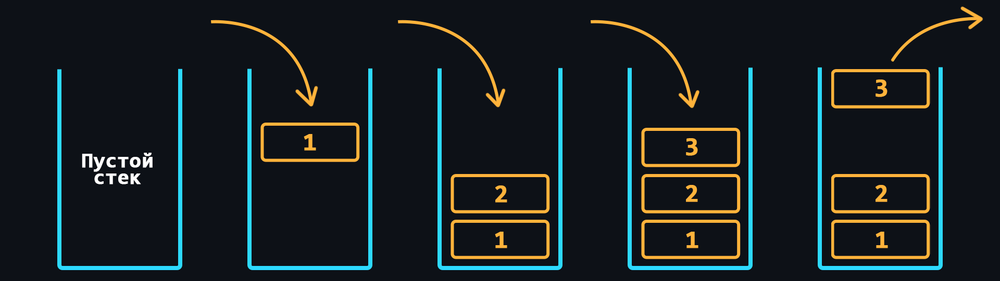
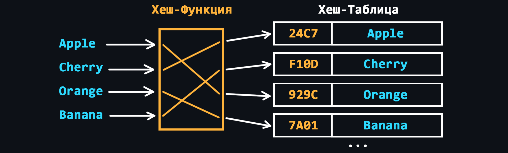
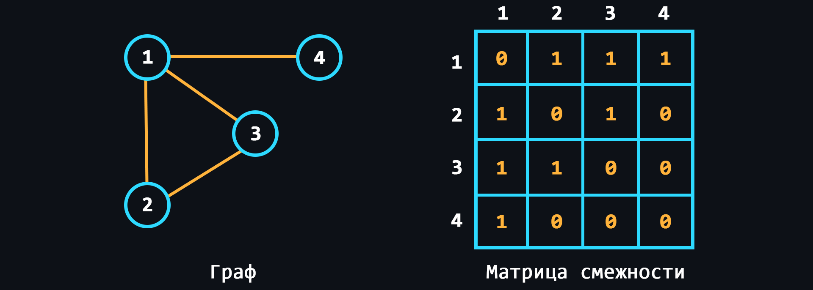

-   ### Структуры данных

    [Структуры данных (СД)](https://ru.wikipedia.org/wiki/%D0%A1%D1%82%D1%80%D1%83%D0%BA%D1%82%D1%83%D1%80%D0%B0_%D0%B4%D0%B0%D0%BD%D0%BD%D1%8B%D1%85) – это контейнеры в которых данные хранятся по определенным правилам. В зависимости от этих правил структура данных будет эффективна в одних задачах и неэффективна в других. Поэтому необходимо понимать, когда и где использовать ту или иную структуру.
    -   [Массив](https://ru.wikipedia.org/wiki/%D0%9C%D0%B0%D1%81%D1%81%D0%B8%D0%B2_(%D1%82%D0%B8%D0%BF_%D0%B4%D0%B0%D0%BD%D0%BD%D1%8B%D1%85))
        > СД, которая позволяет хранить данные одинакового типа, где каждому элементу присваивается свой порядковый номер.

    

    -   [Связный список](https://ru.wikipedia.org/wiki/%D0%A1%D0%B2%D1%8F%D0%B7%D0%BD%D1%8B%D0%B9_%D1%81%D0%BF%D0%B8%D1%81%D0%BE%D0%BA)
        > СД, где все элементы, помимо данных, содержат ссылки на последующий и/или предыдущий элемент. Существуют 3 разновидности:
        > - Односвязный список – СД, где каждый элемент хранит ссылку только на следующий (одно направление).
        > - Двусвязный список – СД, где элементы содержат ссылки, как на следующий элемент, так и на предыдущий (два направления).
        > - Кольцевой список – разновидность односвязного иди двусвязного списка, где последний элемент кольцевого списка содержит указатель на первый, а первый — на последний (в случае двусвязного списка).
        > - [Развёрнутый связный список](https://ru.wikipedia.org/wiki/%D0%A0%D0%B0%D0%B7%D0%B2%D1%91%D1%80%D0%BD%D1%83%D1%82%D1%8B%D0%B9_%D1%81%D0%B2%D1%8F%D0%B7%D0%BD%D1%8B%D0%B9_%D1%81%D0%BF%D0%B8%D1%81%D0%BE%D0%BA) – список, каждый физический элемент которого содержит несколько логических элементов. Прирост производительности достигается за счёт того, что большая часть операций проводится над относительно небольшими массивами, которые обычно целиком помещаются в кэш-памяти.

    

    -   [Стек](https://ru.wikipedia.org/wiki/%D0%A1%D1%82%D0%B5%D0%BA)
        > СД, где хранение данных работает по принципу "последним пришел – первым вышел".

    

    -   [Очередь](https://ru.wikipedia.org/wiki/%D0%9E%D1%87%D0%B5%D1%80%D0%B5%D0%B4%D1%8C_(%D0%BF%D1%80%D0%BE%D0%B3%D1%80%D0%B0%D0%BC%D0%BC%D0%B8%D1%80%D0%BE%D0%B2%D0%B0%D0%BD%D0%B8%D0%B5))
        > СД, где хранение данных происходит по принципу "первым пришел – первым вышел".

        > [Двусвязная очередь](https://ru.wikipedia.org/wiki/%D0%94%D0%B2%D1%83%D1%85%D1%81%D1%82%D0%BE%D1%80%D0%BE%D0%BD%D0%BD%D1%8F%D1%8F_%D0%BE%D1%87%D0%B5%D1%80%D0%B5%D0%B4%D1%8C) - абстрактный тип данных, в котором элементы можно добавлять и удалять как в начало, так и в конец. Может быть реализована при помощи двусвязного списка.

    

    -   [Хеш-таблица](https://ru.wikipedia.org/wiki/%D0%A5%D0%B5%D1%88-%D1%82%D0%B0%D0%B1%D0%BB%D0%B8%D1%86%D0%B0)
        >  СД, реализующая интерфейс ассоциативного массива. Здесь для обращения к каждому из элементов используется соответствующее ключевое значение, которое вычисляется с помощью [хеш-функции](https://ru.wikipedia.org/wiki/%D0%A5%D0%B5%D1%88-%D1%84%D1%83%D0%BD%D0%BA%D1%86%D0%B8%D1%8F) по определенному алгоритму.
        
        > Существуют два основных варианта хеш-таблиц: с открытой адресацией и списками. Хеш-таблица является массивом, элементы которого есть пары (хеш-таблица с открытой адресацией) или списки пар (хеш-таблица со списками).
    
        > Ситуация, когда для различных ключей получается одно и то же хеш-значение, называется коллизией. Если все ключи элементов известны заранее (или очень редко меняются), то для них можно найти некоторую совершенную хеш-функцию, которая распределит их по ячейкам хеш-таблицы без коллизий. Хеш-таблицы, использующие подобные хеш-функции, не нуждаются в механизме разрешения коллизий, и называются хеш-таблицами с прямой адресацией.
        
        > Число хранимых элементов, делённое на размер массива (число возможных значений хеш-функции), называется коэффициентом заполнения хеш-таблицы (load factor) и является важным параметром, от которого зависит среднее время выполнения операций.

        > - [Префиксное дерево](https://ru.wikipedia.org/wiki/%D0%9F%D1%80%D0%B5%D1%84%D0%B8%D0%BA%D1%81%D0%BD%D0%BE%D0%B5_%D0%B4%D0%B5%D1%80%D0%B5%D0%B2%D0%BE) - структура данных, позволяющая хранить ассоциативный массив, ключами которого чаще всего являются строки. Представляет собой корневое дерево, каждое ребро которого помечено каким-то символом так, что для любого узла все рёбра, соединяющие этот узел с его сыновьями, помечены разными символами. Некоторые узлы префиксного дерева отмечены и считается, что префиксное дерево содержит данную строку-ключ тогда и только тогда, когда эту строку можно прочитать на пути из корня до некоторого (единственного для этой строки) отмеченного узла. В сжатом префиксном дереве узел A, являющийся единственным потомком узла B, сливается с узлом B.

        > - [Суффиксное дерево](https://ru.wikipedia.org/wiki/%D0%A1%D1%83%D1%84%D1%84%D0%B8%D0%BA%D1%81%D0%BD%D0%BE%D0%B5_%D0%B4%D0%B5%D1%80%D0%B5%D0%B2%D0%BE) - сжатое префиксное дерево, построенный на всех суффиксах некоторой строки.

    

    -   [Дерево](https://ru.wikipedia.org/wiki/%D0%94%D0%B5%D1%80%D0%B5%D0%B2%D0%BE_(%D1%81%D1%82%D1%80%D1%83%D0%BA%D1%82%D1%83%D1%80%D0%B0_%D0%B4%D0%B0%D0%BD%D0%BD%D1%8B%D1%85))
        > СД с иерархической моделью, в виде набора связанных между собой элементов, как правило, никак не упорядоченных. Виды:
        > - [Двоичное дерево поиска](https://ru.wikipedia.org/wiki/%D0%94%D0%B2%D0%BE%D0%B8%D1%87%D0%BD%D0%BE%D0%B5_%D0%B4%D0%B5%D1%80%D0%B5%D0%B2%D0%BE_%D0%BF%D0%BE%D0%B8%D1%81%D0%BA%D0%B0) - двоичное дерево с условиями:
        >   - оба поддерева — левое и правое — являются двоичными деревьями поиска
        >   - у всех узлов левого поддерева произвольного узла X значения ключей данных меньше либо равны, нежели значение ключа данных самого узла X
        >   - у всех узлов правого поддерева произвольного узла X значения ключей данных больше, нежели значение ключа данных самого узла X
        > - [Красно-чёрное дерево](https://ru.wikipedia.org/wiki/%D0%9A%D1%80%D0%B0%D1%81%D0%BD%D0%BE-%D1%87%D1%91%D1%80%D0%BD%D0%BE%D0%B5_%D0%B4%D0%B5%D1%80%D0%B5%D0%B2%D0%BE) - самобалансирующихся двоичных деревьев поиска, гарантирующих логарифмический рост высоты дерева от числа узлов и позволяющее быстро выполнять основные операции дерева поиска: добавление, удаление и поиск узла. Сбалансированность достигается за счёт введения дополнительного атрибута узла дерева — «цвета». Этот атрибут может принимать одно из двух возможных значений — «чёрный» или «красный».
        > - [Splay-дерево](https://ru.wikipedia.org/wiki/Splay-%D0%B4%D0%B5%D1%80%D0%B5%D0%B2%D0%BE) - двоичное дерево поиска, в котором поддерживается свойство сбалансированности. Для сбалансированности, «расширяющие операции» (splay operation), частью которых являются вращения, выполняются при каждом обращении к дереву.
        > - [АВЛ-дерево](https://ru.wikipedia.org/wiki/%D0%90%D0%92%D0%9B-%D0%B4%D0%B5%D1%80%D0%B5%D0%B2%D0%BE) - идеальное сбалансированное по высоте двоичное дерево поиска - для каждой его вершины высота её двух поддеревьев различается не более чем на 1. Для поддержания баланса, если при новой вставке высота поддеревьев различается больше, чем на 1, происходит балансировка. В каждой вершине хранится значение глубины поддерева.
        > - [B-дерево](https://ru.wikipedia.org/wiki/B-%D0%B4%D0%B5%D1%80%D0%B5%D0%B2%D0%BE) - сбалансированное, сильно ветвистое дерево. С точки зрения физической организации B-дерево представляется как мультисписочная структура страниц памяти, то есть каждому узлу дерева соответствует блок памяти (страница). Внутренние и листовые страницы обычно имеют разную структуру. Структура B-дерева применяется для организации индексов во многих современных СУБД.
        > - [R-дерево](https://ru.wikipedia.org/wiki/R-%D0%B4%D0%B5%D1%80%D0%B5%D0%B2%D0%BE_(%D1%81%D1%82%D1%80%D1%83%D0%BA%D1%82%D1%83%D1%80%D0%B0_%D0%B4%D0%B0%D0%BD%D0%BD%D1%8B%D1%85)) - подобна B-дереву, но используется для организации доступа к пространственным данным, то есть для индексации многомерной информации, такой, например, как географические данные с двумерными координатами (широтой и долготой). Типичным запросом с использованием R-деревьев мог бы быть такой: «Найти все музеи в пределах 2 километров от моего текущего местоположения». Эта структура данных разбивает многомерное пространство на множество иерархически вложенных и, возможно, пересекающихся, прямоугольников (для двумерного пространства).

    

    -   [Куча](https://ru.wikipedia.org/wiki/%D0%9A%D1%83%D1%87%D0%B0_(%D1%81%D1%82%D1%80%D1%83%D0%BA%D1%82%D1%83%D1%80%D0%B0_%D0%B4%D0%B0%D0%BD%D0%BD%D1%8B%D1%85))
        > Аналогична дереву, но в куче, элементы с наибольшим ключом, является корневым узлом (max-куча). Но может быть и наоборот, тогда это min-кучи. Виды:
        > - [Очередь с приоритетом](https://ru.wikipedia.org/wiki/%D0%9E%D1%87%D0%B5%D1%80%D0%B5%D0%B4%D1%8C_%D1%81_%D0%BF%D1%80%D0%B8%D0%BE%D1%80%D0%B8%D1%82%D0%B5%D1%82%D0%BE%D0%BC_(%D0%BF%D1%80%D0%BE%D0%B3%D1%80%D0%B0%D0%BC%D0%BC%D0%B8%D1%80%D0%BE%D0%B2%D0%B0%D0%BD%D0%B8%D0%B5)) — абстрактный тип данных в программировании, поддерживающий две обязательные операции — добавить элемент и извлечь максимум (минимум). Предполагается, что для каждого элемента можно вычислить его приоритет. Реализуется с помощью двоичной кучи, биномиальной кучи или фибоначчиевой кучи.
        > - [Двоичная куча](https://ru.wikipedia.org/wiki/%D0%94%D0%B2%D0%BE%D0%B8%D1%87%D0%BD%D0%B0%D1%8F_%D0%BA%D1%83%D1%87%D0%B0) - двоичное дерево с условиями:
        >   - Значение в любой вершине не меньше, чем значения её потомков
        >   - Глубина всех листьев (расстояние до корня) различается не более чем на 1 слой.
        >   - Последний слой заполняется слева направо без «дырок».
        > - [Биномиальная куча](https://ru.wikipedia.org/wiki/%D0%94%D0%B2%D0%BE%D0%B8%D1%87%D0%BD%D0%B0%D1%8F_%D0%BA%D1%83%D1%87%D0%B0)
        > - [Фибоначчиева куча](https://ru.wikipedia.org/wiki/%D0%94%D0%B2%D0%BE%D0%B8%D1%87%D0%BD%D0%B0%D1%8F_%D0%BA%D1%83%D1%87%D0%B0)
    

    -   [Граф](https://ru.wikipedia.org/wiki/%D0%93%D1%80%D0%B0%D1%84_(%D0%BC%D0%B0%D1%82%D0%B5%D0%BC%D0%B0%D1%82%D0%B8%D0%BA%D0%B0)#%D0%A1%D0%BF%D0%BE%D1%81%D0%BE%D0%B1%D1%8B_%D0%BF%D1%80%D0%B5%D0%B4%D1%81%D1%82%D0%B0%D0%B2%D0%BB%D0%B5%D0%BD%D0%B8%D1%8F_%D0%B3%D1%80%D0%B0%D1%84%D0%B0_%D0%B2_%D0%B8%D0%BD%D1%84%D0%BE%D1%80%D0%BC%D0%B0%D1%82%D0%B8%D0%BA%D0%B5)
        > Структура, которая предназначена для работы с большим количеством связей. Можно представить с помощью:
        > - [Матрица смежности](https://ru.wikipedia.org/wiki/%D0%9C%D0%B0%D1%82%D1%80%D0%B8%D1%86%D0%B0_%D1%81%D0%BC%D0%B5%D0%B6%D0%BD%D0%BE%D1%81%D1%82%D0%B8) - представление в виде таблицы, где строки и столбцы - вершины.
        > - [Матрица инцидентности](https://ru.wikipedia.org/wiki/%D0%9C%D0%B0%D1%82%D1%80%D0%B8%D1%86%D0%B0_%D0%B8%D0%BD%D1%86%D0%B8%D0%B4%D0%B5%D0%BD%D1%82%D0%BD%D0%BE%D1%81%D1%82%D0%B8) - представление в виде таблицы, где строки - вершины, а столбцы - ребра. Для ориентированного графа на пересечении стоят 1, 0, -1.
        > - [Список смежности](https://ru.wikipedia.org/wiki/%D0%A1%D0%BF%D0%B8%D1%81%D0%BE%D0%BA_%D1%81%D0%BC%D0%B5%D0%B6%D0%BD%D0%BE%D1%81%D1%82%D0%B8) - каждой вершине соотвествует список, в которой хранится список смежных вершин
        > - Список рёбер - каждому ребру соответствует набор из 2 вершин, инцидентных ребру

    

    
🔗 <b>Ссылки на материалы</b>

1. 📄 [**Список структур данных**](https://ru.wikipedia.org/wiki/%D0%9F%D1%80%D0%BE%D0%B5%D0%BA%D1%82:%D0%9C%D0%B0%D1%82%D0%B5%D0%BC%D0%B0%D1%82%D0%B8%D0%BA%D0%B0/%D0%A1%D0%BF%D0%B8%D1%81%D0%BA%D0%B8/%D0%A1%D0%BF%D0%B8%D1%81%D0%BE%D0%BA_%D1%81%D1%82%D1%80%D1%83%D0%BA%D1%82%D1%83%D1%80_%D0%B4%D0%B0%D0%BD%D0%BD%D1%8B%D1%85)
2. 📄 [**8 структур данных, которые должен знать каждый программист**](https://blog.askmentor.io/8-data-structure-everybody-should-know/)
3. 📄 [**Структуры данных для самых маленьких** – habr.com](https://habr.com/ru/post/310794/)
4. 📄 [**Обзор наиболее часто используемых структур данных** – habr.com](https://habr.com/ru/post/128457/)
5. 📺 [**Вся правда о массивах** – YouTube](https://youtu.be/47_LhSf-ago)
6. 📺 [**Как работает стек** – YouTube](https://www.youtube.com/watch?v=MXoMuymbfo8)
7. 📺 [**Хэш-таблицы за 10 минут** – YouTube](https://youtu.be/0UX4MIfOMEs)
8. 📺 [**Как работают хэш-таблицы** – YouTube](https://youtu.be/cWbuK7C13HQ)

-   ### Базовые алгоритмы

    [Алгоритмы](https://ru.wikipedia.org/wiki/%D0%90%D0%BB%D0%B3%D0%BE%D1%80%D0%B8%D1%82%D0%BC) подразумевают под собой наборы последовательных инструкций (шагов), которые приводят к решению поставленной задачи. За всю человеческую историю было придумано огромное количество алгоритмов, которые позволяют решать определенные задачи максимально эффективным способом. Соответственно правильный выбор алгоритмов в программировании позволит создавать максимально быстрые и ресурсоемкие решения.
    > Существует очень хорошая книжка по алгоритмам – [Грокаем алгоритмы](https://github.com/mduisenov/GrokkingAlgorithms).

     

    - Общее
      > - [Рекурсия](https://ru.wikipedia.org/wiki/%D0%A0%D0%B5%D0%BA%D1%83%D1%80%D1%81%D0%B8%D1%8F#%D0%92_%D0%BF%D1%80%D0%BE%D0%B3%D1%80%D0%B0%D0%BC%D0%BC%D0%B8%D1%80%D0%BE%D0%B2%D0%B0%D0%BD%D0%B8%D0%B8) - когда функция может вызывать сама себя и так до бесконечности. С одной стороны решения на основе рекурсии выглядят очень элегантно, а с другой стороны такой подход очень быстро приводит к переполнению стека и его рекомендуют избегать.
      > - [Жадный алгоритм](https://ru.wikipedia.org/wiki/%D0%96%D0%B0%D0%B4%D0%BD%D1%8B%D0%B9_%D0%B0%D0%BB%D0%B3%D0%BE%D1%80%D0%B8%D1%82%D0%BC) - алгоритм, который на каждом шагу делает локально наилучший выбор в надежде, что итоговое решение будет оптимальным.
      > - [Двоичный поиск](https://ru.wikipedia.org/wiki/%D0%94%D0%B2%D0%BE%D0%B8%D1%87%D0%BD%D1%8B%D0%B9_%D0%BF%D0%BE%D0%B8%D1%81%D0%BA) - максимально эффективный алгоритм поиска для отсортированных списков. На каждом шаге выбирается центральный элемент и сравнивается с искомым, после чего алгоритм рекурсивно вызывается либо с левой, либо с правой частью.
    - [Сортировки](https://ru.wikipedia.org/wiki/%D0%90%D0%BB%D0%B3%D0%BE%D1%80%D0%B8%D1%82%D0%BC_%D1%81%D0%BE%D1%80%D1%82%D0%B8%D1%80%D0%BE%D0%B2%D0%BA%D0%B8)
      > - [Сортировка выбором](https://ru.wikipedia.org/wiki/%D0%A1%D0%BE%D1%80%D1%82%D0%B8%D1%80%D0%BE%D0%B2%D0%BA%D0%B0_%D0%B2%D1%8B%D0%B1%D0%BE%D1%80%D0%BE%D0%BC) - O(n2), неустойчивая сортировка, на каждом шаге алгоритма происходит поиск минимального элемента и затем он меняется местами с текущим элементом итерации (первым из неупорядоченной части).
      > - [Сортировка пузырьком](https://ru.wikipedia.org/wiki/%D0%A1%D0%BE%D1%80%D1%82%D0%B8%D1%80%D0%BE%D0%B2%D0%BA%D0%B0_%D0%BF%D1%83%D0%B7%D1%8B%D1%80%D1%8C%D0%BA%D0%BE%D0%BC) - O(n2), устойчивая сортировка, на каждой итерации последовательно сравниваются соседние элементы, и, если порядок в паре неверный, то элементы меняют местами.
      > - [Сортировка вставками](https://ru.wikipedia.org/wiki/%D0%A1%D0%BE%D1%80%D1%82%D0%B8%D1%80%D0%BE%D0%B2%D0%BA%D0%B0_%D0%B2%D1%81%D1%82%D0%B0%D0%B2%D0%BA%D0%B0%D0%BC%D0%B8) - O(n2), устойчивая сортировка, элементы входной последовательности просматриваются по одному, и каждый новый поступивший элемент размещается в подходящее место среди ранее упорядоченных элементов.
      > - [Сортировка с помощью двоичного дерева](https://ru.wikipedia.org/wiki/%D0%A1%D0%BE%D1%80%D1%82%D0%B8%D1%80%D0%BE%D0%B2%D0%BA%D0%B0_%D1%81_%D0%BF%D0%BE%D0%BC%D0%BE%D1%89%D1%8C%D1%8E_%D0%B4%D0%B2%D0%BE%D0%B8%D1%87%D0%BD%D0%BE%D0%B3%D0%BE_%D0%B4%D0%B5%D1%80%D0%B5%D0%B2%D0%B0) - O(n * logn), устойчивая сортировка, на основе исходных данных строится двоичное дерево поиска, после чего происходит сборка результирующего массива путём обхода узлов в необходимом порядке следования ключей.
      > - [Быстрая сортировка](https://ru.wikipedia.org/wiki/%D0%91%D1%8B%D1%81%D1%82%D1%80%D0%B0%D1%8F_%D1%81%D0%BE%D1%80%D1%82%D0%B8%D1%80%D0%BE%D0%B2%D0%BA%D0%B0) - O(n * logn), неустойчивая сортировка, выбирается опорный элемент p, обычно это средний элемент. Все ключи, меньшие p, перемещаются влево от него, а все ключи, большие либо равные p, вправо. Далее алгоритм рекурсивно применяется к каждой из частей.
      > - [Сортировка слиянием](https://ru.wikipedia.org/wiki/%D0%A1%D0%BE%D1%80%D1%82%D0%B8%D1%80%D0%BE%D0%B2%D0%BA%D0%B0_%D1%81%D0%BB%D0%B8%D1%8F%D0%BD%D0%B8%D0%B5%D0%BC) - O(n * logn), устойчивая сортировка, рекурсивно сортирует половины массива, а затем комбинирует их в один.
      > - [Пирамидальная сортировка](https://ru.wikipedia.org/wiki/%D0%9F%D0%B8%D1%80%D0%B0%D0%BC%D0%B8%D0%B4%D0%B0%D0%BB%D1%8C%D0%BD%D0%B0%D1%8F_%D1%81%D0%BE%D1%80%D1%82%D0%B8%D1%80%D0%BE%D0%B2%D0%BA%D0%B0) - O(n * logn), неустойчивая сортировка, на основе исходных данных строится двоичная куча, после чего на каждом шаге меняются местами первый (максимальный) и последний элемент, и куча перестраивается без учета последнего элемента (максимального).
      > - [Timsort](https://ru.wikipedia.org/wiki/Timsort) - O(n * logn), устойчивая сортировка, гибрид сортировок вставками и слиянием. Основан на предположении, что при решении практических задач входной массив зачастую состоит из отсортированных подмассивов. Исходный массив делится на подмассивы (перед этим определяется их размер), каждый из них сортируются с помощью сортировки вставками, а потом они объединяются с помощью измененной сортировки слиянием.
      > - Еще сортировки: Сортировка перемешиванием (модификация сортировки пузырьком), Гномья сортировка (гибрид сортировок вставками и пузырьком), Сортировка расчёской (модификация сортировки пузырьком), Сортировка Шелла (модификация сортировки вставками), Плавная сортировка (модификация пирамидальной сортировки), Интроспективная сортировка (гибрид быстрой и пирамидальной сортировок)
    - Графы
      > Поиск в ширину и глубину являются неинформированным поиском, т.е. без дополнительной информации о состояниях, кроме той, которая представлена в определении задачи. В информированном используется эвристическая функция, которая на каждом шаге перебора оценивает альтернативы на основании дополнительной информации с целью принятия решения о том, в каком направлении следует продолжать перебор.
      > - [Поиск в ширину](https://ru.wikipedia.org/wiki/%D0%9F%D0%BE%D0%B8%D1%81%D0%BA_%D0%B2_%D1%88%D0%B8%D1%80%D0%B8%D0%BD%D1%83) - один из методов обхода графа. При реализации используется очередь. На каждом шаге мы берем вершину из очереди и кладем в очередь ее детей, кроме посещенных, и помечаем их сразу как посещенные.
      >   - Для дерева (связного ациклочного графа) разделение на посещенные вершины не требуется.
      > - [Поиск в длину](https://ru.wikipedia.org/wiki/%D0%9F%D0%BE%D0%B8%D1%81%D0%BA_%D0%B2_%D0%B3%D0%BB%D1%83%D0%B1%D0%B8%D0%BD%D1%83) - один из методов обхода графа. При реализации используется стек или рекурсия. На каждом шаге мы снимаем вершину с вершины стека, помечаем посещенной и кладем в стек ее детей, кроме посещенных. Либо можно в стеке хранить пары (текущая вершина, один из ее детей), подменяя детей, и добавляя новые пары в стек для каждого ребенка, который не был посещен.
      >   - Для дерева (связного ациклочного графа) разделение на посещенные вершины не требуется.
      >   - Может быть использован для поиска циклов в графе, для этого следует дополнительно красить вершины в черный цвет (серый соотвествует посещенным) при снятии вершины со стека.
      > - [Алгоритм Дейкстры](https://ru.wikipedia.org/wiki/%D0%90%D0%BB%D0%B3%D0%BE%D1%80%D0%B8%D1%82%D0%BC_%D0%94%D0%B5%D0%B9%D0%BA%D1%81%D1%82%D1%80%D1%8B) - находит кратчайшие пути между всеми вершинами графа и их длину. При реализации используется очередь с приоритетами. На каждом шаге мы вычисляем расстояние от текущей вершины до ее непосещенных соседей (начиная с минимального) и перезаписываем это расстояние в них, если оно меньше предыдущего, после чего вычеркиваем текущую вершину.

     

    
🔗 <b>Ссылки на материалы</b>

1. 📺 [**Алгоритмы и структуры данных. Подготовительный курс (плейлист)** – YouTube](https://youtube.com/playlist?list=PLrCZzMib1e9pDxHYzmEzMmnMMUK-dz0_7)
2. 📺 [**Как работают сортировки** – YouTube](https://youtu.be/PF7AqefS4MU)
3. 📄 [**Сортировки выбором** – habr.com](https://habr.com/ru/post/422085/)
4. 📺 [**Сортировка выбором** – YouTube](https://youtu.be/KZxP5JqtKKA)
5. 📄 [**Рекурсия. Занимательные задачки** – habr.com](https://habr.com/ru/post/275813/)
6. 📄 [**Пузырьковая сортировка и все-все-все** – habr.com](https://habr.com/ru/post/204600/)
7. 📄 [**Алгоритм Дейкстры** – habr.com](https://habr.com/ru/post/111361/)
8. 📄 [**Жадные алгоритмы** – habr.com](https://habr.com/ru/post/120343/)
9. 📄 [**Визуализация алгоритмов сортировки**](https://www.cs.usfca.edu/~galles/visualization/ComparisonSort.html)
10. 📄 [**Сайт с алгоритмами и структурами данных**](https://ru.algorithmica.org/)
11. 📄 [**Крупнейшая библиотека алгоритмов на разных языках**](https://ru.algorithmica.org/ru)
12. 📄 [**Большая коллекция алгоритмов** – GitHub](https://github.com/trekhleb/javascript-algorithms)
13. 📘 [**Алгоритмы. Руководство по разработке** – Скиена Стивен С., 2011](https://static-ru.insales.ru/files/1/445/10019261/original/935462548.pdf?1566571639)
14. 📘 [**Спортивное программирование** – Халим С., 2020](https://ftp.zhirov.website/books/IT/%D0%90%D0%BB%D0%B3%D0%BE%D1%80%D0%B8%D1%82%D0%BC%D1%8B/%D0%A1%D0%BF%D0%BE%D1%80%D1%82%D0%B8%D0%B2%D0%BD%D0%BE%D0%B5%20%D0%BF%D1%80%D0%BE%D0%B3%D1%80%D0%B0%D0%BC%D0%BC%D0%B8%D1%80%D0%BE%D0%B2%D0%B0%D0%BD%D0%B8%D0%B5%20%28%D0%A1%D1%82%D0%B8%D0%B2%D0%B5%D0%BD%20%D0%A5%D0%B0%D0%BB%D0%B8%D0%BC%2C%20%D0%A4%D0%B5%D0%BB%D0%B8%D0%BA%D1%81%20%D0%A5%D0%B0%D0%BB%D0%B8%D0%BC%29.pdf)

-   ### Оценка сложности алгоритмов

    

    В мире программирования существует специальная единица измерения [Большое О (Big O, О-нотация)](https://ru.wikipedia.org/wiki/%C2%ABO%C2%BB_%D0%B1%D0%BE%D0%BB%D1%8C%D1%88%D0%BE%D0%B5_%D0%B8_%C2%ABo%C2%BB_%D0%BC%D0%B0%D0%BB%D0%BE%D0%B5). Оно описывает то, как сложность алгоритма растёт с увеличением количества входных данных. Большое О оценивает то, сколько действий (шагов/итераций) необходимо совершить для выполнения алгоритма, при этом всегда показывая худший вариант развития событий. Если оценивать сложность алгоритма как O(f(n)), то это означает, что с увеличением параметра n, характеризующего количество входной информации алгоритма, время работы алгоритма будет возрастать не быстрее, чем f(n), умноженная на некоторую константу (асимптотическое поведение функции, ограничена сверху функцией).

    -   Основные разновидности сложности алгоритмов
        > - Константная - O(1)  
        > - Линейная - O(n)  
        > - Логарифмическая - O(log n)  
        > - Линеарифметическая - O(n * log n)  
        > - Квадратичная - O(n^2)  
        > - Степенная - О(2^n)  
        > - Факториальная - O(n!)  
    -   [Временная сложность](https://ru.wikipedia.org/wiki/%D0%92%D1%80%D0%B5%D0%BC%D0%B5%D0%BD%D0%BD%D0%B0%D1%8F_%D1%81%D0%BB%D0%BE%D0%B6%D0%BD%D0%BE%D1%81%D1%82%D1%8C_%D0%B0%D0%BB%D0%B3%D0%BE%D1%80%D0%B8%D1%82%D0%BC%D0%B0)
        > Когда вы заранее знаете, на какой машине будет выполняться алгоритм, вы можете измерить время выполнения алгоритма. Опять же, на очень хорошем железе время выполнения алгоритма может быть вполне приемлемым, но тот же алгоритм на более слабой машине может выполняться сотни миллисекунд или даже несколько секунд. Такие задержки будут очень чувствительны, если ваше приложение обрабатывает запросы пользователей по сети.
    -   [Пространственная сложность](https://ru.wikipedia.org/wiki/%D0%92%D1%8B%D1%87%D0%B8%D1%81%D0%BB%D0%B8%D1%82%D0%B5%D0%BB%D1%8C%D0%BD%D0%B0%D1%8F_%D1%81%D0%BB%D0%BE%D0%B6%D0%BD%D0%BE%D1%81%D1%82%D1%8C#%D0%92%D1%80%D0%B5%D0%BC%D0%B5%D0%BD%D0%BD%D0%B0%D1%8F_%D0%B8_%D0%BF%D1%80%D0%BE%D1%81%D1%82%D1%80%D0%B0%D0%BD%D1%81%D1%82%D0%B2%D0%B5%D0%BD%D0%BD%D0%B0%D1%8F_%D1%81%D0%BB%D0%BE%D0%B6%D0%BD%D0%BE%D1%81%D1%82%D0%B8)
        > Помимо времени, необходимо учитывать, сколько памяти тратится на работу алгоритма. Это важно, поскольку вы всегда работаете с ограниченными ресурсами.

    
🔗 <b>Ссылки на материалы</b>

1. 📄 [**Сложность алгоритмов. Big O. Основы**](https://bimlibik.github.io/posts/complexity-of-algorithms/)
2. 📺 [**Вся сложность алгоритмов за 11 минут** – YouTube](https://youtu.be/cXCuXNwzdfY)
3. 📄 [**Шпаргалка по Big O**](https://www.bigocheatsheet.com/)
4. 📄 [**Шпаргалка по Big O** – Learn X in Y minutes](https://learnxinyminutes.com/docs/ru-ru/asymptotic-notation-ru/)
5. 📄 [**Нотация «О» большое: объяснение на примерах**](https://techrocks.ru/2021/04/02/big-o-notation-examples/)

