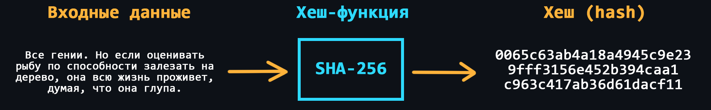

-   ### Аутентификация и авторизация

    > Важно понимать отличие между двумя этими понятиями.

    [Аутентификация](https://ru.wikipedia.org/wiki/%D0%90%D1%83%D1%82%D0%B5%D0%BD%D1%82%D0%B8%D1%84%D0%B8%D0%BA%D0%B0%D1%86%D0%B8%D1%8F) – процедура проверки подлинности пользователя. Как правило выполняется путем сравнения введенного пользователем пароля с паролем, сохраненным в базе данных.
    Так же, в это понятие часто включают и [идентификацию](https://ru.wikipedia.org/wiki/%D0%98%D0%B4%D0%B5%D0%BD%D1%82%D0%B8%D1%84%D0%B8%D0%BA%D0%B0%D1%86%D0%B8%D1%8F_(%D0%B8%D0%BD%D1%84%D0%BE%D1%80%D0%BC%D0%B0%D1%86%D0%B8%D0%BE%D0%BD%D0%BD%D1%8B%D0%B5_%D1%81%D0%B8%D1%81%D1%82%D0%B5%D0%BC%D1%8B)) – процедуру выявления пользователя по его уникальному идентификатору (как правило это обычный логин или email). Это нужно, чтобы точно знать для какого пользователя выполняется проверка подлинности.

    [Авторизация](https://ru.wikipedia.org/wiki/%D0%90%D0%B2%D1%82%D0%BE%D1%80%D0%B8%D0%B7%D0%B0%D1%86%D0%B8%D1%8F) – процедура выдачи прав доступа определенному пользователю на выполнение определенных операций. Например обычные пользователи интернет-магазина могут просматривать товары, добавлять их в корзину. А вот добавлять новые товары или удалять уже имеющиеся могут только администраторы.

    -   [Basic Authentication](https://developer.mozilla.org/ru/docs/Web/HTTP/Authentication#basic_authentication_scheme)
        > Наиболее простая схема аутентификации, при которой username и password пользователя передаются в заголовке [Authorization](https://developer.mozilla.org/ru/docs/Web/HTTP/Headers/Authorization) в незашифрованном виде (base64-encoded). При использовании HTTPS является относительно безопасным.
    -   [SSO (Single Sign-On)](https://ru.wikipedia.org/wiki/%D0%A2%D0%B5%D1%85%D0%BD%D0%BE%D0%BB%D0%BE%D0%B3%D0%B8%D1%8F_%D0%B5%D0%B4%D0%B8%D0%BD%D0%BE%D0%B3%D0%BE_%D0%B2%D1%85%D0%BE%D0%B4%D0%B0)
        > Технология реализующая возможность перехода из одного сервиса в другой (не связанный с первым), без повторной аутентификации.
    -   [OAuth / OAuth 2.0](https://ru.wikipedia.org/wiki/OAuth)
        > Протокол авторизации благодаря которому можно зарегистрироваться в различных приложениях с помощью популярных сервисов (Google, Facebook, GitHub и т.д.)
    -   [OpenID](https://ru.wikipedia.org/wiki/OpenID)
        > Открытый стандарт, позволяющий создавать единую учётную запись для аутентификации на множестве не связанных друг с другом сервисов.
    -   [JWT (Json Web Token)](https://ru.wikipedia.org/wiki/JSON_Web_Token)
        > Стандарт аутентификации работающий на основе токенов доступа. Токены создаются сервером, подписываются секретным ключом и передаются клиенту, который в дальнейшем использует данный токен для подтверждения своей личности.

    
🔗 <b>Ссылки на материалы</b>

1. 📄 [**Аутентификация и авторизация в микросервисных приложениях** – habr.com](https://habr.com/ru/company/dataart/blog/311376/)
2. 📄 [**Обзор способов и протоколов аутентификации в веб-приложениях** – habr.com](https://habr.com/ru/company/dataart/blog/262817/)
3. 📄 [**Как работает single sign-on (технология единого входа)?** – habr.com](https://habr.com/ru/company/nixys/blog/563244/)
4. 📄 [**OAuth 2: введение в протокол авторизации** – selectel.ru](https://selectel.ru/blog/oauth-2/)
5. 📺 [**Как работает OAuth 2 - введение (просто и понятно)** – YouTube](https://youtu.be/DilydjvgVbo)
6. 📄 [**OAuth 2.0 простым и понятным языком** – habr.com](https://habr.com/ru/company/vk/blog/115163/)
7. 📺 [**OpenID Connect. Теория** – YouTube](https://youtu.be/KkIsn7bvUbQ)
8. 📄 [**OpenID Connect простыми словами** – habr.com](https://habr.com/ru/company/nixys/blog/566910/)
9. 📄 [**Пять простых шагов для понимания JSON Web Tokens (JWT)** – habr.com](https://habr.com/ru/post/340146/)
10. 📺 [**Виды авторизации: сессии, JWT-токены. Для чего нужны сессии? Как работает JWT?** – YouTube](https://youtu.be/q0u4yRUSDzI)
11. 📺 [**JWT. Часть 1. Теория** – YouTube](https://youtu.be/vQldMjSJ6-w)

- ### Уязвимости веб-приложений

    -   [Межсайтовый скриптинг (XSS)](https://ru.wikipedia.org/wiki/%D0%9C%D0%B5%D0%B6%D1%81%D0%B0%D0%B9%D1%82%D0%BE%D0%B2%D1%8B%D0%B9_%D1%81%D0%BA%D1%80%D0%B8%D0%BF%D1%82%D0%B8%D0%BD%D0%B3)
        > Атака, которая позволяют злоумышленнику внедрять вредоносный код через веб-сайт в браузеры других пользователей.
    -   [SQL-инъекций](https://ru.wikipedia.org/wiki/%D0%92%D0%BD%D0%B5%D0%B4%D1%80%D0%B5%D0%BD%D0%B8%D0%B5_SQL-%D0%BA%D0%BE%D0%B4%D0%B0)
        > Атака может быть возможна если, пользовательский ввод, который передаётся в SQL-запрос, способен изменить смысл оператора или добавить туда другой запрос.
    -   [Подделка межсайтовых запросов (CSRF)](https://ru.wikipedia.org/wiki/%D0%9C%D0%B5%D0%B6%D1%81%D0%B0%D0%B9%D1%82%D0%BE%D0%B2%D0%B0%D1%8F_%D0%BF%D0%BE%D0%B4%D0%B4%D0%B5%D0%BB%D0%BA%D0%B0_%D0%B7%D0%B0%D0%BF%D1%80%D0%BE%D1%81%D0%B0)
        > Когда на сайте для выполнения какой-либо операции используется POST-запрос, злоумышленник может подделать форму, например в электронном письме и отправить его жертве. Затем жертва, являющаяся авторизованным пользователем, взаимодействую с этим письмом, не зная того, может отправить запрос на сайт с данными, которые задал злоумышленник.
    -   [Кликджекинг (Clickjacking)](https://ru.wikipedia.org/wiki/%D0%9A%D0%BB%D0%B8%D0%BA%D0%B4%D0%B6%D0%B5%D0%BA%D0%B8%D0%BD%D0%B3)
        > Принцип основан на том, что поверх видимой веб-страницы располагается невидимый слой, в который и загружается нужная злоумышленнику страница, при этом элемент управления (кнопка, ссылка), необходимый для осуществления требуемого действия, совмещается с видимой ссылкой или кнопкой, нажатие на которую ожидается от пользователя.
    -   [DoS-атака (Denial of Service)](https://ru.wikipedia.org/wiki/DoS-%D0%B0%D1%82%D0%B0%D0%BA%D0%B0)
        > Хакерская атака, которая приводит к перегрузке сервера, на котором работает веб-приложение, за счет отправки огромного количества запросов.
    -   [Man-in-the-Middle (человек посередине)](https://ru.wikipedia.org/wiki/%D0%90%D1%82%D0%B0%D0%BA%D0%B0_%D0%BF%D0%BE%D1%81%D1%80%D0%B5%D0%B4%D0%BD%D0%B8%D0%BA%D0%B0)
        > Тип атаки при которой злоумышленник попадает в цепь между двумя (или более) общающимися сторонами, чтобы перехватить разговор или передачу данных.
    -   Неверная конфигурация безопасности
        > Использование параметров конфигурации по умолчанию может быть опасным, поскольку это общеизвестная информация. К примеру, частой уязвимостью является то, что сетевые администраторы оставляют стандартные логины и пароли _admin:admin_.

    
🔗 <b>Ссылки на материалы</b>

1. 📄 [**Веб-безопасность** – (MDN) mozilla.org](https://developer.mozilla.org/ru/docs/Learn/Server-side/First_steps/Website_security)
2. 📄 [**Безопасность веб-приложений: от уязвимостей до мониторинга** – habr.com](https://habr.com/ru/company/pentestit/blog/526878/)
3. 📺 [**Безопасность: уязвимости вашего приложения** – YouTube](https://youtu.be/2gthjl2Lks4)
4. 📄 [**Как защитить веб-приложение: основные советы, инструменты, полезные ссылки** – tproger.ru](https://tproger.ru/translations/webapp-security/)
5. 📄 [**Что такое XSS-уязвимость и как тестировщику не пропустить ее** – habr.com](https://habr.com/ru/post/511318/)
6. 📄 [**DDoS-атаки: что это, происхождение, виды и способы защиты** – selectel.ru](https://selectel.ru/blog/ddos-attacks/)
7. 📄 [**DDoS-атаки: нападение и защита** – habr.com](https://habr.com/ru/company/ruvds/blog/321992/)
8. 📄 [**Man-in-the-Middle: советы по обнаружению и предотвращению**](https://habr.com/ru/company/varonis/blog/526632/)
9. 📺 [**Безопасность Web-приложений (плейлист)** – YouTube](https://youtube.com/playlist?list=PLp2kHCN7pLe1azEbJa5ucnLpD0nGex0tg)
10. 📺 [**Безопасность интернет-приложений (плейлист)** – YouTube](https://youtube.com/playlist?list=PLrCZzMib1e9oopXP4-aumUxkbz_56Czon)
11. 📄 [**Аналитика уязвимостей и угроз веб-приложений за 2019 год**](https://www.ptsecurity.com/ru-ru/research/analytics/web-vulnerabilities-2020/)

-   ### SSL/TLS

    [SSL (Secure Socket Layer)](https://ru.wikipedia.org/wiki/SSL) и [TLS (Transport Layer Security)](https://ru.wikipedia.org/wiki/TLS) – это криптографические протоколы, которые обеспечивают защищённую передачу данных между двумя компьютерами в сети. По сути эти протоколы работают одинаково и отличий у них нет. SSL считается устаревшим, хотя все еще используется для поддержки старых устройств.

    -   [Центр сертификации](https://ru.wikipedia.org/wiki/%D0%A6%D0%B5%D0%BD%D1%82%D1%80_%D1%81%D0%B5%D1%80%D1%82%D0%B8%D1%84%D0%B8%D0%BA%D0%B0%D1%86%D0%B8%D0%B8)
        > TLS/SSL использует цифровые сертификаты, выдаваемые центром сертификации. Одним из самых популярных является [Let’s Encrypt](https://ru.wikipedia.org/wiki/Let%E2%80%99s_Encrypt).
    -   Конфигурация и установка сертификатов
        > Необходимо уметь генерировать сертификаты и правильно их устанавливать, чтобы Ваш сервер работал по HTTPS.
    -   [Процесс рукопожатия (handshake)](https://ru.wikipedia.org/wiki/TLS#%D0%9F%D1%80%D0%BE%D1%86%D0%B5%D0%B4%D1%83%D1%80%D0%B0_%D0%BF%D0%BE%D0%B4%D1%82%D0%B2%D0%B5%D1%80%D0%B6%D0%B4%D0%B5%D0%BD%D0%B8%D1%8F_%D1%81%D0%B2%D1%8F%D0%B7%D0%B8_%D0%B2_TLS_%D0%B2_%D0%B4%D0%B5%D1%82%D0%B0%D0%BB%D1%8F%D1%85)
        > Чтобы установить безопасное соединение между клиентом и сервером, должен произойти специальный процесс, который включает в себя обмен ключами и информацией об алгоритмах шифрования.

    
🔗 <b>Ссылки на материалы</b>

1. 📺 [**Протоколы TLS/SSL | Защищенные сетевые протоколы** – YouTube](https://youtu.be/LTLqazCztnc)
2. 📄 [**Как это работает: знакомство с SSL/TLS** – habr.com](https://habr.com/ru/company/1cloud/blog/326292/)
3. 📄 [**Что такое TLS** – habr.com](https://habr.com/ru/post/258285/)
4. 📺 [**TLS/SSL сертификаты и с чем их едят** – YouTube](https://youtu.be/W9M40MdlvSg)
5. 📄 [**Как HTTPS обеспечивает безопасность соединения** – habr.com](https://habr.com/ru/post/188042/)
6. 📺 [**Шифрование в TLS/SSL | Защищенные сетевые протоколы** – YouTube](https://youtu.be/kCkQRH5eweg)
7. 📺 [**Как получить и настроить LetsEncrypt SSL сертификат для сайта?** – YouTube](https://youtu.be/1wnOw1vwPEo)
8. 📺 [**Криптография с нуля** – YouTube](https://youtu.be/7mn4uq4DBJo)

-   ### Хеширование

    

    Для обеспечения безопасности в сети широко используется криптографические алгоритмы на основе [хеш-функций](https://ru.wikipedia.org/wiki/%D0%A5%D0%B5%D1%88-%D1%84%D1%83%D0%BD%D0%BA%D1%86%D0%B8%D1%8F).

    Основные понятия:
    -   Хеширование
        > Процесс преобразования массива информации (от одной буквы и хоть до целого литературного произведения) в некую уникальную короткую строку символов (называемую хэшем), которая присуща только этому массиву информации. Причем если в этом массиве информации изменить хоть один символ, то новый хэш будет отличатся кардинально.  
        > Хеширование является необратимым процессом, то есть по полученному хэшу невозможно восстановить изначальные данные.
    -   [Контрольные суммы](https://ru.wikipedia.org/wiki/%D0%9A%D0%BE%D0%BD%D1%82%D1%80%D0%BE%D0%BB%D1%8C%D0%BD%D0%B0%D1%8F_%D1%81%D1%83%D0%BC%D0%BC%D0%B0)
        > Хэши могут использоваться как контрольные суммы, которые служат доказательством целостности данных.
    -   [Коллизии](https://ru.wikipedia.org/wiki/%D0%9A%D0%BE%D0%BB%D0%BB%D0%B8%D0%B7%D0%B8%D1%8F_%D1%85%D0%B5%D1%88-%D1%84%D1%83%D0%BD%D0%BA%D1%86%D0%B8%D0%B8)
        > Cлучаи когда хеширование разного набора информации приводит к одинаковым хэшам.
    -   [Соль (в криптографии)](https://ru.wikipedia.org/wiki/%D0%A1%D0%BE%D0%BB%D1%8C_(%D0%BA%D1%80%D0%B8%D0%BF%D1%82%D0%BE%D0%B3%D1%80%D0%B0%D1%84%D0%B8%D1%8F))
        > Случайная строка данных, которая добавляется к входным данным перед хешированием, для вычисления хэша. Это необходимо для усложнения взлома методом перебора.

    Основные алгоритмы хеширования:
    -   [Семейство SHA (Secure Hash Algorithm)](https://en.wikipedia.org/wiki/Secure_Hash_Algorithms)
        > [SHA-256](https://ru.wikipedia.org/wiki/SHA-2) наиболее популярный алгоритм шифрования. Используется, например, в [Bitcoin](https://ru.wikipedia.org/wiki/%D0%91%D0%B8%D1%82%D0%BA%D0%BE%D0%B9%D0%BD).
    -   Семейство MD (Message Digest)
        > Наиболее популярный алгоритм семейства – [MD5](https://ru.wikipedia.org/wiki/MD5). Сейчас считается очень уязвимым к коллизиям (существуют даже генераторы коллизий для MD5).
    -   [CRC (Cyclic redundancy check)](https://ru.wikipedia.org/wiki/%D0%A6%D0%B8%D0%BA%D0%BB%D0%B8%D1%87%D0%B5%D1%81%D0%BA%D0%B8%D0%B9_%D0%B8%D0%B7%D0%B1%D1%8B%D1%82%D0%BE%D1%87%D0%BD%D1%8B%D0%B9_%D0%BA%D0%BE%D0%B4)
        > Алгоритм нахождения контрольной суммы, предназначенный для проверки целостности данных.

    
🔗 <b>Ссылки на материалы</b>

1. 📄 [**Хеш-функция, что это такое?** – habr.com](https://habr.com/ru/post/534596/)
2. 📺 [**Что такое ХЭШ функция? | Хеширование** – YouTube](https://youtu.be/Bul0XYMa8Jg)
3. 📺 [**Hash/Хеш - просто о сложном** – YouTube](https://youtu.be/oPknb1k4elE)
4. 📺 [**Как работает SHA256** – YouTube](https://youtu.be/8vg5B2O4RPk)
5. 📄 [**«Привет, мир»: разбираем каждый шаг хэш-алгоритма SHA-256** – habr.com](https://habr.com/ru/company/selectel/blog/530262/)
6. 📄 [**Все методы взлома MD5**](https://xakep.ru/2013/10/13/md5-hack/)
7. 📄 [**CRC: как защитить программу**](https://xakep.ru/2004/03/30/21788/)
8. 📄 [**Простой расчет контрольной суммы** – habr.com](https://habr.com/ru/post/278171/)

-   ### Переменные окружения

    Часто в ваших приложениях могут использоваться различные токены (например для доступа к стороннему платному API), логины и пароли (для подключения к базе данных), различные секретные ключи для подписей и так далее. Все эти данные не должны быть известны и доступны посторонним людям, соответственно оставлять их в коде программы ни в коем случае нельзя. Для решения этой проблемы существуют переменные окружения.

    -   Файл `.env`
        > Специальный файл в котором можно хранить все переменные окружения.
    -   Парсинг `.env` файла
        > Переменные передаются в программу с помощью аргументов командной строки. Чтобы сделать подобное с `.env` файлом необходимо воспользоваться специальной библиотекой под ваш ЯП.
    -   Хранение и передача
        > Изучите как загружать `.env` файлы на хостинг сервисы, а так же помните, что такие файлы нельзя коммитить в удаленные репозитории, поэтому не забывайте добавлять их в исключения через файл `.gitignore`.

    
🔗 <b>Ссылки на материалы</b>

1. 📺 [**Как хранить пароли и ключи в коде проектов? Всё о переменных окружения** – YouTube](https://youtu.be/Y9MRCxq4DIc)
2. 📄 [**Переменные окружения для Python проектов** – habr.com](https://habr.com/ru/post/472674/)
3. 📄 [**Использование переменных окружения в Node.js** – habr.com](https://habr.com/ru/company/ruvds/blog/351254/)
4. 📺 [**Изучаем Go. Переменные окружения в Golang** – YouTube](https://youtu.be/l2BpOaAinDg)

