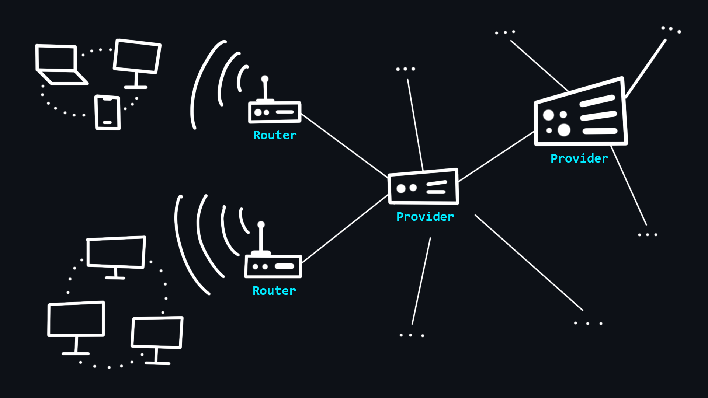
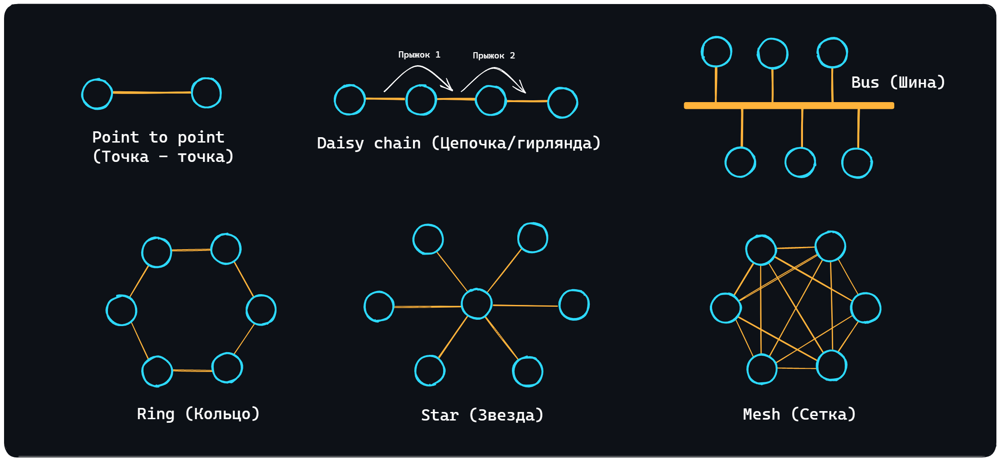
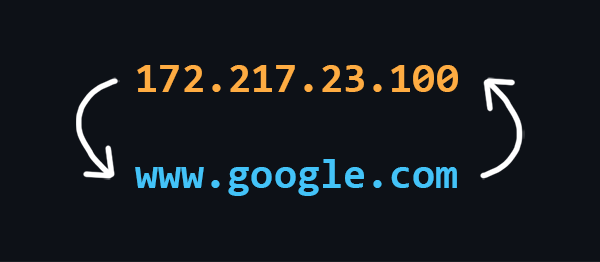
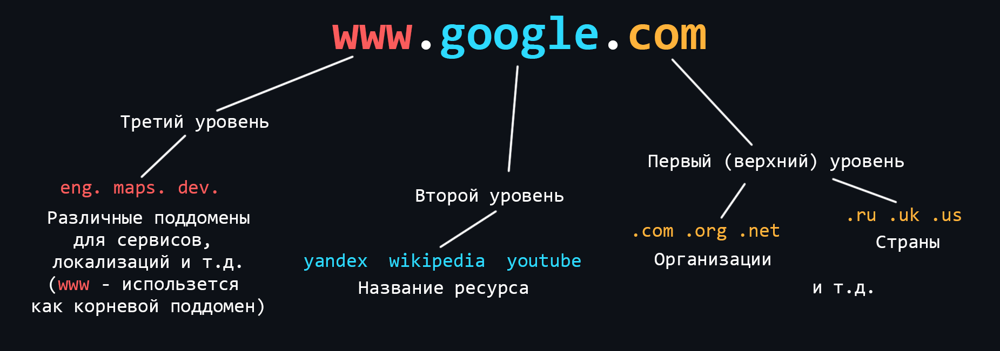
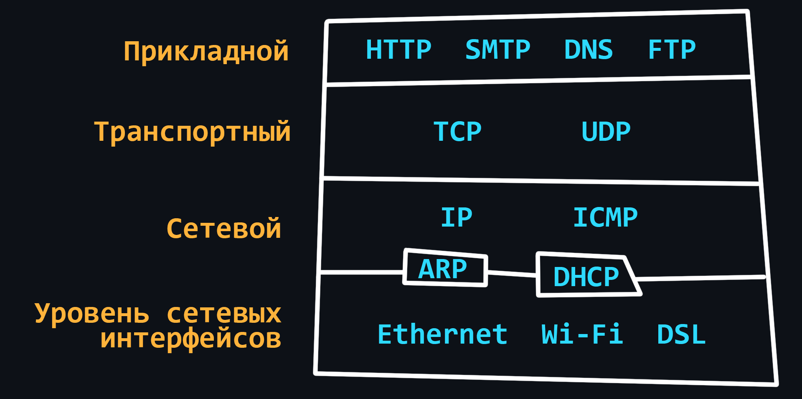
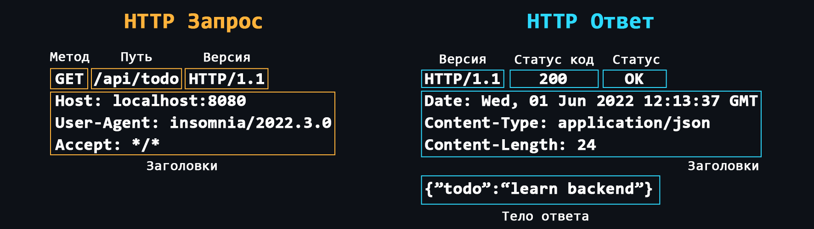
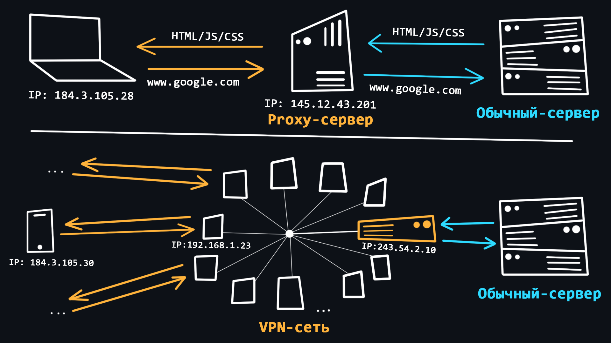
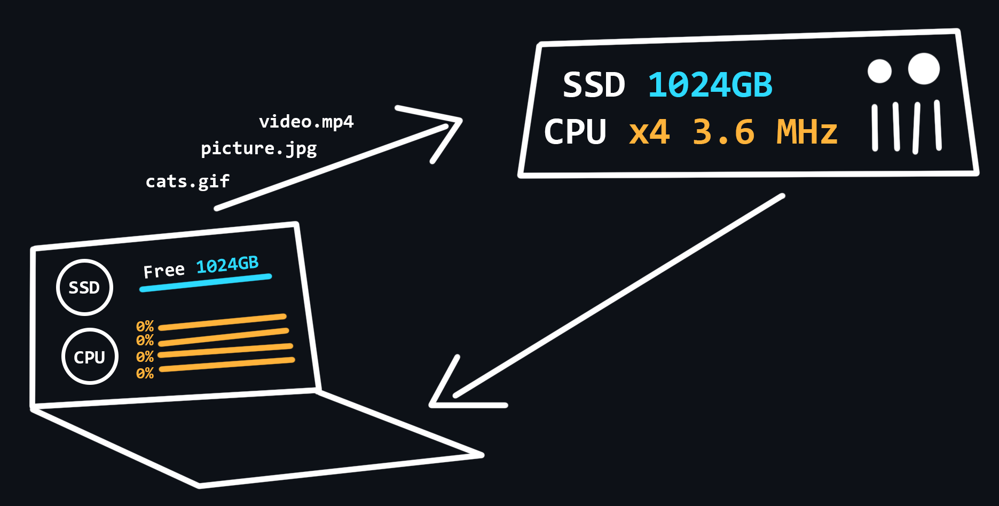
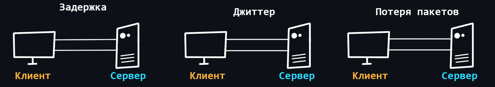
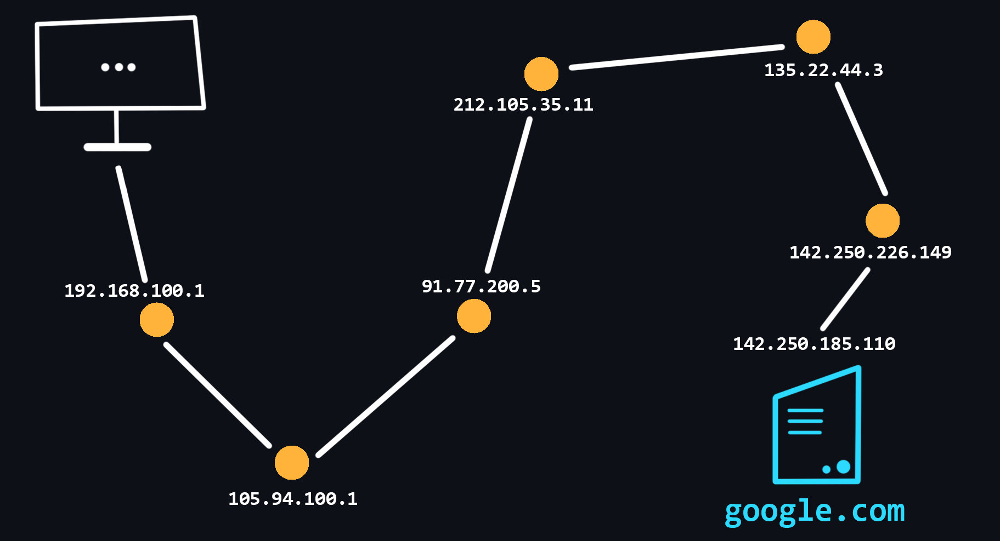

[Интернет](https://ru.wikipedia.org/wiki/%D0%98%D0%BD%D1%82%D0%B5%D1%80%D0%BD%D0%B5%D1%82) - это всемирная система объединяющая компьютерные сети со всего мира в единую сеть для хранения/передачи информации.

-   ### Как устроен Интернет

    

    Ваш компьютер не имеет прямого доступа в Интернет. Вместо этого он имеет доступ к вашей локальной сети, к которой подключены другие устройства через проводное ([Ethernet](https://ru.wikipedia.org/wiki/Ethernet)) или беспроводное (Wi-Fi) соединение. Организатором такой сети является специальный мини-компьютер – [маршрутизатор](https://ru.wikipedia.org/wiki/Маршрутизатор). Это устройство связывает Вас с [интернет-провайдером](https://ru.wikipedia.org/wiki/%D0%98%D0%BD%D1%82%D0%B5%D1%80%D0%BD%D0%B5%D1%82-%D0%BF%D1%80%D0%BE%D0%B2%D0%B0%D0%B9%D0%B4%D0%B5%D1%80), который в свою очередь связан с другими провайдерами более высокого уровня. Таким образом, все эти взаимодействия образуют Интернет, и ваши сообщения всегда проходят транзитом через разные сети, прежде чем достигнут конечного получателя.

    -   [Хост](https://ru.wikipedia.org/wiki/Хост)
        > (Host - принимающий) так называют любое устройство, которое находится в какой-либо сети.
    -   [Сервер](<https://ru.wikipedia.org/wiki/Сервер_(аппаратное_обеспечение)>)
        > (Serve - обслуживать) специальный компьютер в сети, который обслуживает запросы поступающие от других участников.

    

    -   [Сетевые топологии](https://ru.wikipedia.org/wiki/%D0%A1%D0%B5%D1%82%D0%B5%D0%B2%D0%B0%D1%8F_%D1%82%D0%BE%D0%BF%D0%BE%D0%BB%D0%BE%D0%B3%D0%B8%D1%8F)
        > Существует несколько топологий (способов организации сети): [Point to point (Точка-точка)](https://ru.wikipedia.org/wiki/%D0%A1%D0%B5%D1%82%D1%8C_%D1%82%D0%BE%D1%87%D0%BA%D0%B0-%D1%82%D0%BE%D1%87%D0%BA%D0%B0), [Daisy chain (Цепочка/гирлянда)](https://en.wikipedia.org/wiki/Daisy_chain_(electrical_engineering)), [Bus (Шина)](https://ru.wikipedia.org/wiki/%D0%A8%D0%B8%D0%BD%D0%B0_(%D1%82%D0%BE%D0%BF%D0%BE%D0%BB%D0%BE%D0%B3%D0%B8%D1%8F_%D0%BA%D0%BE%D0%BC%D0%BF%D1%8C%D1%8E%D1%82%D0%B5%D1%80%D0%BD%D0%BE%D0%B9_%D1%81%D0%B5%D1%82%D0%B8)), [Ring (Кольцо)](https://ru.wikipedia.org/wiki/%D0%9A%D0%BE%D0%BB%D1%8C%D1%86%D0%BE_(%D1%82%D0%BE%D0%BF%D0%BE%D0%BB%D0%BE%D0%B3%D0%B8%D1%8F_%D0%BA%D0%BE%D0%BC%D0%BF%D1%8C%D1%8E%D1%82%D0%B5%D1%80%D0%BD%D0%BE%D0%B9_%D1%81%D0%B5%D1%82%D0%B8)), [Star (Звезда)](https://ru.wikipedia.org/wiki/%D0%97%D0%B2%D0%B5%D0%B7%D0%B4%D0%B0_(%D1%82%D0%BE%D0%BF%D0%BE%D0%BB%D0%BE%D0%B3%D0%B8%D1%8F_%D0%BA%D0%BE%D0%BC%D0%BF%D1%8C%D1%8E%D1%82%D0%B5%D1%80%D0%BD%D0%BE%D0%B9_%D1%81%D0%B5%D1%82%D0%B8)) и [Mesh (Сетка)](https://ru.wikipedia.org/wiki/%D0%9F%D0%BE%D0%BB%D0%BD%D0%BE%D1%81%D0%B2%D1%8F%D0%B7%D0%BD%D0%B0%D1%8F_%D1%82%D0%BE%D0%BF%D0%BE%D0%BB%D0%BE%D0%B3%D0%B8%D1%8F). Сам Интернет нельзя отнести к какой-то одной топологии, поскольку это невероятно сложная система смешанная разными топологиями.

    
🔗 <b>Ссылки на материалы</b>

1. 📄 [**Как работает Интернет** – MDN (mozilla.org)](https://developer.mozilla.org/ru/docs/Learn/Common_questions/How_does_the_Internet_work)
2. 📺 [**Основы программирования. Как работают сети?** – YouTube](https://www.youtube.com/watch?v=k_0BAtyaDio&ab_channel=Winderton)
3. 📄 [**Что такое сервер и как он работает**](https://timeweb.com/ru/community/articles/chto-takoe-server-i-kak-on-rabotaet)
4. 📄 [**Как выглядит сервер**](https://thecode.media/server/)
5. 📄 [**Что такое Хост**](https://blog.sk8er.name/wiki/xost/)
6. 📺 [**Топологии сетей** – YouTube](https://youtu.be/z8VmkYahV8M)
7. 📺 [**Сетевые технологии: Топология локальных сетей** – YouTube](https://youtu.be/lnFeG4DOMcE)

-   ### Что такое DNS

    

    [DNS (Domain Name System)](https://ru.wikipedia.org/wiki/DNS) - это децентрализованная система именования адресов в Интернете, которая позволяет создавать удобные для человека буквеные наименования (доменные имена) соответствующие числовым [IP-адресам](https://ru.wikipedia.org/wiki/IP-%D0%B0%D0%B4%D1%80%D0%B5%D1%81), которые используются компьютерами.

    -   Структура DNS
        > DNS состоит из множества независимых узлов, каждый из которых хранит только те данные, которые входят в его зону ответственности.
    -   DNS Resolver
        > Сервер, который расположен в непосредственной близости от вашего провайдера. Именно он выполняет поиск адресов по доменным именам, а также занимается их кэшированием (временным хранением для быстрой выдачи при последующих обращениях).
    -   [DNS записи](https://ru.wikipedia.org/wiki/%D0%A2%D0%B8%D0%BF%D1%8B_%D1%80%D0%B5%D1%81%D1%83%D1%80%D1%81%D0%BD%D1%8B%D1%85_%D0%B7%D0%B0%D0%BF%D0%B8%D1%81%D0%B5%D0%B9_DNS)
        > - Запись A – связывает доменное имя с адресом IPv4.
        > - Запись AAAA – связывает доменное имя с адресом IPv6.
        > - Запись CNAME – перенаправляет на другое доменное имя.
        > - и другие – запись MX, запись NS, запись PTR, запись SOA.

    
🔗 <b>Ссылки на материалы</b>

1. 📄 [**Что такое DNS-сервер простыми словами**](https://guides.hexlet.io/ru/dns/)
2. 📺 [**Система доменных имен DNS** — YouTube](https://www.youtube.com/watch?v=B0J0c0KLtbQ&ab_channel=AndreySozykin)
3. 📄 [**Давайте уже разберемся в DNS** – habr.com](https://habr.com/ru/post/303446/)
4. 📄 [**Как это работает: Пара слов о DNS** – habr.com](https://habr.com/ru/company/1cloud/blog/309018/)

-   ### Что такое доменное имя

    

    [Доменные имена](https://ru.wikipedia.org/wiki/%D0%94%D0%BE%D0%BC%D0%B5%D0%BD%D0%BD%D0%BE%D0%B5_%D0%B8%D0%BC%D1%8F) - это человеко-читаемые адреса веб-серверов, доступных в Интернете. Они состоят из частей (уровней) разделенных между собой точкой. Каждая из этих частей предоставляет специфическую информацию о доменном имени. Например страну, название сервиса, локализацию и т.д.

    -   Кто владеем доменными именами
        > Корпорация [ICANN](https://ru.wikipedia.org/wiki/ICANN) является основателем распределённой системы регистрации доменов. Она выдаёт аккредитации компаниям, которые хотят заниматься продажей доменов. Таким образом формируется конкурентный доменный рынок. 
    -   Как купить доменное имя
        > Доменное имя нельзя купить навсегда. Оно выдается в аренду на определенный срок. Покупать домены лучше у [аккредитованных регистраторов](https://www.icann.org/en/accredited-registrars?filter-letter=a&sort-direction=asc&sort-param=name&page=1) (найти их можно почти в любой стране).

    
🔗 <b>Ссылки на материалы</b>

1. 📄 [**Что такое доменные имена** – MDN (mozilla.org)](https://developer.mozilla.org/ru/docs/Learn/Common_questions/What_is_a_domain_name)
2. 📄 [**Как работают домены**](https://temoto.github.io/a/kak-rabotayut-domeny.html)
3. 📄 [**Доменное имя в призме закона** – habr.com](https://habr.com/ru/post/557786/)

-   ### IP-адрес

    

    [IP-адрес](https://ru.wikipedia.org/wiki/IP-%D0%B0%D0%B4%D1%80%D0%B5%D1%81) – уникальный числовой адрес, который используется для распознавания того или иного устройства в сети.

    -   Уровни видимости
        > - Внешний и доступный всем IP-адрес, который принадлежит Вашему провайдеру и используется для выхода в интернет сотен других пользователей.
        > - IP-адрес вашего роутера в локальной сети провайдера, той самой, с IP-адресом которой вы выходите в интернет.
        > - IP-адрес вашего компьютера в локальной (домашней) сети, созданной роутером, к которой вы можете подключать свои устройства. Как правило, имеет вид 192.168.XXX.XXX.
        > - Внутренний IP-адрес компьютера, недоступный извне и используемый только для общения между запущенными процессами. У всех он одинаковый – 127.0.0.1 или просто localhost. 
    -   [Порт](https://ru.wikipedia.org/wiki/%D0%9F%D0%BE%D1%80%D1%82_(%D0%BA%D0%BE%D0%BC%D0%BF%D1%8C%D1%8E%D1%82%D0%B5%D1%80%D0%BD%D1%8B%D0%B5_%D1%81%D0%B5%D1%82%D0%B8))
        > На одном устройстве (компьютере) может работать множество приложений, которые используют сеть. Для того, чтобы правильно распознать, куда и какие данные, пришедшие по сети, нужно доставить (в какое из приложений), используется специальный числовой номер – порт.
    -   [IPv4](https://ru.wikipedia.org/wiki/IPv4)
        > 4 версия IP-протокола. Разработана в 1981 году и ограничивает адресное пространство около 4.3 млрд (2^32) возможными уникальными адресами.
    -   [IPv6](https://ru.wikipedia.org/wiki/IPv6)
        > Со временем распределение адресного пространства стало происходить значительно более быстрыми темпами, что вынудило создание новой версии IP-протокола для хранения большего количества адресов. IPv6 способен выдать 2^128 уникальных адресов.

    
🔗 <b>Ссылки на материалы</b>

1. 📄 [**IP адрес**](https://hackware.ru/?p=11589)
2. 📄 [**Всё об IP адресах и о том, как с ними работать** – habr.com](https://habr.com/ru/post/350878/)
3. 📄 [**Как узнать IP-адрес в Linux**](https://losst.pro/kak-uznat-ip-adres-linux)
4. 📺 [**Порты и перенаправление\открытие портов. Инструкция и объяснения на пальцах** – YouTube](https://www.youtube.com/watch?v=SGmBv_klQ9I)
5. 📄 [**Список зарезервированных портов TCP и UDP** – Википедия](https://ru.wikipedia.org/wiki/%D0%A1%D0%BF%D0%B8%D1%81%D0%BE%D0%BA_%D0%BF%D0%BE%D1%80%D1%82%D0%BE%D0%B2_TCP_%D0%B8_UDP)
6. 📄 [**Протоколы IPv4 и IPv6. В чем разница и что лучше?**](https://bezopasnik.info/%D0%BF%D1%80%D0%BE%D1%82%D0%BE%D0%BA%D0%BE%D0%BB%D1%8B-ipv4-%D0%B8-ipv6-%D0%B2-%D1%87%D0%B5%D0%BC-%D1%80%D0%B0%D0%B7%D0%BD%D0%B8%D1%86%D0%B0-%D0%B8-%D1%87%D1%82%D0%BE-%D0%BB%D1%83%D1%87%D1%88%D0%B5/)
7. 📺 [**Адреса IPv6 | Компьютерные сети. Продвинутые темы** – YouTube](https://youtu.be/KRAKAAJTxTg)
8. 📄 [**IPv6: как организовать миграцию и в чем преимущества перехода**](https://itglobal.com/ru-ru/company/blog/ipv6-migration/)
9. 📺 [**IPv6 - от слов к делу** – YouTube](https://youtu.be/xYQP0iXr3A0)

-   ### Сетевая модель OSI

    | № | Уровень                    | Используемые протоколы |
    |---|----------------------------|------------------------|
    | 7 | Прикладной уровень         | HTTP, DNS, FTP, POP3   |
    | 6 | Уровень представления      | SSL, SSH, IMAP, JPEG   |
    | 5 | Сеансовый уровень          | APIs Sockets           |
    | 4 | Транспортный уровень       | TCP, UDP               |     
    | 3 | Сетевой уровень            | IP, ICMP, IGMP         | 
    | 2 | Канальный уровень          | Ethernet, MAC, HDLC    |
    | 1 | Физический уровень         | RS-232, RJ45, DSL      |

    [OSI (The Open Systems Interconnection model)](https://ru.wikipedia.org/wiki/%D0%A1%D0%B5%D1%82%D0%B5%D0%B2%D0%B0%D1%8F_%D0%BC%D0%BE%D0%B4%D0%B5%D0%BB%D1%8C_OSI) – это набор правил, который описивает то, как должны взамиодействовать друг с другом различные сетевые устройства. Модель разделяется на 7 уровней, каждый из которых отвечает за выполнение определенной функции. Все это нужно для того, чтобы процесс обмена информацией в сети происходил по единому шаблону и все устройства, будь-то умный холодильник и смартфон, могли без проблем понять друг друга.

    -   [Физический уровень](https://ru.wikipedia.org/wiki/%D0%A4%D0%B8%D0%B7%D0%B8%D1%87%D0%B5%D1%81%D0%BA%D0%B8%D0%B9_%D1%83%D1%80%D0%BE%D0%B2%D0%B5%D0%BD%D1%8C)
        > На этом уровне происходит кодирование  битов (единиц/нулей) в физические сигналы (ток, свет, радиоволны) и их дальнейшая передача проводным ([Ethernet](https://ru.wikipedia.org/wiki/Ethernet)) или беспроводным ([Wi-Fi](https://ru.wikipedia.org/wiki/Wi-Fi)) способом.
    -   [Канальный уровень](https://ru.wikipedia.org/wiki/%D0%9A%D0%B0%D0%BD%D0%B0%D0%BB%D1%8C%D0%BD%D1%8B%D0%B9_%D1%83%D1%80%D0%BE%D0%B2%D0%B5%D0%BD%D1%8C)
        > Физические сигналы с первого уровня раскодируются обратно в единицы и нули, исправляются ошибки и дефекты, извлекаются [MAC-адреса](https://ru.wikipedia.org/wiki/MAC-%D0%B0%D0%B4%D1%80%D0%B5%D1%81) отправителя и получателя.
    -   [Сетевой уровень](https://ru.wikipedia.org/wiki/%D0%9F%D1%80%D0%BE%D1%82%D0%BE%D0%BA%D0%BE%D0%BB%D1%8B_%D1%81%D0%B5%D1%82%D0%B5%D0%B2%D0%BE%D0%B3%D0%BE_%D1%83%D1%80%D0%BE%D0%B2%D0%BD%D1%8F)
        > Происходит маршрутизация трафика, запросы к DNS и формирование [IP-пакетов](https://ru.wikipedia.org/wiki/IP).
    -   [Транспортный уровень](https://ru.wikipedia.org/wiki/%D0%A2%D1%80%D0%B0%D0%BD%D1%81%D0%BF%D0%BE%D1%80%D1%82%D0%BD%D1%8B%D0%B9_%D1%83%D1%80%D0%BE%D0%B2%D0%B5%D0%BD%D1%8C)
        > Уровень ответственный за передачу данных. Здесь существуют 2 важнейших протокола:  
        > - [TCP](https://ru.wikipedia.org/wiki/Transmission_Control_Protocol) - обеспечивающий надежную передачу данных. TCP гарантирует доставку данных и сохранение порядка следования сообщений. Это сказывается на скорости передачи. Данный протокол используется там, где потеря информации недопустима, например при отправки почты или загрузке веб-страниц.  
        > - [UDP](https://ru.wikipedia.org/wiki/UDP) – простой протокол с быстрой передачей данных. Он не использует механизмов для гарантирования доставки и порядка следования данных. Используется, например в онлайн-играх, где частичная потеря пакетов не критична, но скорость передачи данных имеет гораздо более важное значение. Так же, запросы к DNS-серверам происходят через UDP протокол.
    -   [Сеансовый уровень](https://ru.wikipedia.org/wiki/%D0%A1%D0%B5%D0%B0%D0%BD%D1%81%D0%BE%D0%B2%D1%8B%D0%B9_%D1%83%D1%80%D0%BE%D0%B2%D0%B5%D0%BD%D1%8C)
        > Отвечает за открытие и закрытие связи (сеансов) между двумя устройствами. Гарантирует, что сеанс будет оставаться открытым достаточно долго для передачи всех необходимых данных, а затем быстро закроется, чтобы избежать траты ресурсов.
    -   [Уровень представления](https://ru.wikipedia.org/wiki/%D0%9F%D1%80%D0%B5%D0%B4%D1%81%D1%82%D0%B0%D0%B2%D0%B8%D1%82%D0%B5%D0%BB%D1%8C%D1%81%D0%BA%D0%B8%D0%B9_%D1%83%D1%80%D0%BE%D0%B2%D0%B5%D0%BD%D1%8C)
        > Трансляция, шифрование/расшифровка и сжатие данных. Именно здесь данные, которые приходят в виде нулей и единиц преобразуются в нужные форматы (PNG, MP3, PDF и т.д.)
    -   [Прикладной уровень](https://ru.wikipedia.org/wiki/%D0%9F%D1%80%D0%BE%D1%82%D0%BE%D0%BA%D0%BE%D0%BB%D1%8B_%D0%BF%D1%80%D0%B8%D0%BA%D0%BB%D0%B0%D0%B4%D0%BD%D0%BE%D0%B3%D0%BE_%D1%83%D1%80%D0%BE%D0%B2%D0%BD%D1%8F)
        > Уровень работы с приложениями. Разрешает приложениям пользователя иметь доступ к сетевым службам, таким как обработчик запросов к базам данных, доступ к файлам, пересылке электронной почты.

    
🔗 <b>Ссылки на материалы</b>

1. 📺 [**Модель OSI | 7 уровней за 7 минут** – YouTube](https://youtu.be/je0QFU7p5Oo)
2. 📺 [**Модель OSI | Курс "Компьютерные сети"** – YouTube](https://youtu.be/Tt8BTkxz_Vc)
3. 📄 [**Простое пособие по сетевой модели OSI для начинающих** – selectel.ru](https://selectel.ru/blog/osi-for-beginners/)
4. 📄 [**Физика Ethernet для самых маленьких** – habr.com](https://habr.com/ru/post/158177/)
5. 📄 [**Как работает Wi-fi. История беспроводных сетей** – habr.com](https://habr.com/ru/company/timeweb/blog/672494/)
6. 📄 [**Wi-Fi или витая пара — что лучше?** – habr.com](https://habr.com/ru/company/zyxel/blog/503724/)
7. 📄 [**Всё, что вы хотели знать о МАС адресе** — habr.com](https://habr.com/ru/post/483670/)
8. 📺 [**Протокол IP: маршрутизация | Курс "Компьютерные сети"** — YouTube](https://youtu.be/kZqqk1tixfk)
9. 📺 [**Протокол TCP** — YouTube](https://www.youtube.com/watch?v=CKUOb4htnB4&ab_channel=AndreySozykin)
10. 📺 [**Протокол UDP** — YouTube](https://www.youtube.com/watch?v=GBrLfZvRrd8&ab_channel=AndreySozykin)
11. 📺 [**Прикладной уровень | Курс "Компьютерные сети"** — YouTube](https://youtu.be/l_MAOvAbYho)

-   ### Cтек протоколов TCP/IP

    

    По сравнению с [моделью OSI](#сетевая-модель-osi) [стек TCP/IP](https://ru.wikipedia.org/wiki/TCP/IP) имеет более простую архитектуру. В целом, модель TCP/IP является более широко используемой и практичной, а модель OSI - более теоретической и детальной. Обе модели описывают одни и те же принципы, но отличаются подходом и протоколами, которые они включают на своих уровнях.

    - [Канальный уровень](https://ru.wikipedia.org/wiki/%D0%9A%D0%B0%D0%BD%D0%B0%D0%BB%D1%8C%D0%BD%D1%8B%D0%B9_%D1%83%D1%80%D0%BE%D0%B2%D0%B5%D0%BD%D1%8C_(TCP/IP))
        > Определяет, как данные передаются по физической среде, такой как кабели или беспроводные сигналы.  
        > Протоколы: [Ethernet](https://ru.wikipedia.org/wiki/Ethernet), [Wi-Fi](https://ru.wikipedia.org/wiki/Wi-Fi), [Bluetooth](https://ru.wikipedia.org/wiki/Bluetooth), [оптоволокно](https://ru.wikipedia.org/wiki/%D0%92%D0%BE%D0%BB%D0%BE%D0%BA%D0%BE%D0%BD%D0%BD%D0%BE-%D0%BE%D0%BF%D1%82%D0%B8%D1%87%D0%B5%D1%81%D0%BA%D0%B8%D0%B9_%D0%BA%D0%B0%D0%B1%D0%B5%D0%BB%D1%8C).
    - [Сетевой (межсетевой) уровень](https://ru.wikipedia.org/wiki/TCP/IP#%D0%A1%D0%B5%D1%82%D0%B5%D0%B2%D0%BE%D0%B9_(%D0%BC%D0%B5%D0%B6%D1%81%D0%B5%D1%82%D0%B5%D0%B2%D0%BE%D0%B9)_%D1%83%D1%80%D0%BE%D0%B2%D0%B5%D0%BD%D1%8C)
        > Маршрутизация данных между различными сетями. Он использует IP-адреса для идентификации устройств и направляет пакеты данных к месту назначения.  
        > Протоколы: [IP](https://ru.wikipedia.org/wiki/Internet_Protocol), [ARP](https://ru.wikipedia.org/wiki/Address_Resolution_Protocol), [ICMP](https://ru.wikipedia.org/wiki/Internet_Control_Message_Protocol), [IGMP](https://ru.wikipedia.org/wiki/Internet_Group_Management_Protocol)
    - [Транспортный уровень](https://ru.wikipedia.org/wiki/%D0%A2%D1%80%D0%B0%D0%BD%D1%81%D0%BF%D0%BE%D1%80%D1%82%D0%BD%D1%8B%D0%B9_%D1%83%D1%80%D0%BE%D0%B2%D0%B5%D0%BD%D1%8C)
        > Передача данных между двумя устройствами. При этом используются такие протоколы, как [TCP](https://ru.wikipedia.org/wiki/Transmission_Control_Protocol) - надежный, но медленный и [UDP](https://ru.wikipedia.org/wiki/User_Datagram_Protocol) - быстрый, но ненадежный.
    - [Прикладной уровень](https://ru.wikipedia.org/wiki/%D0%9F%D1%80%D0%BE%D1%82%D0%BE%D0%BA%D0%BE%D0%BB%D1%8B_%D0%BF%D1%80%D0%B8%D0%BA%D0%BB%D0%B0%D0%B4%D0%BD%D0%BE%D0%B3%D0%BE_%D1%83%D1%80%D0%BE%D0%B2%D0%BD%D1%8F)
        > Предоставляет услуги конечному пользователю, такие как просмотр веб-страниц, электронная почта и передача файлов.  
        > Протоколы: [HTTP](#протокол-http), [FTP](https://ru.wikipedia.org/wiki/File_Transfer_Protocol), [SMTP](https://ru.wikipedia.org/wiki/Simple_Mail_Transfer_Protocol), [DNS](https://ru.wikipedia.org/wiki/Domain_Name_System), [SNMP](https://ru.wikipedia.org/wiki/Simple_Network_Management_Protocol).

    
🔗 <b>Ссылки на материалы</b>

1. 📺 [**Что такое TCP/IP: Объясняем на пальцах** – YouTube](https://youtu.be/2I1HnSN1H9o)
2. 📄 [**Руководство по стеку протоколов TCP/IP для начинающих** – selectel.ru](https://selectel.ru/blog/tcp-ip-for-beginners/)
3. 📺 [**Модель и стек протоколов TCP/IP** — YouTube](https://youtu.be/UZo4ffQ-aAc)
4. 📺 [**В чем разница между OSI и TCP/IP? Зачем существуют одновременно две сетевые модели?** – YouTube](https://youtu.be/4a2CeSD1yIk)

-   ### Протокол HTTP

    [HTTP (HyperText Transport Protocol)](https://ru.wikipedia.org/wiki/HTTP) - cамый важный протокол интернета. Используется для передачи данных любого формата. Сам по себе протокол работает по простому принципу: запрос –> ответ.

    -   [Структура HTTP-сообщений](https://developer.mozilla.org/ru/docs/Web/HTTP/Messages#%D0%B7%D0%B0%D0%BF%D1%80%D0%BE%D1%81%D1%8B_http)
        > HTTP-сообщения состоят из заголовка, содержащего метаданные о сообщении, за которым следует необязательное тело сообщения, содержащее отправляемые данные.

    

    -   [Заголовки](https://developer.mozilla.org/ru/docs/Web/HTTP/Headers)
        > Дополнительная служебная информация которая отправляется вместе с запросом/ответом.  
        > Основные: [Host](https://developer.mozilla.org/ru/docs/Web/HTTP/Headers/Host), [User-Agent](https://developer.mozilla.org/ru/docs/Web/HTTP/Headers/User-Agent), [If-Modified-Since](https://developer.mozilla.org/ru/docs/Web/HTTP/Headers/If-Modified-Since), [Cookie](https://developer.mozilla.org/ru/docs/Web/HTTP/Headers/Cookie), [Referer](https://developer.mozilla.org/ru/docs/Web/HTTP/Headers/Referer), [Authorization](https://developer.mozilla.org/ru/docs/Web/HTTP/Headers/Authorization), [Cache-Control](https://developer.mozilla.org/ru/docs/Web/HTTP/Headers/Cache-Control), [Content-Type](https://developer.mozilla.org/en-US/docs/Web/HTTP/Headers/Content-Type), [Content-Length](https://developer.mozilla.org/ru/docs/Web/HTTP/Headers/Content-Length), [Last-Modified](https://developer.mozilla.org/ru/docs/Web/HTTP/Headers/Last-Modified), [Set-Cookie](https://developer.mozilla.org/ru/docs/Web/HTTP/Headers/Set-Cookie), [Content-Encoding](https://developer.mozilla.org/ru/docs/Web/HTTP/Headers/Content-Encoding).
    -   [Методы запросов](https://developer.mozilla.org/ru/docs/Web/HTTP/Methods)
        > Основные: [GET](https://developer.mozilla.org/ru/docs/Web/HTTP/Methods/GET), [POST](https://developer.mozilla.org/ru/docs/Web/HTTP/Methods/POST), [PUT](https://developer.mozilla.org/ru/docs/Web/HTTP/Methods/PUT), [DELETE](https://developer.mozilla.org/en-US/docs/Web/HTTP/Methods/DELETE).   Дополнительные: [HEAD](https://developer.mozilla.org/en-US/docs/Web/HTTP/Methods/HEAD), [CONNECT](https://developer.mozilla.org/en-US/docs/Web/HTTP/Methods/CONNECT), [OPTIONS](https://developer.mozilla.org/ru/docs/Web/HTTP/Methods/OPTIONS), [TRACE](https://developer.mozilla.org/en-US/docs/Web/HTTP/Methods/TRACE), [PATCH](https://developer.mozilla.org/en-US/docs/Web/HTTP/Methods/PATCH).  
    -   [Коды состояния](https://developer.mozilla.org/ru/docs/Web/HTTP/Status)
        > Каждый ответ от сервера имеет специальный числовой код, который характеризует состояние отправленного запроса. Эти коды делятся на 5 основных классов:
        > -   1хх - служебная информация  
        > -   2хх - успешный запрос  
        > -   3хх - перенаправление на другой адрес  
        > -   4хх - ошибка на стороне клиента  
        > -   5хх - ошибка на стороне сервера  
    -   [HTTPS](https://ru.wikipedia.org/wiki/HTTPS)
        > Тот же HTTP, но с поддержкой шифрования
    -   [Cookie](https://developer.mozilla.org/ru/docs/Web/HTTP/Cookies)
        > Протокол HTTP не предоставляет возможности сохранять информацию о состояниях предыдущих запросов и ответов. Для решения этой проблемы используются куки. Куки позволяют серверу хранить информацию на стороне клиента, которую клиент может передавать обратно на сервер. Например, куки могут использоваться для авторизации пользователей или для сохранения различных параметров и настроек.
    -   [CORS (Cross origin resource sharing)](https://ru.wikipedia.org/wiki/Cross-origin_resource_sharing)
        > Технология, которая позволяет одному домену получать данные от другого.
    -   [CSP (Content Security Policy)](https://developer.mozilla.org/ru/docs/Web/HTTP/CSP)
        > Специальный заголовок позволяющий распознавать и устранять определённые типы уязвимостей веб-приложения.
    -   [HTTP/1.0 vs HTTP/1.1 vs HTTP/2](https://ru.wikipedia.org/wiki/HTTP#%D0%98%D1%81%D1%82%D0%BE%D1%80%D0%B8%D1%8F_%D1%80%D0%B0%D0%B7%D0%B2%D0%B8%D1%82%D0%B8%D1%8F)
        > Главным нововведением в вeрсии 1.1 является режим "постоянного соединения", который позволяет посылать несколько запросов за одно подключение. Во второй версии протокол стал бинарным, появилась возможность передачи данных нескольких потоков по одному каналу.

    
🔗 <b>Ссылки на материалы</b>

1. 📄 [**Протокол HTTP** – MDN (mozilla.org)](https://developer.mozilla.org/ru/docs/Web/HTTP)
2. 📺 [**Протокол HTTP | Курс компьютерные сети** – YouTube](https://youtu.be/RlccXUx4LVw)
3. 📄 [**Простым языком об HTTP** – habr.com](https://habr.com/ru/post/215117)
4. 📄 [**HTTP-запросы: структура, методы, строка статуса и коды состояния** – selectel.ru](https://selectel.ru/blog/http-request/)
5. 📄 [**Что такое протокол HTTPS, и как он защищает вас в интернете**](https://guides.hexlet.io/ru/https-yandex-guide/)
6. 📄 [**В чем разница протоколов HTTP и HTTPS** – selectel.ru](https://selectel.ru/blog/http-https/)
7. 📺 [**Как работает HTTPS?** – YouTube](https://youtu.be/B3j4SS5P8tM)
8. 📺 [**Что такое cookies браузера** – YouTube](https://youtu.be/Ri3IAb6tdlE)
9. 📄 [**Что такое cookie в браузере и почему на многих сайтах предупреждают об их использовании?**](https://club.dns-shop.ru/blog/t-326-internet/47805-chto-takoe-cookie-v-brauzere-i-pochemu-na-mnogih-saitah-preduprejd)
10. 📄 [**CORS для чайников: история возникновения, как устроен и оптимальные методы работы** – habr.com](https://habr.com/ru/company/macloud/blog/553826/)
11. 📄 [**Улучшение сетевой безопасности с помощью Content Security Policy** – habr.com](https://habr.com/ru/company/nix/blog/271575/?)
12. 📄 [**Путь к HTTP/2** – habr.com](https://habr.com/ru/post/308846/)
13. 📄 [**Evolution of HTTP** – MDN (mozilla.org)](https://developer.mozilla.org/ru/docs/Web/HTTP/Basics_of_HTTP/Evolution_of_HTTP)

-   ### VPN и Proxy

    

    Использование VPN и Proxy довольно распространённое явление в последние годы. С помощью этих технологий пользователи могут получить базовую анонимность при серфинге в сети, а также обходить различные региональные блокировки.

    -   [VPN (Virtual Private Network)](https://ru.wikipedia.org/wiki/VPN)
        > Технология позволяющая стать участником приватной сети (подобной вашей локальной), где запросы всех участников проходят через единый публичный IP-адрес. Это позволяет Вам смешаться в общей массе запросов от других участников. 
        > - Простая процедура подключения и использования.  
        > - Надежное шифрование трафика.  
        > - Нет гарантии 100% анонимности, поскольку владелец сети знает IP-адреса всех участников.  
        > - VPN бесполезны для работы с мультиаккаунтами и некоторыми программами, поскольку все аккаунты, работающие с одного VPN легко обнаруживаются и блокируются.  
        > - Бесплатные VPN, как правило, имеют большую нагруженность, что приводит к нестабильной работе и снижению скорости загрузки данных.  
    -   [Proxy (прокси-сервер)](https://ru.wikipedia.org/wiki/%D0%9F%D1%80%D0%BE%D0%BA%D1%81%D0%B8-%D1%81%D0%B5%D1%80%D0%B2%D0%B5%D1%80)
        > Прокси это специальный сервер в сети, который выполняет роль посредника между Вами и конечным сервером к которому Вы намереваетесь обратиться. Когда Вы подключены к прокси-серверу все Ваши запросы будут выполняться от имени этого сервера, то есть IP-адрес и местоположение будут подменены.  
        > - Возможность использовать индивидуальный IP-адрес, что позволяет работать с мультиаккаунтами.  
        > - Стабильность соединения из-за отсутствия высоких нагрузок. 
        > - Подключение через прокси предусмотрено в самой ОС и браузере, поэтому доп. ПО не требуется.  
        > - Существуют разновидности прокси, которые обеспечивают высокий уровень анонимности.  
        > - Ненадежность бесплатных решений, поскольку прокси-сервер может видеть и контролировать всё, что вы делаете в интернете.  

    
🔗 <b>Ссылки на материалы</b>

1. 📄 [**Чем отличается VPN от прокси и что выбрать?**](https://hidemy.name/ru/articles/chem-otlichaetsja-proksi-i-vpn-chto-vybrat-proksi-server-ili-vpn/)
2. 📺 [**Что такое прокси-сервер за 7 минут** – YouTube](https://youtu.be/oeOuaqyYzSY)
3. 📺 [**Всё, что нужно знать о VPN за час** – YouTube](https://youtu.be/ZlaQiys0lcM)
4. 📺 [**Какая разница между Прокси и VPN** – YouTube](https://youtu.be/2QNKtyVwUDo)
5. 📄 [**Защищённые прокси — практичная альтернатива VPN** – habr.com](https://habr.com/ru/post/506356/)

-   ### Хостинг

    

    [Хостинг (hosting)](https://ru.wikipedia.org/wiki/%D0%A5%D0%BE%D1%81%D1%82%D0%B8%D0%BD%D0%B3) - специальная услуга, предоставляемая [хостинг-провайдерами](https://ru.wikipedia.org/wiki/%D0%A5%D0%BE%D1%81%D1%82%D0%B8%D0%BD%D0%B3%D0%BE%D0%B2%D0%B0%D1%8F_%D0%BA%D0%BE%D0%BC%D0%BF%D0%B0%D0%BD%D0%B8%D1%8F), которая позволяет арендовать пространство на сервере (который круглосуточно подключён к сети Интернет), где могут храниться ваши данные и файлы. Существуют различные варианты хостинга, где вы можете использовать не только дисковое пространство сервера, но и так же процессорную мощность для работы ваших сетевых приложений.

    -   [Виртуальный хостинг](https://ru.wikipedia.org/wiki/%D0%92%D0%B8%D1%80%D1%82%D1%83%D0%B0%D0%BB%D1%8C%D0%BD%D1%8B%D0%B9_%D1%85%D0%BE%D1%81%D1%82%D0%B8%D0%BD%D0%B3)
        > Один физический сервер, который распределяет свои ресурсы на нескольких арендаторов.
    -   [VPS/VDS](https://ru.wikipedia.org/wiki/VPS)
        > Виртуальные серверы, эмулирующие работу отдельного физического сервера и предоставляемые в аренду клиенту с максимальными привилегиями.
    -   [Выделенный сервер](https://ru.wikipedia.org/wiki/%D0%92%D1%8B%D0%B4%D0%B5%D0%BB%D0%B5%D0%BD%D0%BD%D1%8B%D0%B9_%D1%81%D0%B5%D1%80%D0%B2%D0%B5%D1%80)
        > Аренда полноценного физического сервера с полным доступом ко всем ресурсам. Как правило, это самая дорогая услуга.
    -   [Облачный хостинг](https://ru.wikipedia.org/wiki/%D0%9E%D0%B1%D0%BB%D0%B0%D1%87%D0%BD%D0%B0%D1%8F_%D1%81%D0%B8%D1%81%D1%82%D0%B5%D0%BC%D0%B0_%D1%85%D1%80%D0%B0%D0%BD%D0%B5%D0%BD%D0%B8%D1%8F)
        > Услуга которая использует ресурсы нескольких серверов. При аренде пользователь платит только за используемые по факту ресурсы.
    -   [Колокация](https://ru.wikipedia.org/wiki/%D0%9A%D0%BE%D0%BB%D0%BE%D0%BA%D0%B0%D1%86%D0%B8%D1%8F)
        > Услуга предоставляющая клиенту возможность установить свое оборудование на территории провайдера.

    
🔗 <b>Ссылки на материалы</b>

1. 📺 [**Что такое хостинг, домен и как устроен интернет на понятном языке** – YouTube](https://youtu.be/v80A1i-82CE)
2. 📄 [**Что такое хостинг и домен сайта простыми словами**](https://guides.hexlet.io/ru/hosting/)
3. 📄 [**Хостинг: что это, зачем и как выбрать**](https://vc.ru/services/74241-hosting-chto-eto-zachem-i-kak-vybrat)
4. 📄 [**Хостинг: варианты, сравнения, пользовательская статистика** — habr.com](https://habr.com/ru/company/ruvds/blog/443522/)
5. 📄 [**VPS-хостинг и облачный хостинг: что выбрать и в чем разница?** – habr.com](https://habr.com/ru/company/ruvds/blog/320880/)
6. 📄 [**Колокейшн: как, зачем и почему** – habr.com](https://habr.com/ru/company/ruvds/blog/325136/)

-   ### Проблемы сети

    

    Качество работы сетей, включая Интернет, далеко от идеального. Это связано со сложной структурой сетей и их зависимости от огромного количества факторов. Например, от стабильности соединения между клиентским устройством и его роутером, от качества услуг провайдера, от мощности и производительность сервера, от физического расстояния между клиентом и сервером и т.д.

    -   [Latency (задержка)](https://developer.mozilla.org/ru/docs/Web/Performance/Understanding_latency)
        > Время которое требуется, чтобы пакет данных дошёл от отправителя к получателю. В большей степени зависит от физического расстояния.
    -   [Packet loss (потеря пакетов)](https://en.wikipedia.org/wiki/Packet_loss)
        > Не все пакеты, путешествуя по сети, могут добраться до места назначения. Чаще всего такое происходит при использовании беспроводных сетей или из-за [перегрузок сети](https://ru.wikipedia.org/wiki/%D0%9F%D0%B5%D1%80%D0%B5%D0%B3%D1%80%D1%83%D0%B7%D0%BA%D0%B0_%D1%81%D0%B5%D1%82%D0%B8).
    -   [Round Trip Time (RTT)](https://ru.wikipedia.org/wiki/%D0%9A%D1%80%D1%83%D0%B3%D0%BE%D0%B2%D0%B0%D1%8F_%D0%B7%D0%B0%D0%B4%D0%B5%D1%80%D0%B6%D0%BA%D0%B0)
        > Время, за которое пакет данных доходит до пункта назначения + время на ответ о том, что пакет был получен успешно.
    -   [Jitter](https://ru.wikipedia.org/wiki/%D0%94%D0%B6%D0%B8%D1%82%D1%82%D0%B5%D1%80#%D0%92_%D1%82%D0%B5%D0%BB%D0%B5%D0%BA%D0%BE%D0%BC%D0%BC%D1%83%D0%BD%D0%B8%D0%BA%D0%B0%D1%86%D0%B8%D1%8F%D1%85)
        > Колебания задержки (нестабильный ping, например, то 50ms, то 120ms, то 35ms...).
    -   [Packet reordering](https://wiki.geant.org/display/public/EK/PacketReordering)
        > Протокол IP не гарантирует, что пакеты будут доставляются в том порядке, в котором они были отправлены.

    
🔗 <b>Ссылки на материалы</b>

1. 📄 [**Лаги, джиттер и потеря пакетов: откуда берутся проблемы с неткодом и как их решать** – habr.com](https://habr.com/ru/company/pixonic/blog/559780/)
2. 📄 [**Внутренние механизмы ТСР, влияющие на скорость загрузки: часть 1** – habr.com](https://habr.com/ru/company/webo/blog/326258/)
3. 📄 [**Внутренние механизмы ТСР, влияющие на скорость загрузки: часть 2** – habr.com](https://habr.com/ru/company/webo/blog/327050/)

-   ### Диагностика сети

    

    -   [Трассировка сетевого маршрута](https://ru.wikipedia.org/wiki/Traceroute)
        > Процедура, позволяющая отследить по каким узлам, с какими IP адресами, передаётся отправленный вами пакет прежде чем он достигнет точки назначения. Трассировка может применяться для выявления связанных с работой компьютерной сети проблем, а также для исследования/анализа сети.
    -   [Ping-сканирование](https://ru.wikipedia.org/wiki/Ping)
        > Самый простой способ проверить сервер на работоспособность.
    -   [Проверка на потерю пакетов](https://ru.wikihow.com/%D0%BF%D1%80%D0%BE%D0%B2%D0%B5%D1%80%D0%B8%D1%82%D1%8C-%D0%BF%D0%BE%D1%82%D0%B5%D1%80%D1%8E-%D0%BF%D0%B0%D0%BA%D0%B5%D1%82%D0%BE%D0%B2-%D0%BD%D0%B0-%D0%BA%D0%BE%D0%BC%D0%BF%D1%8C%D1%8E%D1%82%D0%B5%D1%80%D0%B5)
    -   [Wireshark](https://ru.wikipedia.org/wiki/Wireshark)
        > Мощная программа с графическим интерфейсом для анализа всего трафика, проходящего по сети, в режиме реального времени.

    
🔗 <b>Ссылки на материалы</b>

1. 📄 [**Как находить проблемы с интернетом и кто виноват: часть 1** – habr.com](https://habr.com/ru/post/530324/)
2. 📄 [**Как находить проблемы с интернетом и кто виноват: часть 2** – habr.com](https://habr.com/ru/post/531082/)
3. 📄 [**Прочитай и сделай: проводим сканирование сети самостоятельно** – habr.com](https://habr.com/ru/company/pt/blog/513776/)
4. 📺 [**Основы компьютерных сетей. Диагностика и устранение основных проблем** – YouTube](https://youtu.be/duBeaGZzW7U)
5. 📄 [**Трассировка сетевого маршрута** — hackware.ru](https://hackware.ru/?p=9210#12)
6. 📄 [**Wireshark — приручение акулы** – habr.com](https://habr.com/ru/post/204274/)
7. 📺 [**Протокол HTTPS в WireShark** – YouTube](https://youtu.be/1r1iWq67v3c)

