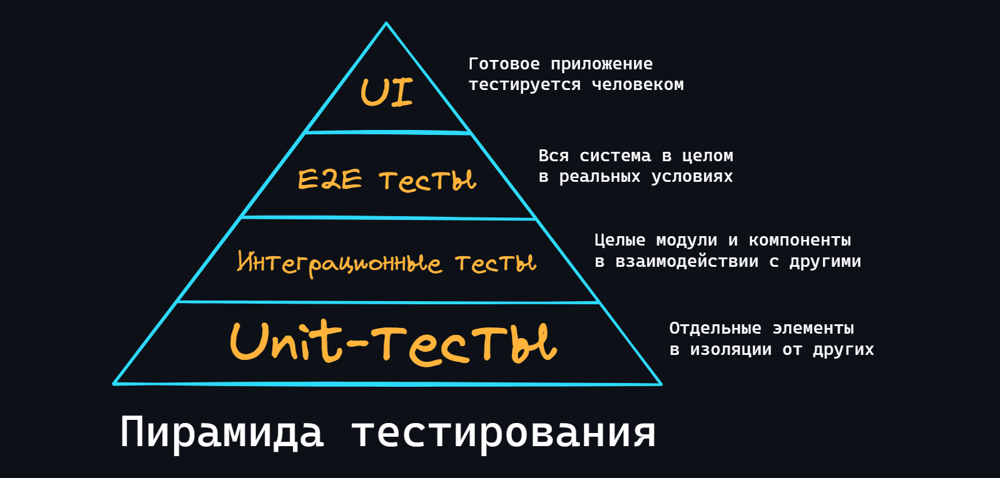

Тестирование — это процесс оценки того, что все части программы ведут себя так, как от них это ожидается. Покрытие продукта должным количеством тестов, позволяет в дальнейшем проводить быстрые проверки на то, не сломалось ли что-нибудь в приложении, после добавления нового или изменения старого функционала.

-   ### Unit-тесты

    Самый простой вид тестов. Как правило, около 70-80% от всех тестов занимают именно [unit-тесты](https://ru.wikipedia.org/wiki/%D0%9C%D0%BE%D0%B4%D1%83%D0%BB%D1%8C%D0%BD%D0%BE%D0%B5_%D1%82%D0%B5%D1%81%D1%82%D0%B8%D1%80%D0%BE%D0%B2%D0%B0%D0%BD%D0%B8%D0%B5). «Unit» означает, что тестируется не вся система в целом, а небольшие и отдельные её части (функции, методы, компоненты и т.д.) в изоляции от других. Всё зависимое внешнее окружение, как правило, покрывается [моками (mocks)](https://gist.github.com/vertigra/696e9d92dc72070584e556e2169e850d).

    - Какая польза от Unit-тестов?
      > Для примера представим автомобиль. Его «юниты» — это двигатель, тормоза, приборная панель и т.д. Их можно проверить по отдельности перед сборкой и, в случае чего заменить или починить. А можно собрать автомобиль, не протестировав юниты, — и он не поедет. Придётся всё разбирать и проверять каждую деталь.
    - Что нужно чтобы начать писать Unit-тесты?
      > Как правило, средств стандартной библиотеки языка достаточно, чтобы писать качественные тесты. Но для более удобного и быстрого написания тестов, лучше использовать сторонние инструменты. Например:
      > - Для Python используется [pytest](https://docs.pytest.org), хотя для начала хватит и стандартного [unittest](https://docs.python.org/3/library/unittest.html).
      > - Для JavaScript/TypeScript лучший выбор – это [Jest](https://jestjs.io/).
      > - Для Go – [testify](https://github.com/stretchr/testify).
      > - [И так далее...](https://github.com/atinfo/awesome-test-automation#awesome-test-automation)

    
🔗 <b>Ссылки на материалы</b>

1. 📄 [**Юнит-тестирование для чайников** – habr.com](https://habr.com/ru/post/169381/)
2. 📺 [**Unit tests - модульное тестирование** – YouTube](https://youtu.be/6whsUwWYYVk)
3. 📺 [**Python – юнит-тестирование. Использование unittest и coverage** – YouTube](https://youtu.be/YD7aYJh3k-w)
4. 📺 [**Jest. Unit Тестирование в JavaScript** – YouTube](https://youtu.be/IEDe8jl5efU)
5. 📺 [**Тестирование в Go: от плохого к хорошему** – YouTube](https://youtu.be/iJK99AQqKZY)
6. 📄 [**Когда использовать mocks в юнит-тестировании** – habr.com](https://habr.com/ru/post/577424/)

-   ### Интеграционные тесты

    [Интеграционное тестирование](https://ru.wikipedia.org/wiki/%D0%98%D0%BD%D1%82%D0%B5%D0%B3%D1%80%D0%B0%D1%86%D0%B8%D0%BE%D0%BD%D0%BD%D0%BE%D0%B5_%D1%82%D0%B5%D1%81%D1%82%D0%B8%D1%80%D0%BE%D0%B2%D0%B0%D0%BD%D0%B8%D0%B5) подразумевает тестирование отдельных модулей (компонентов) в связке с другими (то есть, в интеграции). То, что при Unit-тестировании закрывалось заглушкой – теперь является реальным компонентом или целым модулем.

    -   Зачем это нужно?
        > Интеграционные тесты это следующий этап после юнитов. Протестировав каждый компонент по отдельности мы еще не можем сказать, что основной функционал программы работает без ошибок. Потенциально, еще может существовать множество проблем, которые всплывут только после взаимодействия различных частей программы между собой.
    -   Стратегии написания интеграционных тестов
        > - **Большой Взрыв**: большинство разработанных модулей соединяются вместе, образуя либо всю необходимую систему либо её большую часть. Если всё работает, то таким спобом можно сэкономить много времени.
        > - **Инкрементальный подход**: выполняется путем соединения двух или более логически связанных модулей и затем постепенно подключаются всё новые модули, пока не будет протестирована вся система.
        > - **Подход снизу вверх**: каждый модуль на более низких уровнях тестируется с помощью модулей следующего более высокого уровня , пока не будут протестированы все модули.

    
🔗 <b>Ссылки на материалы</b>

1. 📄 [**Для чего нужно интеграционное тестирование?** – habr.com](https://habr.com/ru/post/556002/)
2. 📄 [**Интеграционное тестирование: полный обзор**](https://www.andreyolegovich.ru/qa/theory/integration.php)
3. 📺 [**Доклад: Интеграционное тестирование** – YouTube](https://youtu.be/BzDzFrhWEHE)

-   ### E2E тесты

    

    End-to-end (E2E, сквозные) тесты подразумевают тестирование работы всей системы в целом. При этом виде тестирования, реализуется среда максимально близкая к реальным условиям. Можно провести аналогию, что за компьютером сидит робот и нажимает кнопки в указанном порядке, как это делал бы реальный пользователь.

    - Когда использовать?
      > E2E это самый сложный вид тестов. Они требуют много времени, как для написания, так и для выполнения, поскольку задействуют всё приложение. Поэтому, если ваше приложение небольшое (например, его разрабатываете только Вы), то скорее всего будет достаточно написания Unit и некоторого кол-ва интеграционных тестов.

    
🔗 <b>Ссылки на материалы</b>

1. 📄 [**Сквозное тестирование (end-to-end): что, зачем, почему** – habr.com](https://habr.com/ru/post/417395/)
2. 📄 [**Про пользу E2E тестирования** – habr.com](https://habr.com/ru/post/525934/)
3. 📺 [**Доклад: End to End – the right way!** – YouTube](https://youtu.be/FlQLUsczSLQ)

-   ### Нагрузочное тестирование

    Когда вы создаете большое приложение, которое должно обслуживать большое количество запросов, возникает необходимость в тестировании этой самой возможности выдерживать большие нагрузки. Для создания [искусственной нагруженности](https://ru.wikipedia.org/wiki/%D0%9D%D0%B0%D0%B3%D1%80%D1%83%D0%B7%D0%BE%D1%87%D0%BD%D0%BE%D0%B5_%D1%82%D0%B5%D1%81%D1%82%D0%B8%D1%80%D0%BE%D0%B2%D0%B0%D0%BD%D0%B8%D0%B5) существует множество утилит.

    -   [JMeter](https://ru.wikipedia.org/wiki/JMeter)
        > Удобный интерфейс, кроссплатформенность, поддержка многопоточности, расширяемость, отличные возможности по созданию отчётов, поддержка многих протоколов для запросов.
    -   [LoadRunner](https://ru.wikipedia.org/wiki/HP_LoadRunner)
        > Имеет интересную функцию виртуальных пользователей, которые параллельно что-то делают с тестируемым приложением. Это позволяет понять как влияет работа одних пользователей, активно что-то делающих с сервисом, на работу других.
    -   [Gatling](https://en.wikipedia.org/wiki/Gatling_(software))
        > Очень мощный инструмент ориентированный уже не более опытных пользователей. Для описания сценариев используется Scala.
    -   [Taurus](https://gettaurus.org/)
        > Целый фреймворк для более удобной работы над JMeter, Gatling и так далее. Для описания тестов используется JSON или YAML.

    
🔗 <b>Ссылки на материалы</b>

1. 📄 [**Поговорим о нагрузочном тестировании** – habr.com](https://habr.com/ru/company/veeam/blog/578942/)
2. 📺 [**Использование непрерывного нагрузочного тестирования для оценки ёмкости и ресурсов** – YouTube](https://youtu.be/VHBBOgIiUgA)
3. 📄 [**Обзор инструментария для нагрузочного и перформанс-тестирования** – habr.com](https://habr.com/ru/company/jugru/blog/337928/)
4. 📄 [**Приручаем JMeter** – habr.com](https://habr.com/ru/post/261483/)
5. 📄 [**Нагрузочное тестирование на Gatling — Полное руководство** – habr.com](https://habr.com/ru/company/otus/blog/552846/)

-   ### Регрессионное тестирование

    [Регрессионное тестирование](https://ru.wikipedia.org/wiki/%D0%A0%D0%B5%D0%B3%D1%80%D0%B5%D1%81%D1%81%D0%B8%D0%BE%D0%BD%D0%BD%D0%BE%D0%B5_%D1%82%D0%B5%D1%81%D1%82%D0%B8%D1%80%D0%BE%D0%B2%D0%B0%D0%BD%D0%B8%D0%B5) (regression - движение назад) – вид тестирования, направленный на обнаружение ошибок в уже протестированных участках исходного кода.

    - Зачем нужно?
      > По статистике, повторное появление одних и тех же ошибок в коде - довольно частое явление. И, что самое интересное, выпускаемые для них патчи/фиксы со временем также перестают работать. Поэтому считается хорошей практикой при исправлении ошибки создать тест на неё и регулярно прогонять его при последующих изменениях.

    
🔗 <b>Ссылки на материалы</b>

1. 📺 [**Регрессионное тестирование** – YouTube](https://youtu.be/1f3yfUnji8o)
2. 📄 [**Что нужно знать о регрессионном тестировании**](https://otus.ru/journal/chto-nuzhno-znat-o-regressionnom-testirovanii/)

