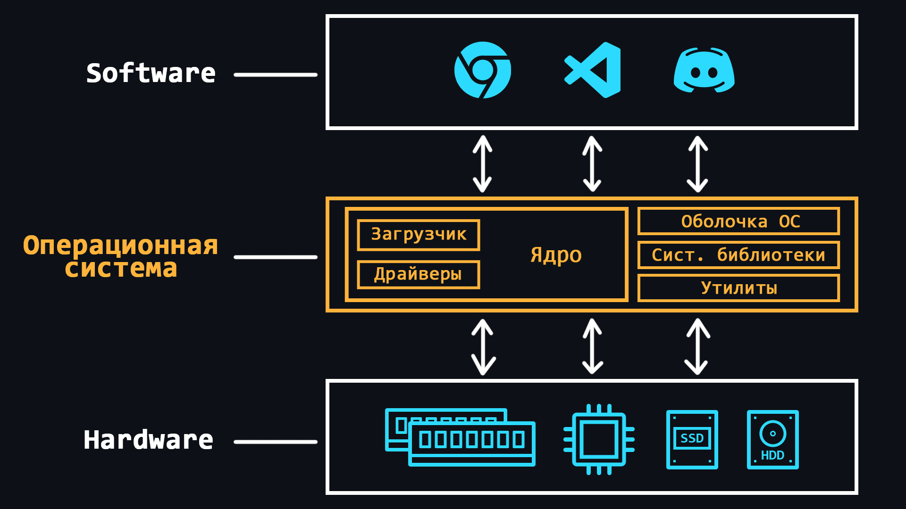
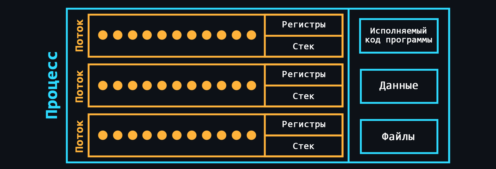
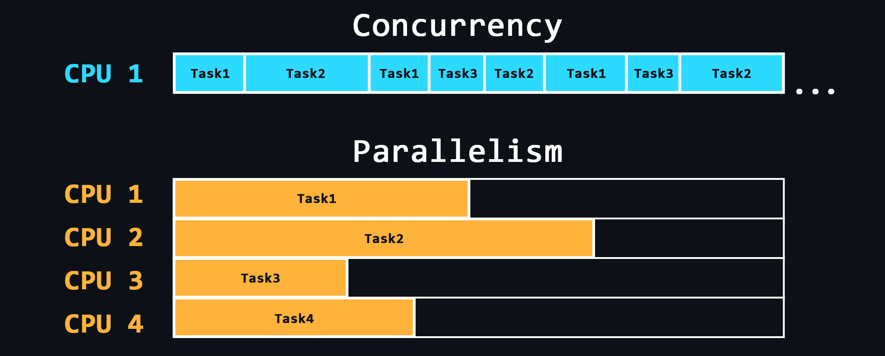

-   ### Основные компоненты (железо)

    - [Материнская плата](https://ru.wikipedia.org/wiki/%D0%9C%D0%B0%D1%82%D0%B5%D1%80%D0%B8%D0%BD%D1%81%D0%BA%D0%B0%D1%8F_%D0%BF%D0%BB%D0%B0%D1%82%D0%B0)
      > Самый важный компонент ПК к которому подключаются все остальные элементы.
      > - [Чипсет](https://ru.wikipedia.org/wiki/%D0%A7%D0%B8%D0%BF%D1%81%D0%B5%D1%82) - набор микросхем, который отвечает за коммуникацию всех элементов материнской платы.
      > - [Сокет](https://ru.wikipedia.org/wiki/%D0%A1%D0%BF%D0%B8%D1%81%D0%BE%D0%BA_%D1%80%D0%B0%D0%B7%D1%8A%D1%91%D0%BC%D0%BE%D0%B2_%D0%BC%D0%B8%D0%BA%D1%80%D0%BE%D0%BF%D1%80%D0%BE%D1%86%D0%B5%D1%81%D1%81%D0%BE%D1%80%D0%BE%D0%B2) - разъем для установки процессора.
      > - [VRM (Voltage Regulator Module)](https://club.dns-shop.ru/blog/t-102-materinskie-platyi/38267-chto-takoe-vrm-materinskoi-platyi) - модуль который преобразовывает поступающие напряжение (как правило 12 В) в более низкое для работы процессора, встроенной графики и оперативной памяти.
      > - Слоты для оперативной памяти.
      > - Слоты расширения [PCI-Express](https://ru.wikipedia.org/wiki/PCI_Express) - предназначены для подключения видеокарт, внешних сетевых/звуковых карт.
      > - Слоты [М.2](https://ru.wikipedia.org/wiki/M.2) / [SATA](https://ru.wikipedia.org/wiki/SATA) - предназначены для подключения жёстких дисков и SSD.
    - [Процессор](https://ru.wikipedia.org/wiki/%D0%A6%D0%B5%D0%BD%D1%82%D1%80%D0%B0%D0%BB%D1%8C%D0%BD%D1%8B%D0%B9_%D0%BF%D1%80%D0%BE%D1%86%D0%B5%D1%81%D1%81%D0%BE%D1%80) (ЦП / CPU)
      > Важнейшее устройство, которое исполняет инструкции (код программы). Процессоры работают только с 1 и 0, поэтому все программы в конечном виде представляют из себя набор двоичного кода.
      > - [Регистры](https://ru.wikipedia.org/wiki/%D0%A0%D0%B5%D0%B3%D0%B8%D1%81%D1%82%D1%80_%D0%BF%D1%80%D0%BE%D1%86%D0%B5%D1%81%D1%81%D0%BE%D1%80%D0%B0) - самая быстрая память в ПК, имеет крайне малый объем, встроена в процессор и предназначена для временного хранения обрабатываемых данных.
      > - [Кэш (Cache)](https://ru.wikipedia.org/wiki/%D0%9A%D1%8D%D1%88_%D0%BF%D1%80%D0%BE%D1%86%D0%B5%D1%81%D1%81%D0%BE%D1%80%D0%B0) - чуть менее быстрая память, которая так же встроена в процессор и используемая для хранения копии данных из часто используемых ячеек основной памяти.
      > - Процессоры могут иметь разные [архитектуры](https://ru.wikipedia.org/wiki/%D0%90%D1%80%D1%85%D0%B8%D1%82%D0%B5%D0%BA%D1%82%D1%83%D1%80%D0%B0_%D0%BF%D1%80%D0%BE%D1%86%D0%B5%D1%81%D1%81%D0%BE%D1%80%D0%B0). В настоящее время наиболее распространена [архитектура х86](https://ru.wikipedia.org/wiki/X86-64) (настольные ПК и ноутбуки) и [ARM](https://ru.wikipedia.org/wiki/ARM_(%D0%B0%D1%80%D1%85%D0%B8%D1%82%D0%B5%D0%BA%D1%82%D1%83%D1%80%D0%B0)) (мобильные девайсы, а также компьютеры фирмы Apple).
    - [Оперативная память](https://ru.wikipedia.org/wiki/DRAM) (ОЗУ / RAM)
      > Быстрая память небольшого объема (4-16GB), предназначенная для временного хранения кода программы, а также входных, выходных и промежуточных данных, обрабатываемых процессором.
    - [Постоянная память](https://ru.wikipedia.org/wiki/%D0%97%D0%B0%D0%BF%D0%BE%D0%BC%D0%B8%D0%BD%D0%B0%D1%8E%D1%89%D0%B5%D0%B5_%D1%83%D1%81%D1%82%D1%80%D0%BE%D0%B9%D1%81%D1%82%D0%B2%D0%BE)
      > Память большого объема (256GB-1TB), предназначенная для долговременного хранения файлов и установленных программ.
    - [Видеокарта](https://ru.wikipedia.org/wiki/%D0%92%D0%B8%D0%B4%D0%B5%D0%BE%D0%BA%D0%B0%D1%80%D1%82%D0%B0) (GPU)
      > Отдельная плата, занимающаяся переводом и обработкой данных в изображения для вывода их на экран монитора. Такое устройство ещё называют дискретной видеокартой. Обычно нужны для тех, кто занимается 3D моделированием или играет в игры.
      > [Встроенная видеокарта](https://ru.wikipedia.org/wiki/%D0%92%D1%81%D1%82%D1%80%D0%BE%D0%B5%D0%BD%D0%BD%D1%8B%D0%B9_%D0%B3%D1%80%D0%B0%D1%84%D0%B8%D1%87%D0%B5%D1%81%D0%BA%D0%B8%D0%B9_%D0%BF%D1%80%D0%BE%D1%86%D0%B5%D1%81%D1%81%D0%BE%D1%80) – это видеокарта встроенная в процессор. Подходит для повседневной работы.
    - [Сетевая карта](https://ru.wikipedia.org/wiki/%D0%A1%D0%B5%D1%82%D0%B5%D0%B2%D0%B0%D1%8F_%D0%BF%D0%BB%D0%B0%D1%82%D0%B0)
      > Устройство, которое обеспечивает приём и передачу данных от других устройств подключённых к [одной сети](https://ru.wikipedia.org/wiki/%D0%9B%D0%BE%D0%BA%D0%B0%D0%BB%D1%8C%D0%BD%D0%B0%D1%8F_%D0%B2%D1%8B%D1%87%D0%B8%D1%81%D0%BB%D0%B8%D1%82%D0%B5%D0%BB%D1%8C%D0%BD%D0%B0%D1%8F_%D1%81%D0%B5%D1%82%D1%8C).
    - [Звуковая карта](https://ru.wikipedia.org/wiki/%D0%97%D0%B2%D1%83%D0%BA%D0%BE%D0%B2%D0%B0%D1%8F_%D0%BA%D0%B0%D1%80%D1%82%D0%B0)
      > Устройство позволяющее обрабатывать звук, выводить его на другие устройства, записывать с помощью микрофона и т.д.
    - [Блок питания](https://ru.wikipedia.org/wiki/%D0%91%D0%BB%D0%BE%D0%BA_%D0%BF%D0%B8%D1%82%D0%B0%D0%BD%D0%B8%D1%8F_%D0%BA%D0%BE%D0%BC%D0%BF%D1%8C%D1%8E%D1%82%D0%B5%D1%80%D0%B0)
      > Устройство, предназначенное для преобразования напряжения переменного тока от сети в напряжение постоянного тока.

    
🔗 <b>Ссылки на материалы</b>

1. 📺 [**Устройство Компьютера для чайников** – YouTube](https://youtu.be/QYR_muKHO00)
2. 📺 [**Материнская плата. Из чего она состоит?** – YouTube](https://youtu.be/sABaxhk6hXo)
3. 📄 [**Внутри материнской платы: анализ технологий, лежащих в основе компонентов ПК** – habr.com](https://habr.com/ru/company/pixonic/blog/558602/)
4. 📺 [**Как работает процессор** – YouTube](https://youtu.be/k9wK2FThEsk)
5. 📄 [**Как работает CPU: интерактивный урок** – habr.com](https://habr.com/ru/post/240929/)
6. 📺 [**Как работает кэш процессора** – YouTube](https://youtu.be/7n_8cOBpQrg)
7. 📺 [**Различия компьютерных архитектур** – YouTube](https://youtu.be/vVjvrTnjoVs)
8. 📺 [**ПРОЦЕССОРЫ ARM vs x86: ОБЪЯСНЯЕМ** – YouTube](https://youtu.be/5hBBFnMevvA)
9. 📄 [**Чем архитектура ARM отличается от x86**](https://losst.pro/chem-arhitektura-arm-otlichaetsya-ot-x86)
10. 📺 [**Как работает память компьютера** – YouTube](https://youtu.be/Wh22_O8jXVQ)
11. 📄 [**Анатомия оперативной памяти** – habr.com](https://habr.com/ru/post/506470/)
12. 📺 [**Сетевая карта** – YouTube](https://youtu.be/RoL9ro7DWX0)
13. 📄 [**О работе ПК на примере Windows 10 и клавиатуры** – habr.com](https://habr.com/ru/post/483330/)

-   ### Устройство операционной системы

    

    [Операционная система (ОС)](https://ru.wikipedia.org/wiki/%D0%9E%D0%BF%D0%B5%D1%80%D0%B0%D1%86%D0%B8%D0%BE%D0%BD%D0%BD%D0%B0%D1%8F_%D1%81%D0%B8%D1%81%D1%82%D0%B5%D0%BC%D0%B0) – это комплексная программная система, которая предназначена для управления ресурсами компьютера. Благодаря операционным системам людям не приходится иметь дело непосредственно с процессором, оперативной памятью или другими составляющими ПК.

    То есть, ОС можно представить как слой абстракции, который управляет железом (hardware) компьютера, тем самым предоставляя простую и удобную среду для работы пользовательского софта (software).

    -   Основные функции
        > - Управление оперативной памятью (выделение пространства для отдельных программ)  
        > - Загрузка программ в оперативную память и их выполнение  
        > - Выполнение запросов поступающих от пользовательских программ (ввод и вывод данных, запуск и остановка других программ, высвобождение памяти или выделение дополнительной...)  
        > - Взаимодействие с устройствами ввода и вывода (мышь, клавиатура, монитор...)  
        > - Взаимодействие с носителями информации (жесткие диски, SSD...)  
        > - Предоставление пользовательского интерфейса (консольная оболочка или графичеcкий интерфейс)  
        > - Ведение журнала об программных ошибках (сохранение логов)
    -   Дополнительные функции (могут быть не во всех ОС)
        > - Организация [многозадачности](https://ru.wikipedia.org/wiki/%D0%9C%D0%BD%D0%BE%D0%B3%D0%BE%D0%B7%D0%B0%D0%B4%D0%B0%D1%87%D0%BD%D0%BE%D1%81%D1%82%D1%8C) (одновременное выполнение нескольких программ)  
        > - Разграничивание доступа к ресурсам для каждого процесса  
        > - [Взаимодействие между процессами](https://ru.wikipedia.org/wiki/%D0%9C%D0%B5%D0%B6%D0%BF%D1%80%D0%BE%D1%86%D0%B5%D1%81%D1%81%D0%BD%D0%BE%D0%B5_%D0%B2%D0%B7%D0%B0%D0%B8%D0%BC%D0%BE%D0%B4%D0%B5%D0%B9%D1%81%D1%82%D0%B2%D0%B8%D0%B5) (обмен данными, синхронизация)  
        > - Организация защиты самой ОС от других программ и действий самого пользователя  
        > - Предоставление многопользовательского режима и разграничение прав между разными пользователями ОС (админ, гость...)
    -   [Ядро ОС](https://ru.wikipedia.org/wiki/%D0%AF%D0%B4%D1%80%D0%BE_%D0%BE%D0%BF%D0%B5%D1%80%D0%B0%D1%86%D0%B8%D0%BE%D0%BD%D0%BD%D0%BE%D0%B9_%D1%81%D0%B8%D1%81%D1%82%D0%B5%D0%BC%D1%8B)
        > Центральная часть ОС, которая используется наиболее интенсивно. Ядро постоянно находится в памяти, в то время как другие части ОС загружаются в память и выгружаются из неё по мере надобности.
    -   [Загрузчик ОС](https://ru.wikipedia.org/wiki/%D0%97%D0%B0%D0%B3%D1%80%D1%83%D0%B7%D1%87%D0%B8%D0%BA_%D0%BE%D0%BF%D0%B5%D1%80%D0%B0%D1%86%D0%B8%D0%BE%D0%BD%D0%BD%D0%BE%D0%B9_%D1%81%D0%B8%D1%81%D1%82%D0%B5%D0%BC%D1%8B)
        > Системный софт, который обеспечивает подготовку окружения для запуска ОС (приводит аппаратуру в нужное состояние, подготавливает память, загружает туда ядро ОС и передает ему (ядру) управление).
    -   [Драйверы](https://ru.wikipedia.org/wiki/%D0%94%D1%80%D0%B0%D0%B9%D0%B2%D0%B5%D1%80)
        > Специальное ПО, которое позволяет ОС работать с тем или иным оборудованием.

    
🔗 <b>Ссылки на материалы</b>

1. 📺 [**Что такое операционная система и как она работает** – YouTube](https://www.youtube.com/watch?v=hb9CTGSJm88&t)
2. 📺 [**Плейлист по операционным системам** – YouTube](https://www.youtube.com/playlist?list=PLo6puixMwuSPrKOCsJhrtr-m79mFthit9)
3. 📄 [**Что такое операционная система и как она работает?** – GitHub](https://github.com/Steindvart/My_study/blob/master/docs/source/OS/articles/what_is_os.rst)
4. 📺 [**Что такое ядро операционной системы? Назначение и виды ядер** – YouTube](https://youtu.be/Bdh88Fd--54)
5. 📺 [**Ввод-вывод внутри компьютера** – YouTube](https://youtu.be/JkOB_eOgNXQ)

-   ### Процессы и потоки

    

    -   [Процесс](https://ru.wikipedia.org/wiki/%D0%9F%D1%80%D0%BE%D1%86%D0%B5%D1%81%D1%81_(%D0%B8%D0%BD%D1%84%D0%BE%D1%80%D0%BC%D0%B0%D1%82%D0%B8%D0%BA%D0%B0))
        > Cвоего рода контейнер, в котором находятся все необходимые ресурсы для работы той или иной программы. Как правило в состав процесса входят:
        > -   Исполняемый код программы  
        > -   Входные и выходные данные  
        > -   [Стек вызовов](https://ru.wikipedia.org/wiki/%D0%A1%D1%82%D0%B5%D0%BA_%D0%B2%D1%8B%D0%B7%D0%BE%D0%B2%D0%BE%D0%B2) (порядок инструкций для выполнения)  
        > -   [Куча](https://ru.wikipedia.org/wiki/%D0%9A%D1%83%D1%87%D0%B0_(%D0%BF%D0%B0%D0%BC%D1%8F%D1%82%D1%8C)) (структура для хранения промежуточных данных, создаваемых во время работы процесса)  
        > -   [Дескриптор сегмента](https://ru.wikipedia.org/wiki/%D0%94%D0%B5%D1%81%D0%BA%D1%80%D0%B8%D0%BF%D1%82%D0%BE%D1%80_%D1%81%D0%B5%D0%B3%D0%BC%D0%B5%D0%BD%D1%82%D0%B0)  
        > -   [Файловые дескрипторы](https://ru.wikipedia.org/wiki/%D0%A4%D0%B0%D0%B9%D0%BB%D0%BE%D0%B2%D1%8B%D0%B9_%D0%B4%D0%B5%D1%81%D0%BA%D1%80%D0%B8%D0%BF%D1%82%D0%BE%D1%80)  
        > -   Информация о наборе допустимых полномочий  
        > -   Информация о состоянии процессора
    -   [Поток](https://ru.wikipedia.org/wiki/%D0%9F%D0%BE%D1%82%D0%BE%D0%BA_%D0%B2%D1%8B%D0%BF%D0%BE%D0%BB%D0%BD%D0%B5%D0%BD%D0%B8%D1%8F)
        > Cущность, в которой выполняются последовательности действий (процедуры) программы. Потоки находятся внутри процесса и используют то же адресное пространство. В одном процессе может быть несколько потоков, что обеспечивает возможность выполнения нескольких задач. Эти задачи, благодаря потокам, могут обмениваться данными, использовать общие данные или результаты других задач.

    
🔗 <b>Ссылки на материалы</b>

1. 📺 [**Процессы и потоки в операционной системе** – YouTube](https://youtu.be/Xwm_88dDdBQ)
2. 📄 [**Процессы и потоки**](https://learnc.info/c/processes_and_threads.html)
3. 📺 [**Что такое поток?** – YouTube](https://youtu.be/t1JpAC1LOKg)
4. 📄 [**Многозадачность и процессы**](https://doka.guide/tools/multitasking-and-processes/)

-   ### Межпроцессорное взаимодействие

    Механизм позволяющий организовать обмен данными между потоками одного или разных процессов. Причем, процессы могут быть запущены как на одном и том же компьютере, так и на разных, соединенных сетью. [Межпроцессорные взаимодействия](https://ru.wikipedia.org/wiki/%D0%9C%D0%B5%D0%B6%D0%BF%D1%80%D0%BE%D1%86%D0%B5%D1%81%D1%81%D0%BD%D0%BE%D0%B5_%D0%B2%D0%B7%D0%B0%D0%B8%D0%BC%D0%BE%D0%B4%D0%B5%D0%B9%D1%81%D1%82%D0%B2%D0%B8%D0%B5) бывают разных типов.

    -   [Файл](https://ru.wikipedia.org/wiki/%D0%A4%D0%B0%D0%B9%D0%BB)
        > Самый простой способ организовать обмен данными. Один процесс записывает данные в определенный файл, другой процесс читает этот же файл и тем самым получает данные от первого процесса.
    -   [Сигнал](https://ru.wikipedia.org/wiki/%D0%A1%D0%B8%D0%B3%D0%BD%D0%B0%D0%BB%D1%8B_(UNIX))
        > Асинхронное уведомление одного процесса о событии произошедшем в другом процессе.
    -   [Сокет](https://ru.wikipedia.org/wiki/%D0%A1%D0%BE%D0%BA%D0%B5%D1%82_(%D0%BF%D1%80%D0%BE%D0%B3%D1%80%D0%B0%D0%BC%D0%BC%D0%BD%D1%8B%D0%B9_%D0%B8%D0%BD%D1%82%D0%B5%D1%80%D1%84%D0%B5%D0%B9%D1%81))
        > В частности для взаимодействия между компьютерами с помощью стека протоколов TCP/IP используются IP-адреса и порты. Эта пара определяет сокет («гнездо», соответствующее адресу и порту).
    -   [Семафор](https://ru.wikipedia.org/wiki/%D0%A1%D0%B5%D0%BC%D0%B0%D1%84%D0%BE%D1%80_(%D0%B8%D0%BD%D1%84%D0%BE%D1%80%D0%BC%D0%B0%D1%82%D0%B8%D0%BA%D0%B0))
        > Счетчик над которым можно проводить только 2 операции: увеличение и уменьшение (причем для 0 операция уменьшения блокируется).
    -   [Сообщения](https://ru.wikipedia.org/wiki/%D0%9E%D0%B1%D0%BC%D0%B5%D0%BD_%D1%81%D0%BE%D0%BE%D0%B1%D1%89%D0%B5%D0%BD%D0%B8%D1%8F%D0%BC%D0%B8) и [очереди сообщений](https://ru.wikipedia.org/wiki/%D0%9E%D1%87%D0%B5%D1%80%D0%B5%D0%B4%D1%8C_%D1%81%D0%BE%D0%BE%D0%B1%D1%89%D0%B5%D0%BD%D0%B8%D0%B9)
    -   [Каналы](https://ru.wikipedia.org/wiki/%D0%9A%D0%BE%D0%BD%D0%B2%D0%B5%D0%B9%D0%B5%D1%80_(Unix)) (akа конвейеры, pipes)
        > Перенаправление выходных данных одного процесса на вход другого процесса (подобие трубы).

    
🔗 <b>Ссылки на материалы</b>

1. 📺 [**Архитектура ЭВМ. Межпроцессное взаимодействие** – YouTube](https://youtu.be/XAODLLrV3uk)
2. 📺 [**Основы программирования. Межпроцессное взаимодействие** – YouTube](https://youtu.be/Mz7UEdqbEpw)
3. 📄 [**IPC: основы межпроцессного взаимодействия**](https://www.rsdn.org/article/baseserv/ipc.xml)
4. 📺 [**Интерфейс сокетов | Курс "Компьютерные сети"** – YouTube](https://youtu.be/_vAjHdh92YU)
5. 📺 [**Порты, сокеты, статика (для самых маленьких программистов)** – YouTube](https://youtu.be/-bLRj0U-xhc)
6. 📺 [**Разделяемая память. Семафоры** – YouTube](https://youtu.be/g_qco-EJqDM)

-   ### Конкурентность и параллелизм

    

    -   [Параллелизм (Parallelism)](https://ru.wikipedia.org/wiki/%D0%9F%D0%B0%D1%80%D0%B0%D0%BB%D0%BB%D0%B5%D0%BB%D0%B8%D0%B7%D0%BC_(%D0%B8%D0%BD%D1%84%D0%BE%D1%80%D0%BC%D0%B0%D1%82%D0%B8%D0%BA%D0%B0))
        > Способность выполнять несколько задач одновременно используя несколько ядер процессора, где на каждом отдельном ядре выполняется отдельно взятая задача.
    -   [Конкурентность (Concurrency)](https://en.wikipedia.org/wiki/Concurrency_(computer_science))
        > Способность выполнять несколько задач, но используя одно ядро процессора. Это достигается путем разделения задач на отдельные блоки команд, которые выполняются по очереди, но переключение между этими блоками происходит настолько быстро, что для пользователей создается впечатление, будто эти процессы выполняются одновременно.

    
🔗 <b>Ссылки на материалы</b>

1. 📺 [**Чем отличаются Concurrency и Parallelism** – YouTube](https://youtu.be/4PNneed92lM)
2. 📄 [**Отличие между конкурентностью, параллелизмом и многопоточностью** – GitHub](https://github.com/gm-soft/knowledge-base/blob/master/dot-net/2019-11-06-asynchronous-programming-epm-theory.md)
3. 📄 [**Parallelism vs Concurrency: правильно подбираем инструменты** – habr.com](https://habr.com/ru/company/piter/blog/274569/)
4. 📄 [**Параллелизм против многопоточности против асинхронного программирования: разъяснение** – habr.com](https://habr.com/ru/post/337528/)

-   ### Многопоточность

    Сегодня компьютеры имеют процессоры с несколькими физическими и виртуальными ядрами, а если взять в расчет серверные машины, то там их количество может доходить до сотен. Все эти имеющиеся ресурсы хорошо бы задействовать по полной, для максимальной производительности приложения. Поэтому современная серверная разработка не обходится без реализации [многопоточности](https://ru.wikipedia.org/wiki/%D0%9C%D0%BD%D0%BE%D0%B3%D0%BE%D0%BF%D0%BE%D1%82%D0%BE%D1%87%D0%BD%D0%BE%D1%81%D1%82%D1%8C) и [распараллеливания](https://ru.wikipedia.org/wiki/%D0%A0%D0%B0%D1%81%D0%BF%D0%B0%D1%80%D0%B0%D0%BB%D0%BB%D0%B5%D0%BB%D0%B8%D0%B2%D0%B0%D0%BD%D0%B8%D0%B5_%D0%BF%D1%80%D0%BE%D0%B3%D1%80%D0%B0%D0%BC%D0%BC).

    -   [Race conditions и data races](https://ru.wikipedia.org/wiki/%D0%A1%D0%BE%D1%81%D1%82%D0%BE%D1%8F%D0%BD%D0%B8%D0%B5_%D0%B3%D0%BE%D0%BD%D0%BA%D0%B8)
        > Основные проблемы которые возникают при использовании многопоточности.
    -   Создание процессов
    -   Создание потоков
    -   [Сопрограммы (сorutines)](https://ru.wikipedia.org/wiki/%D0%A1%D0%BE%D0%BF%D1%80%D0%BE%D0%B3%D1%80%D0%B0%D0%BC%D0%BC%D0%B0)
        > Легковесные потоки исполнения кода, которые организуются поверх аппаратных (системных) потоков. Могут существовать как отдельные библиотеки или быть уже встроенными в ЯП.
    -   [Атомарные операции](https://ru.wikipedia.org/wiki/%D0%90%D1%82%D0%BE%D0%BC%D0%B0%D1%80%D0%BD%D0%B0%D1%8F_%D0%BE%D0%BF%D0%B5%D1%80%D0%B0%D1%86%D0%B8%D1%8F)
        > Операции которые выполняются полностью, либо не выполняются вообще.
    -   Блокировки
        > Использование семафоров и [мьютексов](https://ru.wikipedia.org/wiki/%D0%9C%D1%8C%D1%8E%D1%82%D0%B5%D0%BA%D1%81) для синхронизации данных.

    
🔗 <b>Ссылки на материалы</b>

1. 📄 [**Race condition в веб-приложениях** – habr.com](https://habr.com/ru/post/460339/)
2. 📄 [**Знакомство с уровнями распараллеливания** – ](https://habr.com/ru/company/intel/blog/80342/)
3. 📄 [**Атомарные и неатомарные операции** – habr.com](https://habr.com/ru/post/244881/)
4. 📄 [**Многопоточность, общие данные и мьютексы** – habr.com](https://habr.com/ru/post/72929/)
5. 📺 [**Многопроцессность, многопоточность, асинхронность в Python и не только** – YouTube](https://youtu.be/JIp14T9bvvc)
6. 📺 [**Worker threads. Многопоточность в Node.js** – YouTube](https://youtu.be/96naNd2xbpA)
7. 📺 [**Всё про конкурентность в Go** – YouTube](https://youtu.be/mvUiw9ilqn8)

-   ### Продвинутые темы

    -   [Сборщик мусора (garbage collector)](https://ru.wikipedia.org/wiki/%D0%A1%D0%B1%D0%BE%D1%80%D0%BA%D0%B0_%D0%BC%D1%83%D1%81%D0%BE%D1%80%D0%B0)
        > Процесс благодаря которому сильно популяризировались языки высокого уровня – позволяет программисту не заботится о выделении и очистке памяти. Обязательно ознакомьтесь с тонкостями его работы в своем ЯП.
    -   [Отладчик кода (debuger)](https://ru.wikipedia.org/wiki/%D0%9E%D1%82%D0%BB%D0%B0%D0%B4%D0%BA%D0%B0_%D0%BF%D1%80%D0%BE%D0%B3%D1%80%D0%B0%D0%BC%D0%BC%D1%8B)
        > Удобный инструмент для анализа работы кода программы и выявления ошибок.

    
🔗 <b>Ссылки на материалы</b>

1. 📺 [**Python Memory Management на пальцах** – YouTube](https://youtu.be/8GpI0PAGniA)
2. 📺 [**Управление памятью в python** – YouTube](https://youtu.be/4KhVCga8guc)
3. 📺 [**Утечки памяти в Node.js и JavaScript, сборка мусора и профилирование** – YouTube](https://youtu.be/0oZa64SB2wM)
4. 📺 [**Примеры утечек памяти в JavaScript** – YouTube](https://youtu.be/HJSnq0z_cOE)
5. 📺 [**Как устроена сборка мусора в Go** – YouTube](https://youtu.be/ZZJBu2o-NBU)
6. 📺 [**Потребление оперативной памяти в языке Go: проблемы и пути решения** – YouTube](https://youtu.be/_BbhmaZupqs)

