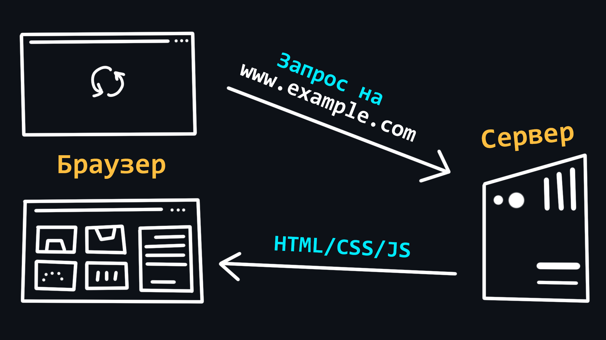
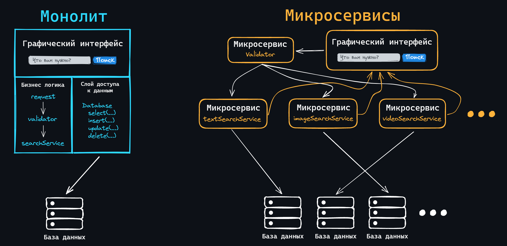
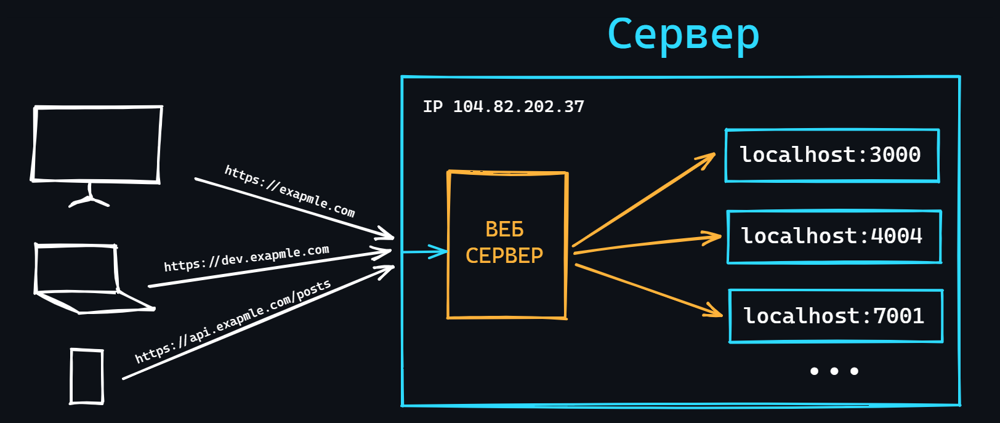
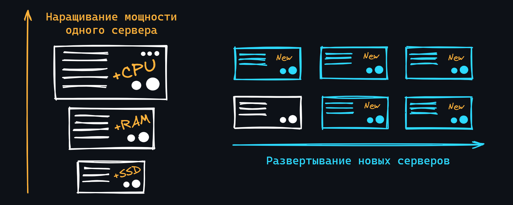
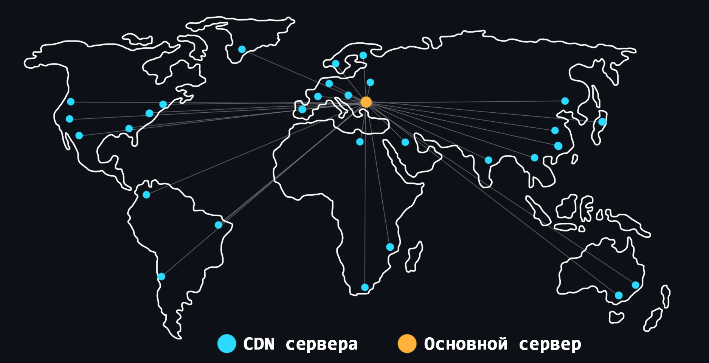
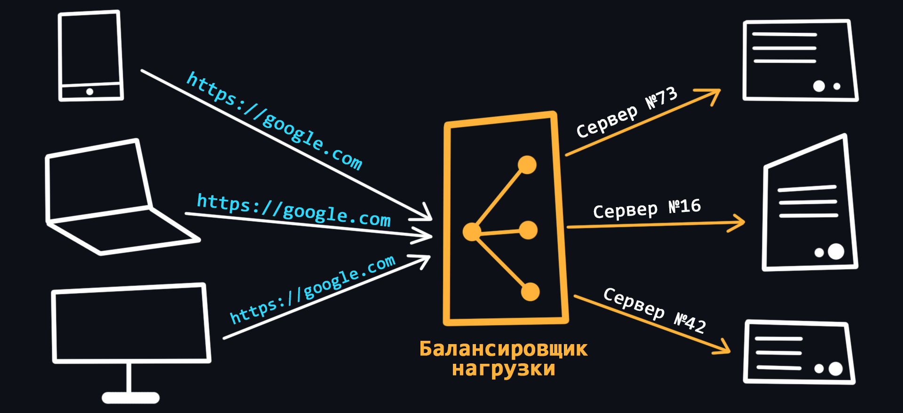

-   ### Устройство веб-приложений

    Современные [веб-приложения](https://ru.wikipedia.org/wiki/%D0%92%D0%B5%D0%B1-%D0%BF%D1%80%D0%B8%D0%BB%D0%BE%D0%B6%D0%B5%D0%BD%D0%B8%D0%B5) состоят из двух частей: клиентской (frontend) и серверной (backend). Тем самым реализуя [клиент-серверную архитектуру](https://ru.wikipedia.org/wiki/%D0%9A%D0%BB%D0%B8%D0%B5%D0%BD%D1%82_%E2%80%94_%D1%81%D0%B5%D1%80%D0%B2%D0%B5%D1%80).

    Задачами клиентской части являются:
   -   Реализация пользовательского интерфейса (внешний вид приложения)
       > - Для создания веб-страниц используется специальный язык разметки – [HTML](https://ru.wikipedia.org/wiki/HTML).
       > - Для стилизации шрифтов, расположения содержимого и т.д. используется язык стилей – [CSS](https://ru.wikipedia.org/wiki/CSS).
       > - Для добавления динамики и интерактивности – язык программирования [JavaScript](https://ru.wikipedia.org/wiki/JavaScript).  
           > Как правило в чистом виде эти инструменты используются редко, поскольку для более удобной и быстрой разработки существуют так называемые [фреймворки](https://2020.stateofjs.com/ru-RU/technologies/front-end-frameworks/) и [препроцессоры](https://mrmlnc.gitbooks.io/less-guidebook-for-beginners/content/chapter_1/css-reprocessors.html).  
   -   Cоздание функционала для формирования запросов к серверу
       > Как правило это различного вида формы ввода, с которыми можно удобно взаимодействовать.
   -   Приём данных от сервера и их последующая обработка для вывода на клиент

    Задачи серверной части:
   -   Обработка клиентских запросов
       > Проверка на наличие прав и доступа, разного рода валидации и т.д.
   -   Выполнение бизнес логики
       > Здесь может подразумевается широкий спектр задач: работа с базами данных, обработка информации, вычисления и т.д. Это, так сказать, самое сердце мира Backend. Здесь и происходит все самое важное и интересное.
   -   Формирование ответа и отправка его на клиент

    
🔗 <b>Ссылки на материалы</b>

1. 📄 [**Как работают веб-приложения** – habr.com](https://habr.com/ru/post/450282)
2. 📺 [**Как устроены веб-приложения? (Frontend/Backend)** – YouTube](https://youtu.be/nQBNH0x4YmI)
3. 📺 [**Архитектура современных WEB приложений. Эволюция от А до Я** – YouTube](https://youtu.be/S0e_5a2WB60)
4. 📄 [**Что такое HTML за 7 минут**](https://youtu.be/MBe1h80ghKA)
5. 📄 [**Базовый курс по фронтенду** – (MDN) mozilla.org](https://developer.mozilla.org/ru/docs/Learn/Front-end_web_developer)
6. 📄 [**Frontend Developer roadmap**](https://roadmap.sh/frontend)
7. 📄 [**Нативные, гибридные и web-приложения в сравнении** – medium.com](https://medium.com/nuances-of-programming/%D0%BD%D0%B0%D1%82%D0%B8%D0%B2%D0%BD%D1%8B%D0%B5-%D0%B3%D0%B8%D0%B1%D1%80%D0%B8%D0%B4%D0%BD%D1%8B%D0%B5-%D0%B8-web-%D0%BF%D1%80%D0%B8%D0%BB%D0%BE%D0%B6%D0%B5%D0%BD%D0%B8%D1%8F-%D0%B2-%D1%81%D1%80%D0%B0%D0%B2%D0%BD%D0%B5%D0%BD%D0%B8%D0%B8-b1360258df2d)

-   ### Браузеры и как они работают

    

    [Браузер](https://ru.wikipedia.org/wiki/Браузер) – клиент, с помощью которого можно отправлять запросы на сервер для получения файлов, которые впоследствии используются для отрисовки web-страниц. Если совсем упрощенно, то браузер можно воспринимать как программу для просмотра HTML-файлов, которая так же может искать и скачивать их из интернета.

   -   Принцип работы
       > Работа с запросами, отрисовка страниц, особенность работы вкладок (для каждой вкладки создается отдельный процесс, чтобы не допустить ситуации, при которой содержимое одной вкладки имеет возможность влиять на содержимое другой).
   -   Расширения ([WebExtensions](https://ru.wikipedia.org/wiki/WebExtensions))
       > Позволяют менять пользовательский интерфейс браузера, модифицировать содержимое вебстраниц, изменять сетевые запросы браузера.
   -   Инструменты разработчика ([DevTools](https://developer.chrome.com/docs/devtools/overview/))
       > Незаменимый инструмент любого веб-разработчика. Позволяет анализировать всю возможную информацию связанную с веб-страницами, мониторить их производительность, логи и, что для нас самое важное, отслеживать информацию о сетевых запросах.

    
🔗 <b>Ссылки на материалы</b>

1. 📄 [**Как работают браузеры** — MDN (mozilla.org)](https://developer.mozilla.org/ru/docs/Web/Performance/How_browsers_work)
2. 📄 [**Как работают браузеры — введение в безопасность веб-приложений** – habr.com](https://habr.com/ru/company/edison/blog/432870/)
3. 📄 [**Как браузер рисует страницы**](https://doka.guide/js/how-the-browser-creates-pages/)
4. 📄 [**Важные аспекты работы браузера для разработчиков** – habr.com](https://habr.com/ru/company/dataart/blog/304138/)
5. 📄 [**Обзор всех инструментов разработчика Chrome DevTools** – habr.com](https://habr.com/ru/company/simbirsoft/blog/337116/)
6. 📄 [**Что на самом деле происходит, когда пользователь вбивает в браузер адрес google.com** – habr.com](https://habr.com/ru/company/htmlacademy/blog/254825/)
7. 📄 [**Принципы работы современных веб-браузеров**](https://www.html5rocks.com/ru/tutorials/internals/howbrowserswork/)
8. 📄 [**Подробное объяснение того, как работает браузер (под капотом)**](https://russianblogs.com/article/7580365317/)
9. 📺 [**Архитектура браузера. Движки и рендер. Самое подробное видео** – YouTube](https://youtu.be/zDlg64fsQow)

-   ### Разработка серверов

    -   Создание и запуск локального HTTP-сервера
    -   Раздача статических файлов
        > Поднятие HTML-страничек; хостинг картинок, PDF-файлов и т.д.
    -   Маршрутизация
        > Создание эндпоинтов (URL-адресов) при обращении к которым на сервере будет вызывается соответствующий обработчик.
    -   Обработка запросов
        > Как правило в HTTP-обработчиках имеется специальный объект в который приходит вся информация о запросе пользователя (заголовки, метод, тело-запроса, полный url с параметрами и т.д.)
    -   Обработка ответов
        > Отправка соответствующего сообщения на поступивший запрос (HTTP-статус и код, тело-ответа, заголовки и т.д.)
    -   Обработка ошибок
        > Всегда нужно предусматривать варианты когда пользователь может отправить некорректные данные, база данных не выполнила операцию или просто в приложении произошла непредвиденная ошибка, чтобы сервер не падал, а отвечал ответом с информацией об ошибке.
    -   Отправка запросов
        > Часто внутри одного приложения вам придется обращаться по сети к другому. Поэтому важно уметь отправлять HTTP-запросы используя встроенные возможности ЯП.
    -   [Шаблонизатор](https://ru.wikipedia.org/wiki/%D0%A8%D0%B0%D0%B1%D0%BB%D0%BE%D0%BD%D0%B8%D0%B7%D0%B0%D1%82%D0%BE%D1%80)
        > Представляет собой специальный модуль, использующий более удобный синтаксис для формирования HTML на основе динамических данных.

    
🔗 <b>Ссылки на материалы</b>

1. 📄 [**Руководство по веб-фреймворку Django (Python)** – metanit.com](https://metanit.com/python/django/)
2. 📺 [**Node JS фундаментальный курс от А до Я** – YouTube](https://youtu.be/243pQXC5Ebs)
3. 📄 [**Руководство по Node.js (JavaScript)** – metanit.com](https://metanit.com/web/nodejs/)
4. 📄 [**Документация Node.js на русском**](https://nodejsdev.ru/doc/)
5. 📄 [**Руководство по веб-фреймворку Express (JavaScript)**](https://nodejsdev.ru/expressjs4/)
6. 📄 [**Создание веб-приложения на Go** – golangify.com](https://golangify.com/go/web-app-go)
7. 📄 [**Разработка веб-серверов на Golang — от простого к сложному** – habr.com](https://habr.com/ru/company/skillbox/blog/446454/)
8. 📄 [**Разработка серверных приложений на Kotlin** – kotlinlang.ru](https://kotlinlang.ru/docs/server-overview.html)

-   ### Архитектурные шаблоны

    -   [Layered (многоуровневый)](https://ducmanhphan.github.io/2020-02-20-Layered-architecture-pattern/)
        > Используется для структурирования программ, которые могут быть разложены на группы подзадач, каждая из которых находится на определенном уровне абстракции. Каждый уровень предоставляет услуги следующему более высокому уровню.
    -   [Client-server](https://ru.wikipedia.org/wiki/%D0%9A%D0%BB%D0%B8%D0%B5%D0%BD%D1%82_%E2%80%94_%D1%81%D0%B5%D1%80%D0%B2%D0%B5%D1%80)
        > Классический шаблон, где клиенты обращаются за данными и услугами к серверу, а сервер эффективно обрабатывает эти запросы.
    -   [Master-slave (ведущий-ведомый)](https://ru.wikipedia.org/wiki/%D0%92%D0%B5%D0%B4%D1%83%D1%89%D0%B8%D0%B9_%E2%80%94_%D0%B2%D0%B5%D0%B4%D0%BE%D0%BC%D1%8B%D0%B9)
        > Ведущий компонент распределяет работу между идентичными ведомыми компонентами и вычисляет конечный результат из результатов, которые возвращают ведомые компоненты.
    -   [Pipe-filter (канал-фильтр)](https://learn.microsoft.com/en-us/azure/architecture/patterns/pipes-and-filters)
        > Каждый этап обработки заключен в компонент фильтра. Данные, подлежащие обработке, передаются по каналам. Эти каналы могут использоваться для буферизации или для синхронизации.
    -   [Broker pattern (посредник)](https://en.wikipedia.org/wiki/Broker_pattern)
        > Компонент посредника отвечает за координацию связи между всеми компонентами.
    -   [Peer-to-peer (одноранговый)](https://ru.wikipedia.org/wiki/%D0%9E%D0%B4%D0%BD%D0%BE%D1%80%D0%B0%D0%BD%D0%B3%D0%BE%D0%B2%D0%B0%D1%8F_%D1%81%D0%B5%D1%82%D1%8C)
        > Компоненты могут функционировать как в качестве клиента, запрашивая услуги у других компонентов, так и в качестве сервера, предоставляя услуги другим компонентам. Компонент может действовать как клиент, как сервер или как оба, а также может динамически менять свою роль со временем.
    -   [Event-bus (шина событий)](https://medium.com/elixirlabs/event-bus-implementation-s-d2854a9fafd5)
        > Имеет 4 основных компонента: источник событий, слушатель событий, канал и шина событий. Источники публикуют сообщения в определенные каналы на шине событий.
    -   [Blackboard (доска)](<https://en.wikipedia.org/wiki/Blackboard_(design_pattern)>)
        > Применяется для решения задач, для которых не известны [детерминированные](https://ru.wikipedia.org/wiki/%D0%94%D0%B5%D1%82%D0%B5%D1%80%D0%BC%D0%B8%D0%BD%D0%B8%D1%80%D0%BE%D0%B2%D0%B0%D0%BD%D0%BD%D0%BE%D1%81%D1%82%D1%8C) стратегии решения.
    -   [Interpreter (интерпретатор)](https://ru.wikipedia.org/wiki/%D0%98%D0%BD%D1%82%D0%B5%D1%80%D0%BF%D1%80%D0%B5%D1%82%D0%B0%D1%82%D0%BE%D1%80_(%D1%88%D0%B0%D0%B1%D0%BB%D0%BE%D0%BD_%D0%BF%D1%80%D0%BE%D0%B5%D0%BA%D1%82%D0%B8%D1%80%D0%BE%D0%B2%D0%B0%D0%BD%D0%B8%D1%8F))
        > Используется для разработки компонента, который интерпретирует программы, написанные на специальном языке.
    -   [Model-view-controller](https://en.wikipedia.org/wiki/Model%E2%80%93view%E2%80%93controller)
    -   [MVP (Modev-View-Presenter)](https://ru.wikipedia.org/wiki/Model-View-Presenter)
    -   [MVVM (Model-View-ViewModel)](https://ru.wikipedia.org/wiki/Model-View-ViewModel)
    -   [DDD (Domain-Driven Design)](https://ru.wikipedia.org/wiki/%D0%9F%D1%80%D0%B5%D0%B4%D0%BC%D0%B5%D1%82%D0%BD%D0%BE-%D0%BE%D1%80%D0%B8%D0%B5%D0%BD%D1%82%D0%B8%D1%80%D0%BE%D0%B2%D0%B0%D0%BD%D0%BD%D0%BE%D0%B5_%D0%BF%D1%80%D0%BE%D0%B5%D0%BA%D1%82%D0%B8%D1%80%D0%BE%D0%B2%D0%B0%D0%BD%D0%B8%D0%B5)
    -   [Event-Driven Architecture](https://ru.wikipedia.org/wiki/%D0%A1%D0%BE%D0%B1%D1%8B%D1%82%D0%B8%D0%B9%D0%BD%D0%BE-%D0%BE%D1%80%D0%B8%D0%B5%D0%BD%D1%82%D0%B8%D1%80%D0%BE%D0%B2%D0%B0%D0%BD%D0%BD%D0%B0%D1%8F_%D0%B0%D1%80%D1%85%D0%B8%D1%82%D0%B5%D0%BA%D1%82%D1%83%D1%80%D0%B0)

    
🔗 <b>Ссылки на материалы</b>

1. 📺 [**Архитектура ПО. Что это и зачем?** – YouTube](https://youtu.be/JXI2CsT2ZZQ)
2. 📄 [**Краткий обзор 10 популярных архитектурных шаблонов приложений** – medium](https://medium.com/nuances-of-programming/%D0%BA%D1%80%D0%B0%D1%82%D0%BA%D0%B8%D0%B9-%D0%BE%D0%B1%D0%B7%D0%BE%D1%80-10-%D0%BF%D0%BE%D0%BF%D1%83%D0%BB%D1%8F%D1%80%D0%BD%D1%8B%D1%85-%D0%B0%D1%80%D1%85%D0%B8%D1%82%D0%B5%D0%BA%D1%82%D1%83%D1%80%D0%BD%D1%8B%D1%85-%D1%88%D0%B0%D0%B1%D0%BB%D0%BE%D0%BD%D0%BE%D0%B2-%D0%BF%D1%80%D0%B8%D0%BB%D0%BE%D0%B6%D0%B5%D0%BD%D0%B8%D0%B9-81647be5c46f)
3. 📺 [**Что такое MVC за 4 минуты** – YouTube](https://youtu.be/NDOPFWOId28)
4. 📺 [**MVC, MVVM Архитектура. Наглядная теория и примеры** – YouTube](https://youtu.be/X85soC5evw0)
5. 📄 [**Самые важные архитектурные шаблоны, которые нужно знать** – habr.com](https://habr.com/ru/company/alconost/blog/522662/)
6. 📄 [**Архитектурные шаблоны** – github.com](https://github.com/Max-Starling/Notes/blob/master/Architecture-Design.md)
7. 📄 [**Чистая архитектура** – habr.com](https://habr.com/ru/post/269589/)
8. 📄 [**Что можно узнать о Domain Driven Design за 10 минут?** – habr.com](https://habr.com/ru/company/dododev/blog/489352/)
9. 📺 [**Доклад про Domain Driven Design** – YouTube](https://youtu.be/_CK5Kag7enw)

-   ### Монолитная и микросервисная архитектура

    

    Монолит – это полноценное приложение, которое содержит единую кодовую базу (написана на одном стеке технологий и хранится в одном репозитории) и имеет единую точку входа для запуска всего приложения. Это самый распространенный подход для создания приложений в одиночку или небольшой командой.

    -   Достоинства
        > - Простота разработки (все в одном стиле и в одном месте).  
        > - Простота развертывания.  
        > - Легко масштабируется на начальном этапе.
    -   Недостатки
        > - Нарастающая сложность (с ростом проекта увеличивается порог входа для новых разработчиков).  
        > - Растет время на сборку и запуск.  
        > - Усложняется добавление нового функционала, который затрагивает старый.  
        > - Сложно (или невозможно) применение новых технологий.

    Микросервис – это полноценное приложение с единой кодовой базой. Но, в отличие от монолита, такое приложение отвечает лишь за одну функциональную единицу. То есть это маленький сервис, который решает только одну задачу, но хорошо.

    -   Достоинства
        > - Каждый отдельный микросервис может иметь свой стек технологий и разрабатываться не зависимо.  
        > - Легко добавлять новый функционал (просто создайте новый микросервис).  
        > - Меньше порог входа для новых разработчиков.  
        > - Малые затраты времени на сборку и запуск.
    -   Недостатки
        > - Сложность реализации взаимодействия между всеми микросервисами.  
        > - Сложнее в эксплуатации, чем несколько экземпляров монолита.  
        > - Сложность выполнения транзакций.  
        > - Изменения, затрагивающие несколько микросервисов, должны координироваться.

    
🔗 <b>Ссылки на материалы</b>

1. 📄 [**Что такое микросервисы**](https://doka.guide/tools/microservices/)
2. 📄 [**Сравнение микросервисной и монолитной архитектур**](https://www.atlassian.com/ru/microservices/microservices-architecture/microservices-vs-monolith)
3. 📺 [**Архитектура приложений. Монолит VS Микросервисы** – YouTube](https://youtu.be/pzwbFUzj5R8)
4. 📺 [**Что такое микросервисы. Основные принципы и паттерны** – YouTube](https://youtu.be/uKtRSmO8ALk)
5. 📄 [**Модули, монолиты и микросервисы** – habr.com](https://habr.com/ru/company/flant/blog/572414/)

-   ### REST API

    [API (Application Programming Interface)](https://ru.wikipedia.org/wiki/API) – программный интерфейс, который описывает определенный набор правил, по которым различные программы (приложения, боты, сайты...) могут взаимодействовать друг с другом. С помощью вызовов API можно выполнить определённые функции программы не зная, как она работает.

    При разработке серверных приложений могут использоваться разные форматы API, в зависимости от поставленных задач и требований.

    [REST (Representational State Transfer)](https://ru.wikipedia.org/wiki/REST) – архитектурный подход, который описывает набор правил того, как программисту организовать написание кода серверного приложения, чтобы все системы легко обменивались данными и приложение можно было легко масштабировать. При построении REST API широко используются методы HTTP-протокола.

    Основные правила написания хорошего REST API:
    -   Использование HTTP-методов
        > Как правило, для работы над определенной моделью данных используется единый URL-маршрут (например для пользователей – `/api/user`). Для выполнения разных операций (получение/создание/изменение/удаление) этот маршрут должен реализовывать обработчики на соответствующие HTTP-методы (GET/POST/PUT/DELETE).
    -   Использование множественных названий
        > Например, URL-маршрут на получение одного пользователя по id выглядит так: `/user/42`, а на получение всех пользователей так: `/users`.
    -   Отправка соответствующих HTTP-кодов ответа
        > Самые часто используемые: [200](https://developer.mozilla.org/ru/docs/Web/HTTP/Status/200), [201](https://developer.mozilla.org/ru/docs/Web/HTTP/Status/201), [204](https://developer.mozilla.org/ru/docs/Web/HTTP/Status/204), [304](https://developer.mozilla.org/ru/docs/Web/HTTP/Status/304), [400](https://developer.mozilla.org/ru/docs/Web/HTTP/Status/400), [401](https://developer.mozilla.org/ru/docs/Web/HTTP/Status/401), [403](https://developer.mozilla.org/ru/docs/Web/HTTP/Status/403), [404](https://developer.mozilla.org/ru/docs/Web/HTTP/Status/404), [405](https://developer.mozilla.org/ru/docs/Web/HTTP/Status/405), [410](https://developer.mozilla.org/ru/docs/Web/HTTP/Status/410), [415](https://developer.mozilla.org/ru/docs/Web/HTTP/Status/415), [422](https://developer.mozilla.org/ru/docs/Web/HTTP/Status/422), [429](https://developer.mozilla.org/ru/docs/Web/HTTP/Status/429).
    -   [Использование версионности](https://github.com/DoctorLines/translate_build_api/blob/master/13.api_versioning.md)
        > Со временем у Вас может возникнуть желание или необходимость кардинально изменить принцип работы вашего REST API сервиса. Чтобы не ломать приложения использующие текущую версию, можно оставить её на прежнем месте, а новую версию реализовать поверх другого URL-маршрута, например `/api/v2`.

    
🔗 <b>Ссылки на материалы</b>

1. 📄 [**Что такое API**](https://guides.hexlet.io/ru/http-api/)
2. 📄 [**Что такое REST API**](https://guides.hexlet.io/ru/rest-api/)
3. 📺 [**Что такое REST API** – YouTube](https://www.youtube.com/watch?v=J4Fy6lmLBr0)
4. 📺 [**Что такое CRUD за 6 минут** – YouTube](https://youtu.be/vD0X5Zm9Gjo)
5. 📄 [**Введение в REST API**](https://starkovden.github.io/about-first-module.html)
6. 📄 [**Используем API как разработчики**](https://starkovden.github.io/about-second-module.html)
7. 📄 [**Основы REST: теория и практика** – tproger.ru](https://tproger.ru/articles/osnovy-rest-teorija-i-praktika/)
8. 📄 [**Глоссарий API и источники**](https://starkovden.github.io/about-tenth-module.html)
9. 📄 [**REST API Best Practices** – habr.com](https://habr.com/ru/post/351890/)
10. 📄 [**Версионирование API или единая кодовая база для всех версий** – habr.com](https://habr.com/ru/company/superjob/blog/577650/)
11. 📄 [**JSON API – работаем по спецификации** – habr.com](https://habr.com/ru/company/oleg-bunin/blog/433322/)

-   ### WebSockets

    [Веб-сокеты](https://ru.wikipedia.org/wiki/WebSocket) это продвинутая технология, позволяющая открыть постоянное двунаправленное сетевое соединение между клиентом и сервером. С помощью его API вы можете отправить сообщение на сервер и получить ответ без выполнения HTTP-запроса, тем самым реализуя real-time взаимодействие.

    Основная идея в том, что вам ненужно посылать запросы на сервер для получения новой информации. Когда соединение установлено, сервер сам будет отправлять новую порцию данных подключенным клиентам, как только эти данные появятся. Веб-сокеты широко используются для создания чатов, онлайн-игр, трейдерских приложений и т.д.

    -   Открытие веб-сокета
        > Отправка HTTP-запроса с определенным набором заголовков: `Connection: Upgrade`, `Upgrade: websocket`, `Sec-WebSocket-Key`, `Sec-WebSocket-Version`.
    -   Состояния соединения
        > `CONNECTING`, `OPEN`, `CLOSING`, `CLOSED`.
    -   События
        > `Open`, `Message`, `Error`, `Close`.
    -   Коды закрытия соединения
        > `1000`, `1001`, `1006`, `1009`, `1011` [и т.д.](https://github.com/Luka967/websocket-close-codes)

    
🔗 <b>Ссылки на материалы</b>

1. 📺 [**Что такое веб-сокеты за 4 минуты** – YouTube](https://youtu.be/WtF-wMzPtuM)
2. 📺 [**Что такое Websocket? Websockets простыми словами** – YouTube](https://www.youtube.com/watch?v=SxMvxIHBahU)
3. 📺 [**Web сокеты | Компьютерные сети. Продвинутые темы** – YouTube](https://www.youtube.com/watch?v=TxVriqBkqbM&t)
4. 📄 [**Использование WebSockets в браузере** – learn.javascript.ru](https://learn.javascript.ru/websockets)
5. 📺 [**Пример использования WebSocket на Python** – YouTube](https://youtu.be/Na_8D9FpKtQ)
6. 📺 [[ENG] **Все об WebSocket на Node.js за 30 минут** – YouTube](https://youtu.be/ZKEqqIO7n-k)
7. 📺 [[ENG] **Приложение с WebSocket на Go** – YouTube](https://youtu.be/-s2ydxHES9U)
8. 📄 [**WebSocket и HTTP/2+SSE. Что выбрать?** – habr.com](https://habr.com/ru/company/ruvds/blog/342346/)

-   ### RPC (Remote Procedure Call)

    [RPC](https://ru.wikipedia.org/wiki/%D0%A3%D0%B4%D0%B0%D0%BB%D1%91%D0%BD%D0%BD%D1%8B%D0%B9_%D0%B2%D1%8B%D0%B7%D0%BE%D0%B2_%D0%BF%D1%80%D0%BE%D1%86%D0%B5%D0%B4%D1%83%D1%80) – технология удаленного вызова процедур. Фактически, это просто вызов функции на сервере с набором определенных аргументов, который ответом отдает результат вызова этой функции. Существует несколько протоколов, которые реализуют RPC.

    -   Протоколы на основе XML
        > Существует два основных: [XML-RPC](https://ru.wikipedia.org/wiki/XML-RPC) и [SOAP (Simple Object Access Protocol)](https://ru.wikipedia.org/wiki/SOAP)  
        > Они считаются устаревшими и не рекомендуются для новых проектов, поскольку потребляют много трафика и сложнее в реализации по сравнению с более новыми альтернативами, такими как REST, GraphQL и другими RPC-протоколами.
    -   [JSON-RPC](https://ru.wikipedia.org/wiki/JSON-RPC)
        > Протокол с очень простой [спецификацией](https://www.jsonrpc.org/specification). Все запросы и ответы сериализуются в формате JSON.
        > - Запрос к серверу включает в себя: `method` - имя вызываемого метода; `params` - объект или массив значений, передаваемых в качестве параметров определенному методу; `id` - идентификатор, используемый для сопоставления ответа с запросом.
        > - Ответ включает в себя: `result` - данные, возвращенные вызванным методом; `error` - объект с ошибкой или null при успехе; `id` - тот же, что и в запросе.
    -   [gRPC](https://ru.wikipedia.org/wiki/GRPC)
        > RPC-фреймворк, разработанный компанией Google. Работает на основе [Protocol Buffers](https://ru.wikipedia.org/wiki/Protocol_Buffers), языкового формата двоичной сериализации, который генерируется в код клиента и сервера для различных языков программирования.

    
🔗 <b>Ссылки на материалы</b>

1. 📺 [**Что такое gRPC за 10 минут** – YouTube](https://youtu.be/bfdF4AJELDc)
2. 📄 [**RPC и REST — в чём разница? Часть 1: RPC** – habr.com](https://youtu.be/vmGdIkn0CK8)
3. 📄 [**Введение в основы RPC: принципы и простые примеры**](https://russianblogs.com/article/9856396913/)
4. 📄 [**Сравнение архитектурных стилей API: SOAP vs REST vs GraphQL vs RPC** – medium.com](https://medium.com/nuances-of-programming/%D1%81%D1%80%D0%B0%D0%B2%D0%BD%D0%B5%D0%BD%D0%B8%D0%B5-%D0%B0%D1%80%D1%85%D0%B8%D1%82%D0%B5%D0%BA%D1%82%D1%83%D1%80%D0%BD%D1%8B%D1%85-%D1%81%D1%82%D0%B8%D0%BB%D0%B5%D0%B9-api-soap-vs-rest-vs-graphql-vs-rpc-68855deb3f4)

-   ### WebRTC

    [WebRTC](https://ru.wikipedia.org/wiki/WebRTC) – open-source проект для организации передачи потоковых данных (видео, звука) в браузере. Работа WebRTC основана на [peer to peer соединении](https://ru.wikipedia.org/wiki/%D0%9E%D0%B4%D0%BD%D0%BE%D1%80%D0%B0%D0%BD%D0%B3%D0%BE%D0%B2%D0%B0%D1%8F_%D1%81%D0%B5%D1%82%D1%8C), однако существуют реализации позволяющие организовывать сложные групповые сеансы. Например, сервис видео-звонков Google Meet широко использует WebRTC.

    
🔗 <b>Ссылки на материалы</b>

1. 📄 [**WebRTC для всех и каждого** – habr.com](https://habr.com/ru/company/timeweb/blog/656947)
2. 📄 [**WebRTC API** – MDN (mozilla.org)](https://developer.mozilla.org/ru/docs/Web/API/WebRTC_API)
3. 📄 [**Оффициальный GitHub-репозиторий WebRTC** – GitHub](https://github.com/webrtc)

-   ### GraphQL

    [GraphQL](https://ru.wikipedia.org/wiki/GraphQL) это язык запросов и серверная среда выполнения API, которая позволяет получать и изменять данные с сервера с помощью единого URL-маршрута. Он обеспечивает ряд преимуществ, включая возможность получения только необходимых данных (снижения потребления трафика), агрегирование данных из нескольких источников и строгую систему типов для описания данных.

    -   [Схема и типы данных](https://graphql.org/learn/schema/)
        > Изучите, как описывать данные с помощью схемы GraphQL и базовых типов.
    -   [Queries (запросы) и Mutations (мутации)](https://graphql.org/learn/queries/)
        > Запросы используются для получения данных с сервера, тогда как мутации используются для изменения (создания, обновления или удаления) данных на сервере.
    -   [Resolvers (резолверы)](https://www.apollographql.com/docs/apollo-server/data/resolvers/)
        > Это функции, которые определяют, как получить данные для определенного поля в схеме GraphQL.
    -   [Data sources](https://www.apollographql.com/docs/apollo-server/v2/data/data-sources/)
        > Это места, откуда вы получаете данные, например, базы данных или стороннего API. Источники данных подключаются к серверу GraphQL через резолверы.
    -   [Оптимизация производительности](https://www.toptal.com/graphql/graphql-internal-api-optimization)
    -   [Лучшие практики](https://graphql.org/learn/best-practices/)

    
🔗 <b>Ссылки на материалы</b>

1. 📄 [**Что же такое этот GraphQL?** – habr.com](https://habr.com/ru/post/326986/)
2. 📄 [**Что такое GraphQL: с основ до первых запросов**](https://ru.hexlet.io/blog/posts/chto-takoe-graphql-s-osnov-do-pervyh-zaprosov)
3. 📺 [**GraphQL vs REST - кто круче?** – YouTube](https://youtu.be/7fPcRouBVqo)
4. 📺 [[ENG] **GraphQL + Python туториал. CRUD приложение** – YouTube](https://youtu.be/ZUrNFhG3LK4)
5. 📺 [[ENG] **Все о GraphQL на Node.js за 40 минут** – YouTube](https://youtu.be/ZQL7tL2S0oQ)
6. 📺 [[ENG] **GraphQL на Go – быстрый старт** – YouTube](https://youtu.be/RroLKn54FzE)

-   ### Веб-сервера

    

    [Веб-сервер](https://ru.wikipedia.org/wiki/%D0%92%D0%B5%D0%B1-%D1%81%D0%B5%D1%80%D0%B2%D0%B5%D1%80) – это программа предназначенная для обработки входящих запросов по протоколу HTTP. Также он может вести журналы ошибок (логи), производить аунтефикацию и авторизацию, хранить правила на обработку файлов и т.д.

    -   Зачем нужен?
        > 1. Не все языки могут иметь встроенный веб-сервер (например PHP). Поэтому для запуска веб-приложений, написанных на таких языках, необходим сторонний.
        > 2. На одном сервере (виртуальном или выделенном) может быть запущенно несколько приложений, но внешний IP-адрес только один. Сконфигурированный веб-сервер способен перенаправлять поступающие запросы в нужные приложения.
    -   Популярные веб-серверы
        > - [Nginx](https://ru.wikipedia.org/wiki/Nginx) – самый популярный на данный момент.
        > - [Apache](https://ru.wikipedia.org/wiki/Apache_HTTP_Server) – тоже популярный, но уже сдает свои позиции.
        > - [Caddy](https://en.wikipedia.org/wiki/Caddy_(web_server)) – довольно молодой веб-сервер с большим потенциалом.

    
🔗 <b>Ссылки на материалы</b>

1. 📺 [**Что такое веб сервер и для чего он нужен?** – YouTube](https://youtu.be/uFWyAn6E4BU)
2. 📄 [**Веб-сервер: краткий обзор**](https://doka.guide/tools/web-server/)
3. 📄 [**Что такое Nginx**](https://eternalhost.net/blog/sozdanie-saytov/chto-takoe-nginx?)
4. 📄 [**Веб-сервер Nginx: краткий обзор**](https://doka.guide/tools/nginx-web-server/)
5. 📺 [**Основы Nginx (плейлист)** – YouTube](https://youtube.com/playlist?list=PLhgRAQ8BwWFa7ulOkX0qi5UfVizGD_-Rc)
6. 📄 [**NGINX изнутри: рожден для производительности и масштабирования** – habr.com](https://habr.com/ru/post/260065/)
7. 📄 [**Что такое Apache**](https://eternalhost.net/blog/hosting/web-server-apache)
8. 📄 [**Веб-сервер Apache: краткий обзор**](https://doka.guide/tools/apache-web-server/)
9. 📄 [**Apache vs Nginx: практический взгляд** – habr.com](https://habr.com/ru/post/267721/)
10. 📺 [**Установка web-сервера Apache на Linux Ubuntu и публикация web-сайта** – YouTube](https://youtu.be/XmN7FUIYycA)
11. 📺 [**Web-технологии. Web сервера | Технострим** – YouTube](https://youtu.be/1Tp5TV3BVWE)
12. 📺 [**Веб-сервер на Ubuntu 18 с нуля: nginx, HTTP/2, Brotli и HTTPS** – YouTube](https://youtu.be/oanbIqkS9LM)

-   ### Ngrok

    [Ngrok](https://ngrok.com/) - это инструмент для создания общедоступных [туннелей](https://ru.wikipedia.org/wiki/%D0%A2%D1%83%D0%BD%D0%BD%D0%B5%D0%BB%D0%B8%D1%80%D0%BE%D0%B2%D0%B0%D0%BD%D0%B8%D0%B5_(%D0%BA%D0%BE%D0%BC%D0%BF%D1%8C%D1%8E%D1%82%D0%B5%D1%80%D0%BD%D1%8B%D0%B5_%D1%81%D0%B5%D1%82%D0%B8)) в интернет, который позволяет локальным сетевым приложениям (веб-серверам, веб-сервисам и т.д.) стать доступными извне.

    -   Как это работает?
        > Ngrok создает временный публичный URL-адрес, который может быть использован для доступа к вашему локальному серверу из Интернета. После запуска Ngrok вы получаете доступ к консоли, где можно наблюдать за запросами, обработкой и ответами на эти запросы, а также настраивать дополнительные функции, такие как аутентификация и шифрование.
    -   Для чего это использовать?
        > Например, для тестирования веб-сайтов и API-интерфейсов, демонстрации работающих приложений на локальном сервере, доступа к локальным сетевым приложениям через Интернет без необходимости настройки маршрутизатора, прокси-сервера и т.д.

    
🔗 <b>Ссылки на материалы</b>

1. 📄 [**Одна команда в терминале делает ваш локальный сервер доступным в Интернете**](https://tproger.ru/articles/ngrok-tutorial/)
2. 📄 [**Ngrokking. Организация удаленного доступа без белого IP** – habr.com)](https://habr.com/ru/articles/674070/)

-   ### Горизонтальное и вертикальное масштабирование

    

    Со временем, когда нагрузка на Ваше приложение начинает расти (приходит больше пользователей, появляется новый функционал и, как следствие, задействуется больше процессорного времени), становится необходимым увеличивать мощность сервера. Для этого есть [2 основных подхода](https://ru.wikipedia.org/wiki/%D0%9C%D0%B0%D1%81%D1%88%D1%82%D0%B0%D0%B1%D0%B8%D1%80%D1%83%D0%B5%D0%BC%D0%BE%D1%81%D1%82%D1%8C):

    -   Вертикальное масштабирование
        > Подразумевает увеличение мощности уже существующего сервера. К примеру, сюда можно отнести увеличение размера оперативной памяти, установка более быстрого накопителя или увеличение его объема, а также покупка нового процессора с большой тактовой частотой и/или большим количеством ядер и потоков. Вертикальное масштабирование имеет свой предел, поскольку мы не можем долго наращивать мощности одного сервера.
    -   Горизонтальное масштабирование
        > Процесс развертывания новых серверов. Данный подход требует построения надёжной и масштабируемой архитектуры, которая позволит разнести логику работы всего приложения (или уже правильнее сказать сервиса) на несколько физических машин.

    
🔗 <b>Ссылки на материалы</b>

1. 📺 [**Собираем масштабируемую архитектуру веб-приложения. Горизонтальное и вертикальное масштабирование** – YouTube](https://youtu.be/kclYmb47LTg)
2. 📄 [**Вертикальное и горизонтальное масштабирование** – microsoft.com](https://azure.microsoft.com/ru-ru/solutions/scaling-out-vs-scaling-up/#overview)
3. 📺 [**Как горизонтально масштабироваться и не взрывать продакшн** – YouTube](https://youtu.be/Er9ISG13iLY)
4. 📄 [**Как масштабировать WebSocket?**](https://dev-gang.ru/article/kak-masshtabirovat-websocket-7qc8oecpbl/)

-   ### Кэширование

    [Кэширование](https://aws.amazon.com/ru/caching/) является одним из самых действенных решений по оптимизации работы веб-приложений. Благодаря кэшированию можно повторно использовать ранее полученные ресурсы (статические файлы), тем самым сокращая задержку, снижая сетевой трафик и уменьшая время, необходимое для полной загрузки контента.

    

    -   [CDN (Content Delivery Network)](https://ru.wikipedia.org/wiki/Content_Delivery_Network)
        > Система серверов расположенная по всему миру. Такие сервера позволяют хранить дубликаты статического контента и доставлять его намного быстрее тем пользователям, которые находятся в непосредственной географической близости. Так же при использовании CDN снижается нагрузка на главный сервер.
    -   Браузерное (клиентское) кэширование
        > Основано на загрузке страниц и других статических данных из локального кэша. Для этого браузеру (клиенту) отдается специальные заголовки: [304 Not Modified](https://developer.mozilla.org/ru/docs/Web/HTTP/Status/304), [Expires](https://developer.mozilla.org/ru/docs/Web/HTTP/Headers/Expires), [Strict-Transport-Security](https://developer.mozilla.org/ru/docs/Web/HTTP/Headers/Strict-Transport-Security).
    -   [Memcached](https://ru.wikipedia.org/wiki/Memcached)
        > Программа-демон которая реализует высокопроизводительное кэширование в оперативной памяти на основе пар _ключ-значение_. В отличие от [Redis](#redis) не может являться надёжным и долговременным хранилищем, поэтому подходит только для кэша.

    
🔗 <b>Ссылки на материалы</b>

1. 📄 [**Что такое CDN и как это работает?** – habr.com](https://habr.com/ru/company/selectel/blog/463915)
2. 📄 [**CDN: что такое и как это работает** – selectel.ru](https://selectel.ru/blog/review-cdn/)
3. 📄 [**Что такое CDN и как работает данная технология**](https://timeweb.com/ru/community/articles/chto-takoe-cdn-i-zachem-on-nuzhen)
4. 📺 [**CDN своими руками** – YouTube](https://youtu.be/YSyQb2BKW9I)
5. 📄 [**Учебное пособие по кэшированию** – habr.com](https://habr.com/ru/post/203548/)
6. 📄 [**Кэширование и производительность веб-приложений** – habr.com](https://habr.com/ru/company/ruvds/blog/350310/)
7. 📄 [**Основы кеширования веб-приложений**](https://dev-gang.ru/article/osnovy-keshirovanija-vebprilozhenii-3hwgeivhpg/)
8. 📄 [**HTTP-кеширование** – (MDN) mozilla.org](https://developer.mozilla.org/ru/docs/Web/HTTP/Caching)
9. 📄 [**Четыре уровня кэширования в сети: клиентский, сетевой, серверный и уровень приложения** – tproger.ru](https://tproger.ru/translations/cache-levels-on-the-web/)
10. 📄 [**«HTTP Strict-Transport-Security» или как обезопасить себя от атак «man-in-the-middle» и заставить браузер всегда использовать HTTPS** – habr.com](https://habr.com/ru/post/216751/)
11. 📄 [**Что такое Memcached?** – Amazon](https://aws.amazon.com/ru/memcached/)
12. 📺 [**Сравниваем Redis и Memcached, плюсы и минусы этих решений** – YouTube](https://youtu.be/sYamcfYati8)

-   ### Балансировка нагрузки

    

    Когда весь код приложения максимально оптимизирован и наращивание мощности сервера подходит к пределу, а нагрузка всё растёт и растёт – приходится прибегать к механизмам [кластеризации](https://ru.wikipedia.org/wiki/%D0%9A%D0%BB%D0%B0%D1%81%D1%82%D0%B5%D1%80_(%D0%B3%D1%80%D1%83%D0%BF%D0%BF%D0%B0_%D0%BA%D0%BE%D0%BC%D0%BF%D1%8C%D1%8E%D1%82%D0%B5%D1%80%D0%BE%D0%B2)) и [балансировки](https://ru.wikipedia.org/wiki/%D0%91%D0%B0%D0%BB%D0%B0%D0%BD%D1%81%D0%B8%D1%80%D0%BE%D0%B2%D0%BA%D0%B0_%D0%BD%D0%B0%D0%B3%D1%80%D1%83%D0%B7%D0%BA%D0%B8). Суть заключается в объединении групп серверов в кластера, где нагрузка между ними распределяется при помощи специальных методов и алгоритмов, называемых балансировкой.

    -   Балансировка на сетевом уровне
        > - **DNS-балансировка**. На одно доменное имя выделяется несколько IP-адресов и сервер на который будет перенаправлен запрос определяется по алгоритму [Round Robin](https://ru.wikipedia.org/wiki/Round-robin_(%D0%B0%D0%BB%D0%B3%D0%BE%D1%80%D0%B8%D1%82%D0%BC)).
        > - **Построение [NLB-кластера](https://learn.microsoft.com/ru-ru/windows-server/networking/technologies/network-load-balancing)**. Используется для управления двумя или более серверами в качестве одного виртуального кластера.
        > - **Балансировка по территориальному признаку**. Примером может служить [метод рассылки Anycast](https://ru.wikipedia.org/wiki/Anycast).
    -   Балансировка на транспортном уровне
        > Общение с клиентом замыкается на балансировщике, который работает как прокси. Он взаимодействует с серверами от своего имени, передавая информацию о клиенте в дополнительных данных и заголовках. Пример – [HAProxy](https://ru.wikipedia.org/wiki/HAProxy).
    -   Балансировка на прикладном уровне
        > Балансировщик анализирует клиентские запросы и перенаправляет их на разные серверы в зависимости от характера запрашиваемого контента. Примером может служить [модуль Upstream в Nginx](https://www.digitalocean.com/community/tutorials/how-to-set-up-nginx-load-balancing) (который отвечает за балансировку) и [pgpool](https://docs.nextgis.ru/docs_ngweb/source/replication.html) из базы данных PostgreSQL (например, c его помощью можно распределять запросы на чтение на один сервер, а запросы на запись — на другой).
    -   Алгоритмы балансировки
        > - [**Round Robin**](https://ru.wikipedia.org/wiki/Round-robin_(%D0%B0%D0%BB%D0%B3%D0%BE%D1%80%D0%B8%D1%82%D0%BC)). Каждый запрос направляется поочередно на каждый сервер (сначала на первый, потом на второй и так по кругу).
        > - [**Weighted Round Robin**](https://en.wikipedia.org/wiki/Weighted_round_robin). Улучшенный алгоритм Round Robin, который учитывает еще и производительность сервера.
        > - [**Least Connections**](https://nginx.org/en/docs/http/load_balancing.html). Каждый последующий запрос направляется на сервер с наименьшим количеством поддерживаемых подключений.
        > - **Destination Hash Scheduling**. Сервер, обрабатывающий запрос, выбирается из статической таблицы по IP-адресу получателя.
        > - **Source Hash Scheduling**. Сервер, который будет обрабатывать запрос, выбирается из таблицы по IP-адресу отправителя.
        > - [**Sticky Sessions**](https://habr.com/ru/company/domclick/blog/548610/). Запросы распределяются в зависимости от IP-адреса пользователя. Sticky Sessions предполагает, что обращения от одного клиента будут направляться на один и тот же сервер, а не скакать в пуле.

    
🔗 <b>Ссылки на материалы</b>

1. 📄 [**Как устроен балансировщик нагрузки: алгоритмы, методы и задачи** – selectel.ru](https://selectel.ru/blog/load-balancer-review/)
2. 📄 [**Балансировка нагрузки: основные алгоритмы и методы** – habr.com](https://habr.com/ru/company/selectel/blog/250201/)
3. 📄 [**Введение в современную балансировку сетевой нагрузки и проксирование** – medium.com](https://medium.com/southbridge/introduction-to-modern-network-load-balancing-and-proxying-52e8ca36adde)
4. 📄 [**Балансировка и распределение нагрузки**](https://linkmeup.gitbook.io/sdsm/8.-bgp-i-ip-sla/2.-bgp/4.-balansirovka-nagruzki)
5. 📺 [**Балансировка нагрузки при помощи NGINX** – YouTube](https://youtu.be/XGIqSHpScrI)
6. 📺 [**HAProxy - бесплатный LoadBalancer. Установка и конфигурация** – YouTube](https://youtu.be/FmV_GMC_Sw8)

-   ### Форматы хранения данных

    Для хранения и передачи данных по сети могут использоваться файлы разных форматов. Текстовые файлы удобны для чтения человеку, поэтому они используются, например, для файлов конфигурации. Но передавать данные в текстовых форматах по сети не всегда рационально, поскольку они весят больше, чем соответствующие им бинарные файлы.

    -   Текстовые форматы
        -   [JSON (JavaScript Object Notation)](https://ru.wikipedia.org/wiki/JSON)
            > Представляет из себя объект, в котом данные хранятся в виде пар ключ-значение.
        -   [YAML (Yet Another Markup Language)](https://ru.wikipedia.org/wiki/YAML)
            > Формат близкий к языкам разметки по типу HTML. Минималистичный, поскольку не имеет открывающих и закрывающих тегов. Удобный для редактирования.
        -   [XML (eXtensible Markup Language)](https://ru.wikipedia.org/wiki/XML)
            > Формат более близкий к HTML. Здесь данные оборачиваются в открывающие и закрывающие теги.

    -   Бинарные форматы
        -   [Message Pack](https://msgpack.org/)
            > Бинарный аналог JSON. Позволяет упаковывать данные на 15-20% эффективнее.
        -   [BSON (Binary JavaScript Object Notation)](https://ru.wikipedia.org/wiki/BSON)
            > Является надмножеством JSON, включая дополнительно регулярные выражения, двоичные данные и даты.
        -   [ProtoBuf (Protocol Buffers)](https://ru.wikipedia.org/wiki/Protocol_Buffers)
            > Бинарная альтернатива текстовому формату XML. Проще, компактнее и быстрее.

    
🔗 <b>Ссылки на материалы</b>

1. 📄 [**Форматы сериализации данных** – habr.com](https://habr.com/ru/company/infowatch/blog/312320/)
2. 📄 [**Введение в JSON** – medium.org](https://medium.com/@stasonmars/%D0%B2%D0%B2%D0%B5%D0%B4%D0%B5%D0%BD%D0%B8%D0%B5-%D0%B2-json-c798d2723107)
3. 📄 [**Работа с JSON** – (MDN) mozilla.org](https://developer.mozilla.org/ru/docs/Learn/JavaScript/Objects/JSON)
4. 📄 [**Шпаргалка по JSON** – Learn X in Y Minutes](https://learnxinyminutes.com/docs/ru-ru/json-ru/)
5. 📄 [**Шпаргалка по YAML** – Learn X in Y Minutes](https://learnxinyminutes.com/docs/ru-ru/yaml-ru/)
6. 📄 [**Шпаргалка по XML** – Learn X in Y Minutes](https://learnxinyminutes.com/docs/ru-ru/xml-ru/)
7. 📄 [**Краткое руководство по XML**](https://xml.readthedocs.io/xml-intro.html)
8. 📄 [**YAML за 5 минут: синтаксис и основные возможности** – tproger.ru](https://tproger.ru/translations/yaml-za-5-minut-sintaksis-i-osnovnye-vozmozhnosti/)
9. 📄 [**Universal Binary JSON — ещё один бинарный JSON** – habr.com](https://habr.com/ru/post/130112/)

-   ### Кодировки текста

    Компьютеры работают только с числами, а если точнее только с 0 и 1. Как преобразовывать числа из разных систем счисления в двоичную, уже понятно. Но с текстом производить такие преобразования не получится. Именно поэтому были придуманы специальные таблицы, называемые [кодировками](https://ru.wikipedia.org/wiki/%D0%9D%D0%B0%D0%B1%D0%BE%D1%80_%D1%81%D0%B8%D0%BC%D0%B2%D0%BE%D0%BB%D0%BE%D0%B2), в которых текстовым символам присваиваются числовые эквиваленты.

    -   [ASCII (American standard code for information interchange)](https://ru.wikipedia.org/wiki/ASCII)
        > Самая простая кодировка, созданная специально для американского алфавита. Состоит из 128 символов.
    -   [Unicode](https://ru.wikipedia.org/wiki/%D0%AE%D0%BD%D0%B8%D0%BA%D0%BE%D0%B4)
        > Это международная таблица символов, которая помимо английского алфавита, содержит алфавиты почти всех стран. Способна вместить в себя более миллиона различных символов (на данный момент таблица заполнена не полностью).
    -   [UTF-8 (Unicode Transformation Format)](https://ru.wikipedia.org/wiki/UTF-8)
        > Unicode-кодировка переменной длинны, с помощью которой можно представить любой символ unicode.
    -   [UTF-16](https://ru.wikipedia.org/wiki/UTF-16)
        > Главное ее отличие от UTF-8 состоит в том что структурной единицей в ней является не один а два байта.

    
🔗 <b>Ссылки на материалы</b>

1. 📄 [**Что такое кодировки**](https://guides.hexlet.io/ru/encoding/)
2. 📄 [**Как работают кодировки текста. Откуда появляются «кракозябры»** – habr.com](https://habr.com/ru/post/478636)
3. 📄 [**Что нужно знать каждому разработчику о кодировках и наборах символов для работы с текстом** – habr.com](https://habr.com/ru/post/158639/)
4. 📄 [**Символы Unicode: о чём должен знать каждый разработчик** – habr.com](https://habr.com/ru/company/vk/blog/547084/)

-   ### Postman/Insomnia

    При создании серверной части приложения, возникает необходимость в тестировании его работоспособности. Это можно сделать разными способами. Один из самых простых – это воспользоваться консольной утилитой [curl](https://ru.wikipedia.org/wiki/CURL). Но такой способ годится для совсем простых приложений. Намного эффективнее использовать специальное ПО для тестирования, которое имеют удобный интерфейс и весь необходимый функционал для создания коллекций запросов.

    -   [Postman](https://www.postman.com/)
        > Очень популярная и многофункциональная программа. Здесь точно есть всё, что Вам может пригодиться и даже больше: начиная от банального создания коллекций до поднятия mock-серверов. Основной функционал приложения предоставляется бесплатно.
    -   [Insomnia](https://insomnia.rest/)
        > Не такой популярный, но очень приятный инструмент. Интерфейс в Insomnia, минималистичный и понятный. Здесь поменьше функционала, но все самое необходимое есть: коллекции, переменные, работа с GraphQL, gRPC, WebSocket и т.д. Имеется возможность установки сторонних плагинов.

    
🔗 <b>Ссылки на материалы</b>

1. 📺 [**Уроки по тестированию в Postman (плейлист)** – YouTube](https://www.youtube.com/playlist?list=PLZqgWWF4O-zhpYUPLjpe2yfg93s1olElm)
2. 📺 [**Insomnia. Инструмент для API тестирования** – YouTube](https://youtu.be/aXa_nQtDjUI)
3. 📄 [**Insomnia docs на русском**](https://insomnia.w3ref.ru/insomnia/get-started/)

