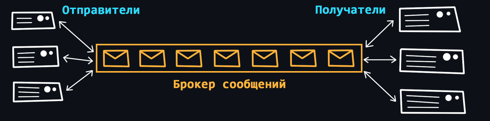

-   ### Общее

    

    При создании масштабной backend-системы может возникать проблема коммуникации между большим количеством микросервисов. Чтобы не усложнять уже имеющиеся сервисы (налаживать надёжную систему коммуникации, распределять нагрузку, предусматривать различные ошибки и т.д.) можно использовать отдельный сервис, который называется [брокером сообщений (очередью сообщений)](https://ru.wikipedia.org/wiki/%D0%91%D1%80%D0%BE%D0%BA%D0%B5%D1%80_%D1%81%D0%BE%D0%BE%D0%B1%D1%89%D0%B5%D0%BD%D0%B8%D0%B9).

    Брокер берет на себя ответственность создания надежной и отказоустойчивой системы коммуникации между сервисами (выполняет балансировку, гарантирует доставки, мониторит получателей, ведёт логи, буферизацию и т.д.)

    Под сообщением понимается обычный HTTP запрос/ответ с данными определенного формата.

    -   [RabbitMQ](https://ru.wikipedia.org/wiki/RabbitMQ)
    -   [Apache Kafka](https://ru.wikipedia.org/wiki/Apache_Kafka)
    -   [NATS](https://nats.io/)

    
🔗 <b>Ссылки на материалы</b>

1. 📺 [**Системы доставки сообщений, для чего они нужны?** – YouTube](https://youtu.be/ygZ9LsJG7Dw)
2. 📄 [**Что такое очередь сообщений?** – Amazon)](https://aws.amazon.com/ru/message-queue/)
3. 📄 [**Понимание брокеров сообщений. Изучение механики обмена сообщениями** – habr.com](https://habr.com/ru/post/466385/)
4. 📺 [**Микросервисы: Коммуникации через очередь сообщений** – YouTube](https://youtu.be/pCF-AeplALc)
5. 📺 [**RabbitMQ Tutorial на русском (плейлист)** – YouTube](https://youtube.com/playlist?list=PLCpsrvs6hImZShRjUbqewZWgjJgU6SIvU)
6. 📄 [**Что такое Apache Kafka за 5 минут** – YouTube](https://youtu.be/Mw9YFay8-WM)
7. 📄 [**Apache Kafka: основы технологии** – habr.com](https://habr.com/ru/company/southbridge/blog/550934/)
8. 📺 [**Про Kafka (основы)** – YouTube](https://youtu.be/-AZOi3kP9Js)
9. 📺 [**Брокер сообщений Kafka в условиях повышенной нагрузки** – YouTube](https://youtu.be/BtmYjTO1EpI)
10. 📄 [**Выбор MQ для высоконагруженного проекта** – habr.com](https://habr.com/ru/post/326880/)

