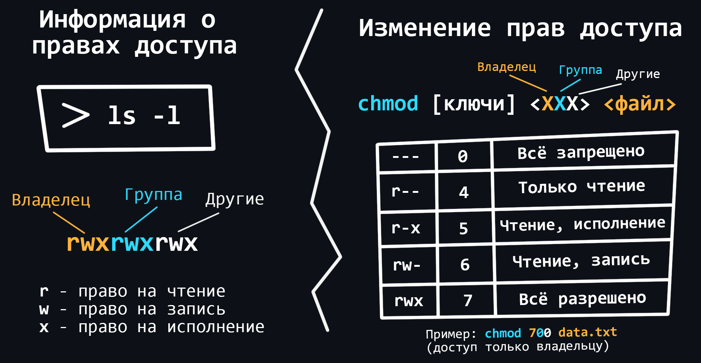
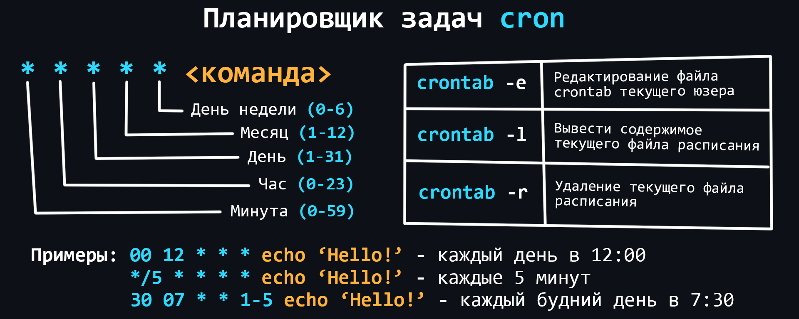

-   ### Общее

    Операционные системы на базе [ядра Linux](https://ru.wikipedia.org/wiki/%D0%AF%D0%B4%D1%80%D0%BE_Linux) это стандарт в мире серверной разработки, поскольку большинство серверов работают именно на таких ОС. Использовать Linux на серверах выгодно, ведь он распространяется бесплатно.

    Существует огромное количество дистрибутивов (сборок с набором предустановленного ПО) Linux на любой вкус и цвет. Одним из самых популярных является [Ubuntu](https://ru.wikipedia.org/wiki/Ubuntu). Именно с него можно начать своё погружение в серверную разработку.

    [Установить Ubuntu](https://ubuntu.com/download/desktop) можно на отдельный ПК или ноутбук. Если такой возможности нет, можно воспользоваться специальной программой [Virtual Box](https://www.virtualbox.org/wiki/Downloads), в которой можно [запускать другие ОС](https://lumpics.ru/how-install-ubuntu-on-virtualbox-virtual-machine/) поверх основной. Так же можно запустить [Docker](https://www.docker.com/products/docker-desktop) [контейнер с образом Ubuntu](https://losst.ru/zapusk-kontejnera-docker) (Docker - это [отдельная тема](#docker), которая рассматривается в этом репозитории).

    После этого можно быстро пройти [вводный курс по Linux и Bash](https://younglinux.info/bash/linux).

-   ### Работа с терминалом

    [Терминал (или консоль)](https://ru.wikipedia.org/wiki/%D0%98%D0%BD%D1%82%D0%B5%D1%80%D1%84%D0%B5%D0%B9%D1%81_%D0%BA%D0%BE%D0%BC%D0%B0%D0%BD%D0%B4%D0%BD%D0%BE%D0%B9_%D1%81%D1%82%D1%80%D0%BE%D0%BA%D0%B8) - программа, в которой для управления компьютером используются специальные текстовые команды. Как правило, на серверах отсутствуют графические оболочки, поэтому вам обязательно понадобятся навыки работы с терминалом.

    -   Основные команды для навигации по файловой системе
        ```bash
        ls # просмотр содержимого директории
        cd <путь> # переход в указанный каталог
        cd .. # переход на уровень выше (в родительский каталог)
        touch <файл> # создание файла
        cat > <файл> # ввод текста в файл из консоли (перезапись)
        cat >> <файл> # ввод текста в конец файла (добавление)
        cat/more/less <файл> # просмотр содержимого файла
        head/tail <файл> # просмотр первых/последних строк файла
        pwd # путь к текущей директории
        mkdir <имя> # создать директорию
        rmdir <имя> # удалить директорию
        cp <файл> <путь> # копировать файл или директорию
        mv <файл> <путь># перемещение или переименование
        rm <файл> # удаление файла или директории
        find <строка># поиск в файловой системе
        du <файл># вывод размера файла или каталога
        ```
    -   Команды для получения справочной информации
        ```bash
        man <название_команды> # позволяет посмотреть руководство по любой команде
        apropos <слово> # поиск команды с описанием имеющим указанное слово
        man -k <слово> # аналогично команде выше
        whatis <название_команды> # краткое описание команды
        ```
    -   Права суперпользователя
        > Аналог запуска от имени администратора в Windows
        ```bash
        sudo <команда> # выполняет команду с правами суперпользователя
        ```
    -   Текстовый редактор
        > Изучите любой для того чтобы свободно читать и редактировать файлы через терминал. <br>
        > Самый простой – [nano](https://habr.com/ru/post/106471/). <br>
        > Самый продвинутый – [Vim](https://habr.com/ru/company/ruvds/blog/544160/).

<details>
    <summary>🔗 <b>Ссылки на материалы</b></summary>

1. 📺 [**Linux для Начинающих (Плейлист)** – YouTube](https://youtube.com/playlist?list=PLg5SS_4L6LYuE4z-3BgLYGkZrs-cF4Tep)
2. 📄 [**Основные linux-команды для новичка** – habr.com](https://habr.com/ru/post/501442/)
3. 📄 [**44 команды Linux которые вы должны знать** – losst.ru](https://losst.ru/42-komandy-linux-kotorye-vy-dolzhny-znat)
4. 📄 [**Основные команды Linux: (почти) полное руководство с примерами** – selectel.ru](https://selectel.ru/blog/basic-linux-commands/)
5. 📄 [**Шпаргалка для редактора Nano**](https://www.nano-editor.org/dist/latest/cheatsheet.html)
6. 📄 [**Основы редактора Vim (Плейлист)** – YouTube](https://youtube.com/playlist?list=PLcjongJGYetkY4RFSVftH43F91vgzqB7U)
7. 📄 [**Изучение терминала через прохождение челленджей**](https://overthewire.org/wargames/)
</details>

-   ### Менеджер пакетов

    Менеджер пакетов – это утилита позволяющая устанавливать/обновлять программные пакеты с помощью терминала.

    Linux дистрибутивы можно разделить на несколько групп, в зависимости от того, какой в них используется менеджер пакетов: [apt](https://ru.wikipedia.org/wiki/Advanced_Packaging_Tool) (в дистрибутивах на основе [Debian](https://ru.wikipedia.org/wiki/Debian)), [RPM](https://ru.wikipedia.org/wiki/RPM) (система управления пакетами [Red Hat](https://ru.wikipedia.org/wiki/Red_Hat)) и [Pacman](https://ru.wikipedia.org/wiki/Pacman_(%D1%81%D0%B8%D1%81%D1%82%D0%B5%D0%BC%D0%B0_%D1%83%D0%BF%D1%80%D0%B0%D0%B2%D0%BB%D0%B5%D0%BD%D0%B8%D1%8F_%D0%BF%D0%B0%D0%BA%D0%B5%D1%82%D0%B0%D0%BC%D0%B8)) (менеджер пакетов в [Arch-подобных дистрибутивах](https://ru.wikipedia.org/wiki/Arch_Linux))

    Ubuntu основан на Debian, поэтому там используется менеджер пакетов apt (advanced packaging tool).

    -   Базовые команды
        ```bash
        apt install <имя_пакета> # установить пакет
        apt remove <имя_пакета> # удалить пакет, но оставить конфигурацию
        apt purge <имя_пакета> # удалить пакет вместе с конфигурацией
        apt update # обновление информации о новых версиях пакетов
        apt upgrade # обновление пакетов, установленных в системе
        apt list --installed # список установленных в системе пакетов
        apt list --upgradable # список пакетов, которые требуют обновления
        apt search <имя> # поиск пакетов по имени в сети
        apt show <имя_пакета> # информация о пакете
        ```

<details>
    <summary>🔗 <b>Ссылки на материалы</b></summary>

1. 📄 [**Как пользоваться apt** – losst.ru](https://losst.ru/kak-polzovatsya-apt)
2. 📄 [**Использование APT. Команды apt и apt-get** – pingvinus.ru](https://pingvinus.ru/note/apt)
</details>

-   ### Скрипты Bash

    С помощью скриптов (сценариев) можно автоматизировать последовательный ввод любого количества команд. В [Bash](https://ru.wikipedia.org/wiki/Bash#%D0%A1%D0%BA%D1%80%D0%B8%D0%BF%D1%82%D1%8B) можно создавать различные условия (разветвления), циклы, таймеры и т.д. для выполнения всевозможных действий связанных с вводом в консоль.

    -   [Основы Bash скриптов](https://github.com/cheatsnake/bash-scripts-by-example/blob/master/README_RUS.md)
        > Самые базовые и часто используемые возможности такие как: переменные, ввод/вывод, циклы, условия и т.д.
    -   Практика
        > Решайте задания на таких сайтах как [HackerRank](https://www.hackerrank.com/domains/shell) и [Codewars](https://www.codewars.com/join?language=shell). <br>
        > Начните использовать Bash для автоматизации рутинных действий на своем компьютере. Если вы уже занимаетесь программированием, создавайте скрипты для удобной сборки вашего проекта, для установки настроек и так далее.
    -   [ShellCheck](https://github.com/koalaman/shellcheck) инструмент для анализа скриптов
        > Укажет Вам на возможные ошибки и научит лучшим практикам написания действительно качественных скриптов.
    -   Дополнительные ресурсы
        > В таких репозиториях, как [awesome bash](https://github.com/awesome-lists/awesome-bash) и [awesome shell](https://github.com/alebcay/awesome-shell) собраны целые коллекции полезных ресурсов и инструментов, которые помогут развить ещё больше навыков работы с Bash и терминалом в общем.

<details>
    <summary>🔗 <b>Ссылки на материалы</b></summary>

1. 📺 [**Основы работы с Bash** – YouTube](https://youtube.com/playlist?list=PLR-hhxrErPAXqI1b4paqCKhWPoXMRLj_G)
2. 📄 [**Интерактивный онлайн-тренажёр по основам Bash**](https://www.learnshell.org/)
3. 📄 [**Bash-скрипты: начало** – habr.com](https://habr.com/ru/company/ruvds/blog/325522/)
4. 📄 [**Шпаргалка по Bash** – Learn X in Y minutes](https://learnxinyminutes.com/docs/ru-ru/bash-ru/)
5. 📄 [**Шпаргалка оп Bash** – quickref.me](https://quickref.me/bash)
6. 📄 [**Страница Bash на Reddit** – reddit.com](https://www.reddit.com/r/bash/)
7. 📄 [**Лучшие практики Bash скриптов** – habr.com](https://habr.com/ru/company/vk/blog/513064/)
8. 📄 [**Как работает bash: разбираемся в деталях** – VK Cloud](https://mcs.mail.ru/blog/detali-raboty-bash)
</details>

-   ### Пользователи

    ОС на базе Linux являются многопользовательскими. Это означает, что несколько людей могут запускать множество различных приложений одновременно на одном и том же компьютере. Чтобы система Linux смогла «узнать» пользователя, он должен войти в систему, соответственно каждый пользователь должен иметь уникальное имя и секретный пароль.

    -   Работа с пользователями
        ```bash
        useradd <имя> [ключи] # создать нового пользователя
        passwd <имя> # установить пароль пользователю
        usermod <имя> [ключи] # редактировать пользователя
        usermod -L <имя> # заблокировать пользователя
        usermod -U <имя> # разблокировать пользователя
        userdel <имя> [ключи] # удалить пользователя
        ```
    -   Работа с группами
        ```bash
        groupadd <группа> [ключи] # создать группу
        groupmod <группа> [опции] # редактировать группу
        groupdel <группа> [опции] # удалить группу
        usermod -a -G <группы(через запятую)> <пользователь> # добавить пользователя в группы
        gpasswd --delete <пользователь> <группы(через запятую)> # удалить пользователя из групп
        ```
    -   Системные файлы
        ```bash
        /etc/passwd # файл паролей, содержащий основную информацию о пользователях
        /etc/shadow # файл теневых шифрованных паролей, содержащий зашифрованные пароли
        /etc/group # файл групп, содержащий основную информацию о группах
        /etc/gshadow # файл теневых групп, содержащий шифрованные пароли групп
        ```

<details>
    <summary>🔗 <b>Ссылки на материалы</b></summary>

1. 📄 [**Пользователи в Linux: добавление, изменение, удаление**](https://host-consult.ru/polzovateli-v-linux/)
2. 📄 [**Группы и пользователи в Linux**](https://sysadminium.ru/groups_and_users_in_linux/)
</details>

-   ### Права доступа

    <p align="center"></p>

    В Linux можно разделять привилегии между пользователями, ограничить доступ к нежелательным файлам или возможностям, контролировать доступные действия для сервисов и многое другое. В Linux существует всего три вида прав - право на чтение, запись и выполнение, а также три категории пользователей, к которым они могут применяться - владелец файла, группа файла и все остальные.

    -   Основные команды для работы с правами
        ```bash
        chown <пользователь> <файл> # изменяет владельца и/или группу для указанных файлов
        chmod <права> <файл> # изменяет права доступа к файлам и каталогам
        chgrp <группа> <файл> # позволяет пользователям изменять группы
        ```
    -   Расширенные права [SUID](https://ru.wikipedia.org/wiki/Suid), [GUID](https://ru.wikipedia.org/wiki/Suid) и [sticky bit](https://ru.wikipedia.org/wiki/Sticky_bit)
    -   [ACL (Access control list)](https://help.ubuntu.ru/wiki/access_control_list)
        > Продвинутая подсистема для управления правами доступа.

<details>
    <summary>🔗 <b>Ссылки на материалы</b></summary>

1. 📄 [**Права доступа в Linux** – younglinux.info](https://younglinux.info/bash/rwx)
2. 📄 [**Управление доступом в Linux**](https://zinvapel.github.io/it/tools/2018/01/10/linux-users/)
3. 📄 [**Команда chmod – изменение прав доступа** – younglinux.info](https://younglinux.info/bash/chmod)
4. 📄 [**Права в Linux (chown, chmod, SUID, GUID, sticky bit, ACL, umask)** – habr.com](https://habr.com/ru/post/469667/)
5. 📄 [**Быть или не быть ACL в администрировании Linux** – habr.com](https://habr.com/ru/company/southbridge/blog/673570/)
</details>

-   ### Работа с процессами

    Процессы в Linux можно описать как контейнеры, в которых хранится вся информация о состоянии выполняемой программы. Если программа зависла и нужно восстановить её работу, тогда Вам понадобиться навыки работы по управлению процессами.

    -   Базовые команды
        ```bash
        ps # вывести 'снимок' процессов всех пользователей
        top # диспетчер задач в реальном времени
        <команда> & # запуск процесса в фоновом режиме, то есть не занимая консоль
        jobs # список запущенных в фоновом режиме процессов
        fg <номер> # вернуть процесс обратно в активный режим по его номеру
        bg <номер> # запуск остановленного процесса в фоновый режим
        kill <id процесса> # завершить процесс по id
        killall <программа> # завершить все процессы связанные с одной программой
        ```

<details>
    <summary>🔗 <b>Ссылки на материалы</b></summary>

1. 📺 [**Работа с процессами в Linux** – YouTube](https://www.youtube.com/watch?v=Y4W_rJStNSA)
2. 📄 [**Шпаргалка по работе процессами в Linux**](https://www.dmosk.ru/miniinstruktions.php?mini=processes-linux)
</details>

-   ### Работа с SSH

    [Служба SSH](https://ru.wikipedia.org/wiki/SSH) позволяет получить удаленный доступ к терминалу другого компьютера. В случае с персональным компьютером, это может понадобиться для срочного решения какой-либо проблемы, а в случае работы с сервером это вообще является основным методом подключения.

    -   Базовые команды
        ```bash
        apt install openssh-server # установка SSH (хотя он почти везде идёт из коробки)
        service ssh start # запуск SSH
        service ssh stop # остановка SSH
        ssh -p <Порт> user@remotehost # подключение к удаленному ПК через SSH
        ssh-keygen -t rsa # генерация RSA-ключа для беспарольного входа
        ssh-copy-id -i ~/.ssh/id_rsa user@remotehost # копирование ключа на удаленную машину
        ```

<details>
    <summary>🔗 <b>Ссылки на материалы</b></summary>

1. 📄 [**Что такое протокол SSH**](https://guides.hexlet.io/ru/ssh/)
2. 📄 [**Как пользоваться SSH**](https://losst.ru/kak-polzovatsya-ssh)
3. 📄 [**Удалённое управление по SSH**](https://doka.guide/tools/ssh/)
4. 📺 [**Настраиваем аутентификацию SSH по ключу в Linux** – YouTube](https://youtu.be/IVHv3eVQa14)
5. 📄 [**Почему SSH-ключ — безопасная альтернатива паролю** – selectel.ru](https://selectel.ru/blog/ssh-keys/)
6. 📄 [**SSH-туннели: практические примеры использования и важные функции** – selectel.ru](https://selectel.ru/blog/ssh-tunnels/)
</details>

-   ### Сетевые утилиты

    Для Linux существует множество, как встроенных, так и сторонних утилит, которые помогут настроить сеть, проанализировать её или устранить возможные проблемы.

    -   Базовые утилиты
        ```bash
        ip address # показать информацию об IPv4 и IPv6 адресах ваших устройств
        ip monitor # мониторинг состояния устройств в режиме реального времени
        ifconfig # параметры сетевого адаптера и IP-протокола
        traceroute <host> # показать маршрут, пройденный пакетами для достижения хоста
        tracepath <host> # отслеживает значения MTU до указанного хоста
        ping <host> # проверка соединения с хостом
        ss -at # показать список всех прослушиваемых TCP-соединений
        dig <host> # показать информацию о сервере имен DNS
        host <host | ip-address> # показать IP-адрес указанного домена
        mtr <host | ip-address> # комбинация утилит ping и traceroute
        nslookup # интерактивный запрос к серверам DNS
        whois <host> # показать информацию о регистрации домена
        ifplugstatus # определение состояния локальных устройств
        iftop # информация о пропускной способности
        ethtool <device name> # показать подробную информацию о устройстве
        nmap # инструмент для изучения и аудита безопасности сети
        bmon # монитор пропускной способности и скорости сети
        firewalld # добавление, настройка и удаление правил брандмауэра
        ipref # измерение и настройка производительности сети
        speedtest-cli # информация о скорости сети
        wget <link> # скачать файл из Интернета
        ```
    -   [`tcpdump`](https://ru.wikipedia.org/wiki/Tcpdump)
        > Консольная утилита, позволяющая перехватывать и анализировать весь сетевой трафик, проходящий через ваш компьютер.
    -   [`netcat`](https://ru.wikipedia.org/wiki/Netcat)
        > Утилита позволяющая устанавливать соединения по TCP и UDP, принимать оттуда данные и передавать их. Может выполнять сканирование портов, передачу файлов и прослушивание портов: как и любой сервер, она может быть использована как [Бэкдор]([<https://en.wikipedia.org/wiki/Backdoor_(computing)>](https://ru.wikipedia.org/wiki/%D0%91%D1%8D%D0%BA%D0%B4%D0%BE%D1%80)).
    -   [`iptables`](https://ru.wikipedia.org/wiki/Iptables)
        > Пользовательская утилита, позволяющая настраивать правила фильтрации IP-пакетов брандмауэра ядра Linux. Фильтры организованы в виде таблиц, которые содержат цепочки правил обработки пакетов сетевого трафика.
    -   [`nftables`](https://ru.wikipedia.org/wiki/Nftables)
        > Является современной заменой для `iptables`, а также объединяет в себе ряд других пакетов.
    -   [`curl`](https://ru.wikipedia.org/wiki/CURL)
        > Инструмент командной строки для передачи данных с использованием различных сетевых протоколов.

<details>
    <summary>🔗 <b>Ссылки на материалы</b></summary>

1. 📺 [**Linux для Начинающих - Сетевые комманды** – YouTube](https://youtu.be/MjItfiOG0cs)
2. 📄 [**Шпаргалка по сетевым инструментам Linux** – habr.com](https://habr.com/ru/company/ruvds/blog/417485/)
3. 📄 [**7 важных сетевых Linux-команд** – habr.com](https://habr.com/ru/company/ruvds/blog/567156/)
4. 📄 [**Используем tcpdump для анализа и перехвата сетевого трафика** – habr.com](https://habr.com/ru/company/alexhost/blog/531170/)
5. 📄 [**Что такое Netcat? Bind Shell и Reverse Shell в действии** – habr.com](https://habr.com/ru/post/657613/)
6. 📄 [**Переход с iptables на nftables. Краткий справочник** – habr.com](https://habr.com/ru/company/ruvds/blog/580648/)
7. 📄 [**Что такое curl? Как работает эта команда?** – habr.com](https://highload.today/curl/)
8. 📄 [**Шпаргалка по метрикам производительности cURL** – habr.com](https://habr.com/ru/company/ruvds/blog/568614/)
</details>

-   ### Планировщик задач

    <p align="center"></p>

    Благодаря планировщикам можно гибко управлять отложенным запуском команд и скриптов. В Linux есть встроенный планировщик [cron](https://ru.wikipedia.org/wiki/Cron), с помощью которого можно легко выполнять необходимые действия через определенные интервалы времени.

    -   Основные команды
        ```bash
        crontab -e # редактирование файла crontab текущего пользователя
        crontab -l # вывод содержимого текущего файла расписания
        crontab -r # удаление текущего файла расписания
        ```
    -   Конфигурационные файлы
        ```bash
        /etc/crontab # основной конфиг
        /etc/cron.d/ # файлы crontab, используемые для управления всей системой

        # автоматически запускаемые программы:
        /etc/cron.daily/ # ежедневно
        /etc/cron.weekly/ # еженедельно
        /etc/cron.monthly/ # ежемесячно
        ```

<details>
    <summary>🔗 <b>Ссылки на материалы</b></summary>

1. 📄 [**Использование Cron для автоматизации задач** – Digital Ocean](https://www.digitalocean.com/community/tutorials/how-to-use-cron-to-automate-tasks-ubuntu-1804-ru)
2. 📺 [**Crontab: запуск задач по расписанию** – YouTube](https://youtu.be/52-eyCp56ew)
3. 📄 [**Удобный онлайн-редактор для crontab**](https://crontab.guru/)
</details>

-   ### Системные логи

    [Файлы журнала (логи)](https://ru.wikipedia.org/wiki/%D0%A4%D0%B0%D0%B9%D0%BB_%D0%B6%D1%83%D1%80%D0%BD%D0%B0%D0%BB%D0%B0) - cпециальные текстовые файлы, в которые заносится вся информация о работе компьютера, программы или пользователя. Они особенно полезны при возникновении багов и ошибок в работе программы или сервера. Рекомендуется периодически просматривать логи, даже если ничего подозрительного не происходит.

    -   Основные лог файлы
        ```bash
        /var/log/syslog или /var/log/messages # информация о ядре, различных службах, обнаруженных
        # устройствах, сетевых интерфейсах и т.д. 
        /var/log/auth.log или /var/log/secure # информация об авторизации пользователей
        /var/log/faillog # неудачные попытки входа в систему
        /var/log/dmesg # информация о драйверах устройств
        /var/log/boot.log # информация о загрузке операционной системы
        /var/log/cron # отчёт о работе планировщика задач cron
        ```
    -   [Утилита lnav](https://lnav.org/)
        > Предназначена для удобного просмотра лог файлов (подсветка, чтение разных форматов, поиск и т.д.)
    -   Ротация логов с помощью [logrotate](https://github.com/logrotate/logrotate)
        > Позволяет настроить автоматическое удаление (чистку) лог-файлов, чтобы не забивать память.
    -   [Демон journald](https://manpages.ubuntu.com/manpages/bionic/man1/journalctl.1.html)
        > Cобирает данные из всех доступных источников и сохраняет их в двоичном формате для удобного и динамичного управления

<details>
    <summary>🔗 <b>Ссылки на материалы</b></summary>

1. 📄 [**Что такое логирование**](https://guides.hexlet.io/ru/logging/)
2. 📄 [**Как посмотреть логи в Linux** – losst.ru](https://losst.ru/kak-posmotret-logi-v-linux)
3. 📄 [**Лог файлы Linux по порядку** – habr.com](https://habr.com/ru/post/332502/)
4. 📄 [**Что такое «управление конфигурацией»**](https://guides.hexlet.io/ru/configuration-management/)
5. 📄 [**Туториал по системным логам Linux**](https://proglib.io/p/pomedlennee-ya-zapisyvayu-tutorial-po-sistemnym-logam-linux-2020-07-09)
6. 📄 [**Логи Linux. Всё о логах и журналировании**](https://hacker-basement.ru/2021/04/24/logi-linux-jurnalirovanie/)
7. 📄 [**Документация по lnav на русском**](https://akawah.ru/linux/lnav.html)
8. 📄 [**Ротация логов в Linux с помощью logrotate**](https://www.dmosk.ru/miniinstruktions.php?mini=logrotate-linux)
9. 📄 [**Использование journalctl для просмотра и анализа логов: подробный гайд** – habr.com](https://habr.com/ru/company/ruvds/blog/533918/)
</details>

-   ### Проблемы в Linux

    -   Проблемы с командами в терминале
        > Возникают из-за ошибочных действий пользователя. Часто связано с опечатками, отсутствием прав, неправильно указанными опциями и т.д.
    -   Проблемы с драйверами
        > Все свободные драйвера Linux встроены прямо в его ядро. Поэтому после установки системы все должно работать "прямо из коробки" (проблемы могут быть с совсем новым оборудованием, которое только вышло в продажу). Драйвера, исходный код, которых закрыт, считаются проприетарными и не включаются в ядро, а доустанавливаются вручную (например как у Nvidia).
    -   Проблемы с ядром
        > [Kernel panic](https://ru.wikipedia.org/wiki/Kernel_panic) может возникать из-за ошибки при монтировании корневой файловой системы. <br>
        > Тут лучше всего поможет навык чтения логов для выявления проблем (команда `dmesg`).
    -   [Ошибка сегментации (segmentation fault)](https://ru.wikipedia.org/wiki/%D0%9E%D1%88%D0%B8%D0%B1%D0%BA%D0%B0_%D1%81%D0%B5%D0%B3%D0%BC%D0%B5%D0%BD%D1%82%D0%B0%D1%86%D0%B8%D0%B8)
        > Возникает когда процесс обращается к недействительным участкам памяти.
    -   Проблемы с диском и файловой системой
        > Могут возникать из-за отсутствия свободного места.

<details>
    <summary>🔗 <b>Ссылки на материалы</b></summary>

1. 📄 [**Исправление ошибок в Linux** – losst.ru](https://losst.ru/ispravlenie-oshibok-linux)
2. 📄 [**Установка драйверов в Linux** – losst.ru](https://losst.pro/ustanovka-drajverov-v-linux)
3. 📄 [**Segmentation Fault (распределение памяти компьютера)** – habr.com](https://habr.com/ru/company/nix/blog/277759/)
</details>