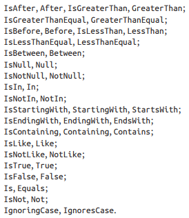

## 1\. Общая информация

Spring предлагает контейнер, часто называемый **контекстом приложения Spring**, который создает bean-компоненты приложения 
и управляет ими. Объединение bean-компонентов основан на шаблоне, известном как **внедрение зависимостей** (Dependency Injection, DI). 
Компоненты не создают и не поддерживают жизненный цикл других компонентов, от которых они зависят, а полагаются в этом 
на отдельный объект (контейнер), который создаст все нужные компоненты и внедрит их в другие компоненты, которые в них нуждаются. 
Это делается с помощью аргументов конструктора или методов доступа к свойствам. (TODO: почему внедрять через конструктор лучше?)

Когда имеется только один конструктор, Spring неявно применяет автоматическое связывание зависимостей через параметры этого конструктора. 
Если имеется более одного конструктора или если нужно, чтобы автоматическое связывание определялось явно, к конструктору можно 
добавить аннотацию `@Autowired`.

Используя **механизм сканирования**, Spring может автоматически обнаруживать компоненты в пути поиска классов (classpath) приложения 
и создавать их как bean-компоненты в контексте приложения Spring. **Механизм автоматического связывания** позволяет фреймворку Spring 
внедрять компоненты в другие bean-компоненты, от которых те зависят.

#### Spring Boot

**Автоконфигурация** – Spring Boot может делать обоснованные предположения о том, какие компоненты следует настроить и связать вместе, 
опираясь на элементы в пути поиска классов, переменные окружения и другие факторы.

В дополнение к начальным зависимостям и автонастройке Spring Boot предлагает также другие полезные возможности:
- Actuator позволяет исследовать работу внутренних механизмов приложения во время выполнения, включая получение метрик, 
 дампов потоков выполнения и приложения и свойства окружения приложения;
- гибкую спецификацию свойств окружения;
- дополнительную поддержку тестирования, помимо поддержки, предоставляемой ядром фреймворка.

Кроме того, Spring Boot предлагает альтернативную модель программирования, основанную на сценариях Groovy, которая называется Spring Boot CLI. 
С помощью Spring Boot CLI можно писать целые приложения в виде набора сценариев Groovy и запускать их из командной строки.

## 2\. Базовая конфигурация

### Зависимости

Зависимости от Spring Boot Starter обычно не имеют своего библиотечного кода, а транзитивно подключают другие библиотеки.

- `org.springframework.boot` - основной плагин с указанием версии Spring Boot.
- `io.spring.dependency-management` - контроль версий транзитивных зависимостей.
- `org.jetbrains.kotlin.plugin.spring` - делает классы открытыми (open) в Kotlin для поддержки Spring AOP (CGLIB proxies) и Spring JPA, 
с помощью следующих аннотаций: `@Component` (и производных `@Configuration`, `@Controller`, `@RestController`, `@Service`, `@Repository`), 
 `@Async`, `@Transactional`, `@Cacheable`, `@SpringBootTest`.
- `org.jetbrains.kotlin.plugin.jpa` - создает класс без параметров в Kotlin (вызываемый только с помощью рефлексии) для поддержки Spring JPA, 
с помощью следующих аннотаций: `@Entity`, `@Embeddable` и `@MappedSuperclass`.
- `freeCompilerArgs.addAll("-Xjsr305=strict")` - для поддержки Kotlin null-safety в Spring.
- `org.jetbrains.kotlin:kotlin-reflect` - поддержка рефлексии.
- `com.fasterxml.jackson.module:jackson-module-kotlin` - поддержка сериализации/десериализации для классов Kotlin.
- `org.springframework.boot:spring-boot-starter-test`, `org.jetbrains.kotlin:kotlin-test-junit5`, `org.junit.platform:junit-platform-launcher` - 
для тестирования.
- `org.springframework.boot:spring-boot-devtools` - инструменты разработчика, позволяют:
 - автоматически перезапускать приложение при изменении кода;
 - автоматически обновлять окно браузера при изменении ресурсов, передаваемых браузеру;
 - автоматически отключать кеширование шаблонов;
 - открывать встроенную [консоль H2](http://localhost:8080/h2-console), если используется база данных H2.

- `io.github.oshai:kotlin-logging-jvm` - удобный логгинг в Kotlin.

### Аннотации

- `@SpringBootApplication` - для класса запуска приложения Spring Boot, состоит из аннотаций:
 - `@SpringBootConfiguration` - определяет этот класс как класс конфигурации, специализированная форма аннотации `@Configuration`.
 - `@EnableAutoConfiguration` - включает автоконфигурацию Spring Boot, Spring Boot автоматически настраивает необходимые компоненты.
 - `@ComponentScan` - включает обнаружение и регистрацию в контексте Spring компонентов с аннотацией `@Component` и ее производными. 
Никакой функциональной разницы между ними нет, выбирается та, которая лучше описывает роль компонента в приложении.
- `@SpringBootTest` - настраивает JUnit на запуск тестов с поддержкой возможностей Spring Boot. Также выполняет загрузку контекста 
приложения Spring для теста. Сама снабжена аннотацией `@ExtendWith(SpringExtension.class)`, добавляющей поддержку возможностей 
тестирования Spring в JUnit 5.
- `@WebMvcTest(Controller.class)` - обеспечивает регистрацию класса `Controller` в Spring MVC, чтобы дать возможность 
отправлять ему запросы, также настраивает поддержку тестирования Spring MVC в Spring. Используется с `MockMvc`, чтобы 
можно было делать запросы.
- `@Configuration` - для класса конфигурации, в котором создаются bean-компоненты для контекста Spring.
- `@Bean` - для метода, в котором создается объект, который будет добавлен в контекст приложения как bean-компонент. 
При создании объекта можно передать в качестве аргумента конструктора вызов другого bean-метода. Bean-компонент доступен 
по идентификатору, совпадающему с именем метода.

## 3\. Spring MVC

Когда приложение запускается, механизм автоконфигурации Sprint Boot:
- настраивает bean-компоненты в контексте приложения Spring для включения Spring MVC.
- настраивает встроенный сервер Tomcat в контексте приложения Spring.
- настраивает механизм шаблонов Thymeleaf для отображения представлений Spring MVC.

## 3\.1\. Spring Contoller и Spring REST

### Зависимости

- `org.springframework.boot:spring-boot-starter-web` - подключение Spring MVC и встроенного сервера сервлетов Tomcat.

### Аннотации

- `@Controller` - для класса контроллера, обрабатывающего HTTP-запросы, который либо заполняет модель данных и передает результаты 
в представление для преобразования в HTML, либо записывает их непосредственно в тело ответа (RESTful).
- `@RequestMapping("path")` - для класса контроллера, определяет тип запросов, которые обрабатывает этот контроллер.
- `@GetMapping("path")` - вызывается для обработки HTTP-запроса GET. Аналогично для `@PostMapping`, `@PutMapping`, `@DeleteMapping`, 
`@PatchMapping`. (TODO: Разница между Put, Patch, Post)

## 3\.2\. Spring Model-View

### Зависимости

- `org.springframework.boot:spring-boot-starter-thymeleaf` - подключение механизма шаблонов Thymeleaf.
- `org.springframework.boot:spring-boot-starter-validation` - подключение проверки полей объектов.

### Аннотации

- `@SessionAttributes("name")` - указывает, что создаваемый методом с `ModelAttribute` объект, должен поддерживаться на уровне сеанса. 
В методе, который обрабатывает объект сессии в качестве параметре, также должен быть указан в качестве параметра объект `SessionStatus`, 
чтобы можно было очистить сеанс.
- `@ModelAttribute` - на метод, который либо взаимодействует с моделью `Model` и сам добавляет аттрибуты, либо добавляет объект 
в качестве аттрибута в модель с определенным именем `name`. Можно добавить перед параметром метода, чтобы указать, что он должен 
использовать объект, помещенный в модель другим методом с `@ModelAttribute`.
- `@Valid` - на параметр метода, для проверки объекта. Дополнительно в метод передается параметр `Errors` для последующей обработки 
ошибок с помощью `hasErrors()`.
- `@NotNull`, `@NotBlank`, `Size("min")`, `@CreditCardNumber`, `@Pattern`, `@Digits` - на поле объекта для проверки вводимых данных.

### Допополнительная информация

`Model` – это объект, в котором данные пересылаются между контроллером и любым представлением, ответственным за преобразование 
этих данных в разметку HTML. В конечном итоге данные, помещенные в атрибуты модели, копируются в атрибуты запроса сервлета, 
где представление найдет их и использует для отображения страницы в браузере пользователя.

Конвертер - это любой класс, который реализует интерфейс `Converter` с методом `convert()`, получающим значение одного типа 
и преобразующим его в значение другого типа (к примеру, `Converter<String, ИмяКласса>`).

При возвращении имени представления можно указать `redirect:/путь`, чтобы перейти на другую страницу по этому пути.

Можно создать `@Configuration` класс, который реализует интерфейс `WebMvcConfigurer` и переопределяет метод `addViewControllers`, 
для того, чтобы добавить контроллер, который просто возвращает имя представления по определенному пути 
`registry.addViewController("путь").setViewName("представление")`.

### Шаблоны

Шаблоны Thymeleaf – это самый обычный код HTML с некоторыми дополнительными атрибутами элементов, которые управляют 
преобразованием данных в механизме шаблонов.

`/src/main/resources/templates/` - стандартный путь для шаблонов 
`/src/main/resources/static/images/` - стандартный путь для изображений 

## 4\. Spring Data

Позволяет определять репозитории данных для приложений в форме простых интерфейсов спецификаций Java, используя соглашение 
об именах при определении методов, реализующих хранение и извлечение данных.

`schema.sql` - файл, лежащий в корне проекта, выполняется при запуске приложения для инициализации схем базы данных. 
`data.sql` - файл, лежащий в корне проекта, выполняется при запуске приложения для добавления данных. Работает только для реалиционных 
баз данных.

## 4\.1\. Spring JDBC

### Зависимости

- `org.springframework.boot:spring-boot-starter-jdbc` - подключение Spring JDBC.
- `com.h2database:h2` - подключение встроенной H2 базы данных.

### Свойства

- `spring.datasource.generate-unique-name=false` и `spring.datasource.name=MYNAME` - задает имя для H2 базы. После этого путь 
 к ней будет `jdbc:h2:mem:MYNAME`.

### Допополнительная информация

Класс `JdbcTemplate` позволяет разработчикам посылать SQL-запросы реляционной базе данных без лишних действий и шаблонов, 
характерных для работы с JDBC. Для этого нужно создать интерфейс репозитория конкретной сущности, а также создать его реализацию 
со всеми методами, в которую внедряется объект `JdbcTemplate`. При получении всех сущностей из таблицы нужно создать метод, 
который создает объект сущности используя объект `ResultSet`, представляющий строку таблицы.

Для сохранения сущностей сначала нужно создать `PreparedStatementCreatorFactory`, описывающего запрос insert вместе с типами 
параметров запроса. Стоит вызвать метод `setReturnGeneratedKeys(true)` для сохранения значения поля id, назначенного базой данных. 
После этого он используется для создания объекта `PreparedStatementCreator` с переданными значениями, которые требуется сохранить. 
После этого можно сохранить объект, передав ему `PreparedStatementCreator` и `GeneratedKeyHolder`, который будет хранить значение 
поля id, назначенное базой данных.

## 4\.2\. Spring Data JDBC

Предоставляет возможность автоматического создания реализации репозиториев данных на основе интерфейса спецификации Java.

### Зависимости

- `org.springframework.boot:spring-boot-starter-data-jdbc` - подключение Spring Data JDBC.

### Аннотации

- `@Table(имя)` - на класс данных, необязательная аннотация, позволяет указать имя таблицы, иначе будет использовано для AbcEfg - Abc_Efg.
- `@Id` - на поле класса данных, определяет уникальный идентификатор сущности.
- `@Column(имя)` - на поле класса данных, позволяет указать имя столбца, ингаче будет использовано для abcEfg - abc_efg.
- `@Query("запрос")` - на метод в репозитории, позволяет написать свой SQL запрос к базе данных. Любой метод в репозитории должен иметь 
эту аннотацию.

### Допополнительная информация

Для автоматического создания реализации репозитория необходимо унаследовать интерфейс спецификации от одного из стандартных интерфейсов, 
предоставляемых Spring Data:
- `Repository<Тип данных, Тип идентификатора>` - обычный репозиторий.
- `CrudRepository<Тип данных, Тип идентификатора>` - добавляет методы чтения, добавления, изменения и удаления сущностей, 
в том числе `findAll`, `findById`, `save`.

Можно удалить `data.sql` и использовать один из интерфейсов `CommandLineRunner` или `ApplicationRunner`, которые служат 
для выполнения логики при запуске приложения. На этапе запуска, после включения всех компонентов в контекст приложения Spring, 
но до того,как произойдет что-либо еще, для всех компонентов в контексте, реализующих эти интерфейсы, будут вызываться их методы `run()`. 
Для использования необходимо создать `@Bean` метод в классе конфигурации, который возвращает реализацию лямбды метода `run()`. 
Для `CommandLineRunner` метод `run()` принимает строку со всеми параметрами командной строки, а `ApplicationRunner` - 
параметр типа `ApplicationArguments`, предлагающий методы для доступа к отдельным аргументам, извлеченным из командной строки. 
Лучше использовать `ApplicationRunner`.

Использование этого принципа позволяет загружать данные и для нереалиционных баз данных, так как вместо SQL-сценария используются репозитории.

## 4\.3\. Spring Data JPA

По умолчанию использует Hibernate в качестве реализации JPA.

### Зависимости

- `org.springframework.boot:spring-boot-starter-data-jpa` - подключение Spring Data JPA.

### Аннотации

- `@Entity(имя)` - на класс данных, необязательная аннотация, позволяет указать имя таблицы, иначе будет использовано для AbcEfg - Abc_Efg.
- `@Id` - на поле класса данных, определяет уникальный идентификатор сущности (та же аннотация, что и в Spring Data JDBC, но другой пакет).
- `@GeneratedValue(strategy = GenerationType.AUTO)` - на поле класса данных, чтобы база даннхы саама создавала уникальные 
значения идентификаторов.
- `@OneToMany(cascade)`, `@ManyToOne(cascade)`, `@ManyToMany(cascade)` - на поле данных, для связи двух сущностей.
 - `cascade = CascadeType.ALL` - при удалении текущей сущности будут удалены все связанные с ней сущности.
- `@Query("запрос")` - на метод в репозитории, позволяет написать свой JPA запрос.

### Допополнительная информация

Генерируя реализацию репозитория, Spring Data JPA проверяет все методы в его интерфейсе, анализирует их имена и пытается определить 
назначение каждого метода в контексте хранимого объекта. Таким образом, детали операций с базой данных выражаются в сигнатурах методов. 
К примеру, `findByАттрибут` для поиска сущностей (можно также `get` или `read`), а `countBy` позволяет подсчитать количество сущностей. 
Можно указывать несколько аттрибутов связывая их с помощью `and`. В конце имени метода можно добавить `OrderBy`, чтобы 
отсортировать результаты по заданному полю. Все варианты промежуточных операторов:

JPA требует, чтобы классы данных имели конструкторы без аргументов, а также все классы данных и их поля были открытыми.

После изменений можно удалить файл `schema.sql`, так как теперь схема генерируется автоматически.

## 4\.4\. Spring Data Сassandra

## 5\. Spring Security

## 6\. Spring AOP

## 7\. Spring Reactive

Использование реактивного программирования направлено на обеспечение большей масштабируемости и улучшенной производительности 
за счет неблокирующих операций.

## 8\. Spring Integration и Spring Batch

Служат для интеграции с другими приложениями или даже с другими компонентами того же приложения. Spring Integration обеспечивает 
интеграцию в реальном времени, когда данные обрабатываются по мере их поступления. Spring Batch, напротив, предназначен 
для пакетной интеграции, когда данные могут собираться в течение некоторого времени, пока не произойдет какое-то событие 
(например, сработает таймер), сообщающее о том, что пришла пора для обработки пакета данных.

## 9\. Spring Cloud

Набор проектов для разработки облачных приложений с помощью Spring.